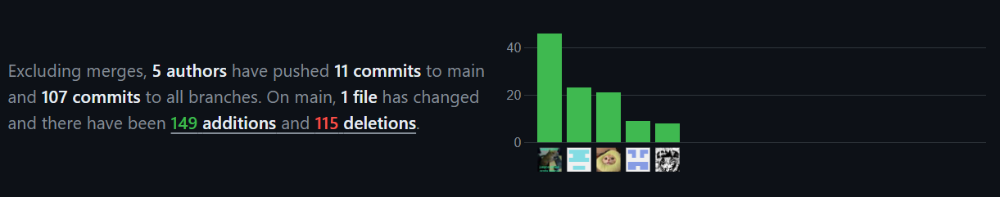
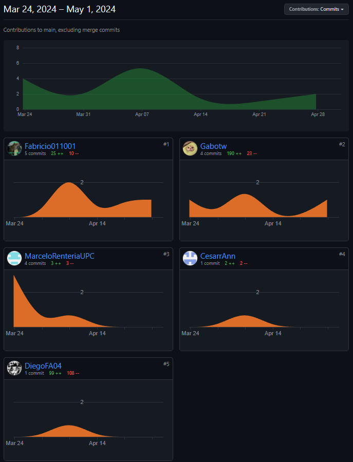

# INFORME DEL TRABAJO FINAL

### UNIVERSIDAD PERUANA DE CIENCIAS APLICADAS

### INGENIERÍA DE SISTEMAS DE INFORMACIÓN Y SOFTWARE

### CICLO 2024-01

Nombre del curso: Aplicaciones Web  
 Sección: WX55  
 Nombre del Profesor: Angel Augusto Velasquez Nuñez  
 Nombre del StartUp: Code Rush  
 Nombre del Producto: MedicDefensed  
Relación de Integrantes:

- Castilla Pachas, Cesar Antonio - U202218735
- Garcia Rodriguez, Gabriel Stefano - U202018627
- Rentería Puga, Héctor Marcelo - U202216558
- Flores Avalos, Diego - U20221B394
- Apaza Morales, Fabricio - U201922146

## Historial de Versiones

<table>
<tr>
    <th colspan="3">Version</th>
    <th colspan="3">Fecha</th>
    <th colspan="10">Autores</td>
    <th colspan="5">Descripción de Modificaciones</td>
  <tr>
    <td colspan="3">1era</td>
    <td colspan="3">29/03/2024</td>
    <td colspan="10">Héctor Marcelo Rentería Puga, Gabriel Stefano Garcia Rodriguez, Cesar Castilla Pachas, Diego Flores Avalos, Fabricio Apaza Morales.</td>
    <td colspan="5">Carátula, CapítuloI, Capítulo II</td>
  </tr>
  <tr>
    <td colspan="3">2da</td>
    <td colspan="3">5/04/2024</td>
    <td colspan="10">Héctor Marcelo Rentería Puga, Gabriel Stefano Garcia Rodriguez, Cesar Castilla Pachas, Diego Flores Avalos, Fabricio Apaza Morales.</td>
    <td colspan="5">CapítuloIII, Capítulo IV</td>
  </tr>
  <tr>
    <td colspan="3">3ra</td>
    <td colspan="3">12/04/2024</td>
    <td colspan="10">Héctor Marcelo Rentería Puga, Gabriel Stefano Garcia Rodriguez, Cesar Castilla Pachas, Diego Flores Avalos, Fabricio Apaza Morales.</td>
    <td colspan="5">Capítulo V, Desarrollo Landing Page</td>
  </tr>
  <tr>
    <td colspan="3">4ta</td>
    <td colspan="3">20/04/2024</td>
    <td colspan="10">Héctor Marcelo Rentería Puga, Gabriel Stefano Garcia Rodriguez, Cesar Castilla Pachas, Diego Flores Avalos, Fabricio Apaza Morales.</td>
    <td colspan="5">Correccion CapítuloI, Capítulo II, CapítuloIII, Capítulo IV, Capítulo V</td>
  </tr>
  <tr>
    <td colspan="3">5ta</td>
    <td colspan="3">2/05/2024</td>
    <td colspan="10">Héctor Marcelo Rentería Puga, Gabriel Stefano Garcia Rodriguez, Cesar Castilla Pachas, Diego Flores Avalos, Fabricio Apaza Morales.</td>
    <td colspan="5">Capítulo V, Desarrollo Frontend</td>
  </tr>
 <tr>
    <td colspan="3">6ta</td>
    <td colspan="3">7/06/2024</td>
    <td colspan="10">Héctor Marcelo Rentería Puga, Gabriel Stefano Garcia Rodriguez, Cesar Castilla Pachas, Diego Flores Avalos, Fabricio Apaza Morales.</td>
    <td colspan="5">Capítulo V, Desarrollo Backend</td>
  </tr>
 <tr>
    <td colspan="3">6ta</td>
    <td colspan="3">25/06/2024</td>
    <td colspan="10">Héctor Marcelo Rentería Puga, Gabriel Stefano Garcia Rodriguez, Cesar Castilla Pachas, Diego Flores Avalos, Fabricio Apaza Morales.</td>
    <td colspan="5">Capítulo V, Integración Backend con Frontend</td>
  </tr>
  </table>

## Project Report Collaboration Insights
A continuación, se detalla el proceso de elaboración del informe para cada entrega, junto con capturas de pantalla que muestran los análisis de colaboración y commits en GitHub para el repositorio del informe:

**URL del Repositorio del Informe:** https://github.com/Aplicaciones-Web-Grupo-CodeRush/Informe-Final

**Entrega N°1: TB1**
- Todos los miembros del equipo contribuyeron en la redacción del Informe. Se dividió en secciones específicas para cada capítulo, lo que permitió un mayor avance y equidad en el desarrollo del informe.
- Se establecieron fechas límite para la finalización de cada capítulo, lo que facilitó el avance de cada capítulo. 

**Entrega N°2: TP1**
- Todos los miembros del equipo contribuyeron en la redacción del Informe. Se dividió en secciones específicas a corregir para cada capitulo permitiendo asi mejorar el informe y a la vez anvazar con el frontend application-
- Se establecieron fechas límite para la finalización de cada capítulo, lo que facilitó el avance de cada capítulo.

**Entrega N°3: TB2**
- Todos los miembros del equipo contribuyeron en la redacción del Informe. Se dividió en secciones específicas a corregir para cada capitulo permitiendo asi mejorar el informe y a la vez anvazar con el backend application-
- Se establecieron fechas límite para la finalización de cada capítulo, lo que facilitó el avance de cada capítulo.

**Entrega N°4: TF1**
- Todos los miembros del equipo contribuyeron en la redacción del Informe. Se dividió en secciones específicas a corregir para cada capitulo permitiendo asi mejorar el informe y a la vez anvazar con la integración del frontend y backend application-
- Se establecieron fechas límite para la finalización de cada capítulo, lo que facilitó el avance de cada capítulo. 

A continuacion, se presentará la evidencia que muestra los análisis de colaboración y commits en el repositorio del informe realizados por los miembros del equipo durante las entregas realizadas:

**Commits:**

**Analisis de Colaboración:**

# Índice

- [Capítulo I: Introducción](https://github.com/Aplicaciones-Web-Grupo-CodeRush/Informe-Final/blob/Chapter-01/docs/chapter-01.md)
  - [1.1. StartUp Profile](#11-startup-profile)
    - [1.1.1. Descripción de la StartUp](#111-descripción-de-la-startup)
    - [1.1.2. Perfiles de Integrantes del equipo](#112-perfiles-de-integrantes-del-equipo)
  - [1.2. Solution Profile](#12-solution-profile)
    - [1.2.1. Antecedentes y Problemática](#121-antecedentes-y-problemática)
    - [1.2.2. Lean UX Process](#122-lean-ux-process)
      - [1.2.2.1. Lean UX Problem Statements](#1221-lean-ux-problem-statements)
      - [1.2.2.2. Lean UX Assumptions](#1222-lean-ux-assumptions)
      - [1.2.2.3. Lean UX Hyphotesis Statements](#1223-lean-ux-hyphotesis-statements)
      - [1.2.2.4. Lean UX Canvas](#1224-lean-ux-canvas)
  - [1.3. Segmentos objetivo](#13-segmentos-objetivo)
- [Capítulo II: Requirements Elicitation & Analysis](https://github.com/Aplicaciones-Web-Grupo-CodeRush/Informe-Final/blob/Chapter-02/docs/Chapter-02.md)
  - [2.1. Competidores](#21-competidores)
    - [2.1.1 Análisis competitivo](#211-análisis-competitivo)
    - [2.1.2. Estrategias y tácticas frente a competidores](#212-estrategias-y-tácticas-frente-a-competidores)
  - [2.2. Entrevistas](#22-entrevistas)
    - [2.2.1 Diseño de entrevistas](#221-diseño-de-entrevistas)
    - [2.2.2. Registro de entrevistas](#222-registro-de-entrevistas)
    - [2.2.3. Análisis de entrevistas](#223-análisis-de-entrevistas)
  - [2.3. Needfinding](#23-needfinding)
    - [2.3.1. User Persona](#231-user-persona)
    - [2.3.2. User Task Matrix](#232-user-task-matrix)
    - [2.3.3. User Journey Mapping](#233-user-journey-mapping)
    - [2.3.4. Empathy Mapping](#234-empathy-mapping)
    - [2.3.5. As-is Scenario Mapping](#235-as-is-scenario-mapping)
    - [2.3.6. Ubiquitous Language](#236-ubiquitous-language)
- [Capítulo III: Requirements Specification](https://github.com/Aplicaciones-Web-Grupo-CodeRush/Informe-Final/blob/Chapter-03/docs/Chapter-03.md)
  - [3.1. To-Be Scenario Mapping](#31-to-be-scenario-mapping)
  - [3.2. User Stories](#32-user-stories)
  - [3.3. Impact Mapping](#33-impact-mapping)
  - [3.4. Product Backlog](#34-product-backlog)
- [Capítulo IV: Product Design](https://github.com/Aplicaciones-Web-Grupo-CodeRush/Informe-Final/blob/Chapter-04/docs/Chapter-04.md)
  - [4.1. Style Guidelines](#41-style-guidelines)
    - [4.1.1. General Style Guidelines](#411-general-style-guidelines)
    - [4.1.2. Web Style Guidelines](#412-web-style-guidelines)
  - [4.2. Information Architecture](#42-information-architecture)
    - [4.2.1. Organization Systems](#421-organization-systems)
    - [4.2.2. Labeling Systems](#422-labeling-systems)
    - [4.2.3. SEO Tags and Meta Tags](#423-seo-tags-and-meta-tags)
    - [4.2.4. Searching Systems](#424-searching-systems)
    - [4.2.5. Navigation Systems](#425-navigation-systems)
  - [4.3. Landing Page UI Design](#43-landing-page-ui-design)
    - [4.3.1. Landing Page Wireframe](#431-landing-page-wireframe)
    - [4.3.2. Landing Page Mock-up](#432-landing-page-mock-up)
  - [4.4. Web Applications UX/UI Design](#44-web-applications-uxui-design)
    - [4.4.1. Web Applications Wireframes](#441-web-applications-wireframes)
    - [4.4.2. Web Applications Wireflow Diagrams](#442-web-applications-wireflow-diagrams)
    - [4.4.3. Web Applications Mock-ups](#443-web-applications-mock-ups)
    - [4.4.4. Web Applications User Flow Diagrams](#444-web-applications-user-flow-diagrams)
  - [4.5. Web Applications Prototyping](#45-web-applications-prototyping)
  - [4.6. Domain-Driven Software Architecture](#46-domain-driven-software-architecture)
    - [4.6.1. Software Architecture Context Diagram](#461-software-architecture-context-diagram)
    - [4.6.2. Software Architecture Container Diagrams](#462-software-architecture-container-diagrams)
    - [4.6.3. Software Architecture Components Diagrams](#463-software-architecture-components-diagrams)
  - [4.7. Software Object-Oriented Design](#47-software-object-oriented-design)
    - [4.7.1. Class Diagrams](#471-class-diagrams)
    - [4.7.2. Class Dictionary](#472-class-dictionary)
  - [4.8. Database Design](#48-database-design)
    - [4.8.1. Database Diagram](#481-database-diagram)
- [Capítulo V: Product Implementation, Validation & Deployment](https://github.com/Aplicaciones-Web-Grupo-CodeRush/Informe-Final/blob/Chapter-05/docs/Chapter-05.md)
  - [5.1. Software Configuration Management](#51-software-configuration-management)
    - [5.1.1. Software Development Environment Configuration](#511-software-development-environment-configuration)
    - [5.1.2. Source Code Management](#512-source-code-management)
    - [5.1.3. Source Code Style Guide & Conventions](#513-source-code-style-guide--conventions)
    - [5.1.4. Software Deployment Configuration](#514-software-deployment-configuration)
  - [5.2. Landing Page, Services & Applications Implementation](#52-landing-page-services--applications-implementation)
    - [5.2.1. Sprint 1](#521-sprint-1)
      - [5.2.1.1. Sprint Planning 1](#5211-sprint-planning-1)
      - [5.2.1.2. Sprint Backlog 1](#5212-sprint-backlog-1)
      - [5.2.1.3. Development Evidence for Sprint Review](#5213-development-evidence-for-sprint-review)
      - [5.2.1.4. Testing Suite Evidence for Sprint Review](#5214-testing-suite-evidence-for-sprint-review)
      - [5.2.1.5. Execution Evidence for Sprint Review](#5215-execution-evidence-for-sprint-review)
      - [5.2.1.6. Services Documentation Evidence for Sprint Review](#5216-services-documentation-evidence-for-sprint-review)
      - [5.2.1.7. Software Deployment Evidence for Sprint Review](#5217-software-deployment-evidence-for-sprint-review)
      - [5.2.1.8. Team Collaboration Insights during Sprint](#5218-team-collaboration-insights-during-sprint)
- [Conclusiones](#conclusiones)
  - [Conclusiones y recomendaciones](#conclusiones-y-recomendaciones)
- [Bibliografía](#bibliografía)
- [Anexos](#anexos)

# Student Outcome
                                                                                                    |
<table>
 <tr>
    <th colspan="2">Criterio Específico</th>
    <th colspan="10">Acciones Realizadas</td>
    <th colspan="2">Conclusiones</td>
 </tr>
 <tr>
    <td colspan="2">Participa en equipos multidisciplinarios con eficacia, eficiencia y objetividad, en el marco de un proyecto en soluciones de ingeniería de software.</th>
    <td colspan="10"><b>Fabricio Josue Apaza Morales</b> TB1:  - Colaborar en la organización de las tareas del equipo - Establecer los tiempos necesarios para las tareas - Entregar sus tareas designadas a tiempo TP:  - Organizar las correcciones - Corroborar la calidad de las correcciones - Colaborar grandemente en las correcciones TB2:  - Organizar las partes de trabajo - Editar los videos - Supervisar el estado de avance TF:  - Organizar las partes de trabajo - Corregir errores - Supervisar el estado de avance <b>Gabriel Stefano Garcia Rodriguez</b> TB1:  - Colaborar en la organización de las tareas del equipo - Establecer los tiempos necesarios para las tareas - Entregar sus tareas designadas a tiempo TP:  - Organizar las correcciones - Corroborar la calidad de las correcciones - Colaborar grandemente en las correcciones TB2:  - Organizar las correcciones - Manejar el estado del backend - Colaborar grandemente en las correcciones TF:  - Organizar las partes de trabajo - Corregir errores - Supervisar el estado de avance <b>Héctor Marcelo Rentería Puga</b> TB1:  - Elegir y trabajar en su tarea designada a tiempo - Corregir algunos errores - Informar el progreso de sus tareas TP:  - Elegir las correcciones a trabajar - Colaborar en la calidad de las correcciones - Colaborar eficazmente en las correcciones TB2:  - Ayudar a organizar las tareas - Colaborar con miembros para aclarar dudas - Hacer correcciones TF:  - Corregir informe - Corregir errores - Ayudar en integración <b>Diego Flores Avalos</b> TB1:  - Elegir y trabajar en su tarea designada a tiempo - Mejorar sus contribuciones - Informar el progreso de sus tareas TP:  - Cumplir con las correcciones a trabajar - Mejorar algunas correcciones - Colaborar efectivamente en las correcciones TB2:  - Hacer correcciones - Colaborar en el PPT TF:  - Ayudar en integración - Corregir errores - Supervisar el estado de avance <b>Cesar Castilla Pachas</b> TB1:  - Elegir y trabajar en su tarea designada a tiempo - Corregir algunos errores - Informar el progreso de sus tareas TP:  - Cumplir las correcciones a trabajar - Confirmar la calidad de las correcciones - Colaborar rapidamente en las correcciones TB2:  - Ayudar a manejar el backend - Colaborar con el PPT - Hacer correcciones TF:  - Corregir frontend - Corregir errores - Ayudar en integración | Nos aseguramos de trabajar de forma coordinada y eficaz, avanzando lo más posible en una cantidad de tiempo límite. Para lograrlo, tuvimos que trabajar como equipo y discutir las decisiones importantes de manera organizada y objetiva.</td>
    <td colspan="2">Nos aseguramos de trabajar de forma coordinada y eficaz, avanzando lo más posible en una cantidad de tiempo límite. Para lograrlo, tuvimos que trabajar como equipo y discutir las decisiones importantes de manera organizada y objetiva.</td>
 </tr>
 <tr>
    <td colspan="2">Conoce al menos un sector empresarial o dominio de aplicación de soluciones de software.</td>
    <td colspan="10"><b>Fabricio Josue Apaza Morales</b> TB1:  - Proporcionar información sobre el sector en el que trabajar - Conseguir entrevistas de los involucrados en el sector TP:  - Realizar correcciones según estándares del negocio - Corroborar la calidad de las correcciones TB2:  - Conseguir entrevistas de los involucrados en el sector - Hacer vídeos según estándares de negocio TF:  - Corregir backend según estándares - Corregir frontend según estándares - Ayudar en integración <b>Gabriel Stefano Garcia Rodriguez</b> TB1:  - Liderar el proyecto según información del sector de trabajo - Conseguir entrevistas de los involucrados en el sector TP:  - Realizar correcciones según estándares del negocio - Corroborar la calidad de las correcciones TB2:  - Conseguir entrevistas de los involucrados en el sector - Corroborar estándares de negocio del backend TF:  - Corregir backend según estándares - Corregir frontend según estándares - Ayudar en integración <b>Héctor Marcelo Rentería Puga</b> TB1:  - Investigar información relacionada con el sector de trabajo - Trabajar según dicha investigación TP:  - Realizar correcciones según estándares del negocio - Corroborar la calidad de las correcciones TB2:  - Hacer correcciones según estándares de negocio - Preparar la base del backend según estándares de negocio TF:  - Corregir backend según estándares - Corregir frontend según estándares - Ayudar en integración <b>Diego Flores Avalos</b> TB1:  - Investigar información relacionada con el sector de trabajo - Conseguir entrevistas de los involucrados en el sector TP:  - Realizar correcciones según estándares del negocio - Corroborar la calidad de las correcciones TB2:  - Conseguir entrevistas de los involucrados en el sector - Hacer correcciones según estándares de negocio TF:  - Corregir backend según estándares - Corregir frontend según estándares - Ayudar en integración <b>Cesar Castilla Pachas</b> TB1:  - Investigar información relacionada con el sector de trabajo - Conseguir entrevistas de los involucrados en el sector TP:  - Realizar correcciones según estándares del negocio - Corroborar la calidad de las correcciones TB2:  - Conseguir entrevistas de los involucrados en el sector - Hacer correcciones según estándares de negocio</td>
    <td colspan="2">Nos aseguramos de tener toda la información necesaria para entender el sector empresarial en el que nos vamos a involucrar, y poder usarla correctamente para el desarrollo de nuestra solución. Para hacerlom tuvimos que investigar sobre los problemas del sector, y las herramientas que usamos.</td>
 </tr>
  </table>
