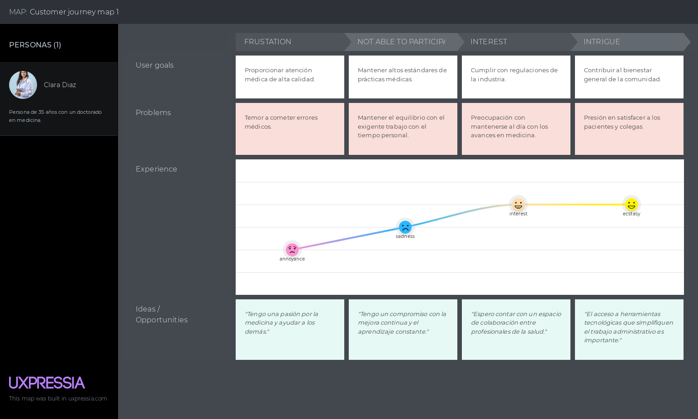
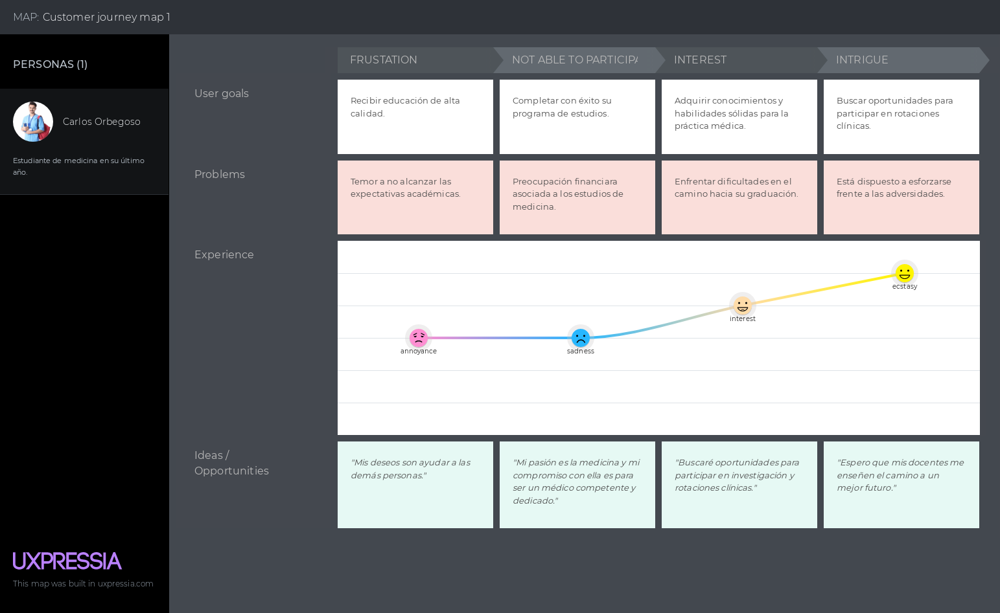

# Capítulo II: Requirements Elicitation & Analysis

## 2.1. Competidores

Nuestros competidores principales seran los siguientes:

| Maconsultor   link: https://maconsultor.com/ | Maconsultor es una aplicación web que ofrece representación y asistencia judicial para profesionales de la salud, así como asesoría en gestión del recurso humano en salud, gestión de cartera en el sector salud, y gestión del riesgo médico legal |
|:---------:|:---------:|
| SEPSA Abogados   link: https://www.sepsaabogados.com/ | SEPSA es una página web cuyo principal objetivo es la protección jurídica y económica de los profesionales de la salud, frente a todos aquellos eventos que tengan que ver con demandas y denuncias que se pueden presentar por su ejercicio profesional. |
| Legify   link:  https://www.legify.es/| Legify es una plataforma para encontrar abogados online en España o cualquier parte del mundo, sin necesidad de moverte de tu casa. Ofrece consultas legales online |

### 2.1.1 Análisis Competitivo

|  Competitive Analysis Landscape |
|:--------------:|

| ¿Por qué llevar a cabo el análisis? | Este análisis nos ayuda a entender las particularidades de cada sitio web o aplicación, identificar la competencia en el mercado y planificar cómo abordar las oportunidades. También nos permite trabajar en la mejora continua de nuestras áreas de desarrollo. |
|:---------:|:---------:|

|  |  |  |  |  |  |
|-----------|-----------|-----------|-----------|-----------|-----------|
| **Perfil** | **Overview** | Es una aplicación donde podrás solicitar los servicios de  nuestros abogados expertos en la medicina legal dentro nuestra plataforma para que te ayuden en caso necesites ayuda legal con algún problema con algún paciente. También puedes pagar subscripciones para tener acceso a consultas ocasionales con los mismos abogados. | Es una aplicación web que ofrece servicios a nivel nacional desde el año 2006, con profesionales formados simultáneamente en áreas médicas y legales. Ofrecen representaciones judiciales así como asesorías en gestión  del riesgo médico legal | Es una aplicación que cuenta con abogados de gran experiencia en el campo de la protección jurídica de los médicos profesionales de la salud, además su misión es el acompañamiento y apoderamiento de sus afiliados para este tipo de contingencias. | Es una aplicación web que ofrece soluciones legales inteligentes para simplificar y agilizar el proceso legal para profesionales médicos y sus equipos legales. |
|  | **Ventaja competitiva ¿Qué valor ofrece a los clientes?** | Contamos con un fuerte seguimiento de todos los casos en nuestro sistema, además contamos con contratos de manera digital para facilitar las solicitudes de nuestros clientes y contamos con un historial para las expedientes de casos anteriores. | Cuentan con médicos formados como abogados, médicos de diferentes especialidades y abogados especialistas en las diferentes ramas del derecho, lo que garantiza un asesoramiento eficiente y a la medida de las necesidades de nuestros clientes. | Cuentan con tiempos de respuesta ágiles, oportunos y eficientes de cara a las asesorías. | Cuentan con la potencia en el vínculo entre un cliente y sus expertos, además cuentan con video consultas las 24 horas del día, y un buen seguimiento del caso de sus usuarios. |
| **Perfil de marketing** | **Mercado objetivo** | 1. Médicos que necesiten ayuda legal por una denuncia o alguna asesoría que necesiten.   2. Profesionales especializados en la medicina legal que busquen oportunidades de trabajo   3. Practicantes o internos en la medicina que deseen consultar sobre la medicina legal. | 1. Profesionales en la medicina donde conseguirán orientación jurídica.   2. Empresas prestadoras del servicio de la salud. | 1. Médicos que necesiten una asesoría legal para mejorar su tranquilidad y bienestar en su trabajo. | 1. Una gran cantidad de personas con algún tipo de denuncia ya sean sobre herencias, derecho animal, multas, extranjeros, así como  también en el área de la medicina. |
|  | **Estrategias de marketing** | Publicidad de nuestro negocio en diversas redes sociales, en periódicos y buscando contactos de abogados y medicos. | Publicidad en algunas redes sociales y  otras en páginas web promocionando sus servicios. | Cuenta con la publicidad de la aplicación en noticieros y periódicos virtuales. | Presentan publicidad en redes sociales, promocionando sus años de experiencia obtenidos. |
| **Perfil de producto** | **Productos & servicios** | Contamos con tres formas de ayudar a nuestros usuarios:  1. Refiere cuando un usuario necesita la ayuda legal para defenderse de una denuncia.  2. La segunda es a través de una suscripción la cual recibirá asesorías con nuestros expertos.  3. Son para los abogados que quieran trabajar con nosotros enviando una solicitud de trabajo. | 1. Cuentan con asesorías en diversos temas como la gestión del riesgo médico legal, gestión del recurso humano en el sector salud, entre otros.  2. Cuentan con representaciones Jurídicas en el derecho administrativo, derecho civil y comercial. | 1. Cuentan con asesoría ilimitada en áreas del derecho como: civil, penal, contencioso administrativo, laboral y ética.  2. Cobertura económica frente a sentencias condenatorias. | 1. Cuentan con la ayuda de procesos en denuncias como suplantación de identidad o reclamación de rentas.  2. Cuentan con servicios de asesorías legales de diversas áreas. |
|  | **Precios y Costos** | Nuestros usuarios tendrán que pagar una suscripción mensual o un pago especial para la ayuda legal por denuncias médicas. | Cuentan con un pago único para asesorías y ayuda legales de diversas áreas. | Cuentan con diversos tipos de planes representados en colores con diferentes beneficios en cada color. | Cuentan con servicios de pago único para sus ayudas legales. |
|  | **Canales de distribución (Web y/o Móvil)** | Aplicación web y móvil | Aplicación web y móvil | Aplicación web y móvil | Aplicación web y móvil |
| **Análisis SWOT** | **Fortalezas** | 1. El precio de nuestros servicios serán más económicos y accesibles en comparación con las nuestras competencias.  2. Brindaremos diversas herramientas necesarias para la facilidad de nuestros para acceder a nuestros servicios. | 1. Ofrecen sus servicios no solo a profesionales en el área de la salud sino también a empresas como hospitales. | 1. Ofrecen una gran variedad de planes para que el precio se adecue a lo que sus usuarios necesitan. | 1.Ofrecen diversas ofertas a sus usuarios al momento de contratar un servicio, por ejemplo cuando pide un servicio por primera vez. |
|  | **Debilidades** | 1. Solo ofrecer ayudas legales o asesorías en el área de la medicina  | 1. No cuentan con diversos planes para sus usuarios | 1. No cuenta con un horario de atención muy accesible. | 1. Cuentan con precios demasiados altos. |
|  | **Oportunidades** | Como somos una empresa nueva que recién está empezando a publicar sus servicios, podemos ver las debilidades de nuestras competencias y ofrecer una solución para nuestros usuarios. | Cuentan con muchos años de experiencia por lo que le genera más confianza a sus usuarios. | Tienen una interfaz creativa y fácil de entender por lo que hay más posibilidad de obtener más clientes. | Atienden casos de todo los lugares del mundo, por lo que tendrán una mayor cantidad de clientes. |
|  | **Amenazas** | Los competidores cuentan con diversos tipos de ayuda legal y varios años de experiencia. | Muy poca entendibilidad en los servicios que ofrece o términos que algunos clientes no entienden. | Muy pocas o casi ninguna oferta en los pagos de sus servicios. | Se dificulta mucho al momento de buscar un servicio específico que necesitan en la página web ya que no cuenta con un filtrador ni un buscador. |

### 2.1.2. Estrategias y tácticas frente a competidores.

Nuestras estrategias y tácticas para hacer frente a nuestros competidores serían las siguientes:
- Para enfrentar a los competidores establecidos en el mercado de asesoramiento legal para profesionales de la salud, nuestra estrategia se centra en la diferenciación mediante la especialización en el nicho de derecho médico. Planeamos ofrecer contenido educativo especializado, una plataforma fácil de usar y acceso a una red de expertos en litigios de salud. Además, implementaremos estrategias de marketing digital focalizadas, estableceremos alianzas estratégicas con instituciones médicas y mantendremos un modelo de precios competitivo. A través de estas tácticas, nuestra aplicación buscará establecerse como una autoridad en el campo, proporcionando soluciones personalizadas y efectivas para las necesidades legales de médicos y estudiantes de medicina.

## 2.2. Entrevistas
La entrevista se realiza con el objetivo de obtener mayor información acerca de los usuarios y del servicio de tecnología. De este modo, podremos conocer cuál es sus puntos de vista respecto a los servicios electrónicos, qué problemas tuvieron y cuáles son sus expectativas frente a los nuevos servicios educativos virtuales.

### 2.2.1 Diseño de entrevistas  
**Preguntas para Doctores**
- Presentacion (Nombre, lugar en el que trabaja y rol que desempeña)
- Cuando tiempo llevas ejerciendo la carrera de medicina y/o especialidad?
- Como te sientes cada vez que tienes que intervenir a alguien quirúrgicamente?
- Alguna vez has tenido algún problema medico con algún paciente? En caso NO, conoces algún caso?
- Conoces a alguien que haya tenido algún problema con algún paciente o con la familia del mismo por el resultado de su cirugía?
- Si tuviera algún problema con el resultado de la cirugía de tu paciente, que harías? Buscarías ayuda profesional?

**Preguntas para Estudiantes Medicinas**

- Presentación(Nombre, edad, centro de estudios)  
- ¿Cuánto tiempo llevas estudiando medicina?  
- ¿Estás desempeñando practicas médicas en algún Hospital? ¿En que hospital?  
- ¿Has tenido alguna mala experiencia mientras realizabas tus practicas médicas? ¿Conociste a alguien que haya tenido una mala experiencia?  
- ¿Alguna vez has escuchado sobre las negligencias médicas que ocurren en el país? Que opinas sobre eso?  
- ¿Qué conocimientos tienes sobre la responsabilidad médica y las posibles implicaciones legales que pueden surgir durante la práctica clínica?  
- ¿Has recibido alguna formación o orientación específica sobre cómo evitar situaciones que puedan llevar a denuncias por negligencia médica durante tu formación médica? ¿Cómo cuales?  
- ¿Algún profesor de tu facultad les ha comentado sobre si tuvo alguna negligencia? En caso de si, que hizo al respecto?  
- ¿Te gustaría tener acceso a servicios legales especializados en el campo de la medicina para obtener asesoramiento o defensa en caso de enfrentar una denuncia por negligencia médica en el futuro? ¿Como cuales: asesorías, cursos, talleres, etc?
### 2.2.2. Registro de entrevistas  

### 2.2.3. Análisis de entrevistas

## 2.3. Needfinding
Posteriormente a las entrevistas, pudimos obtener la información sobre sus deseos, frustraciones, situación y múltiples datos que nos van a servir para satisfacer sus necesidades, mejorando la experiencia a nuestros usuarios. 
Esta información también nos ayudará a realizar los esquemas para las secciones de User Personas, User Task Matrix, User Journey Maps y el Empathy Mapping.

### 2.3.1. User Persona
En el proceso de desarrollo de un sitio web para ayudar a médicos que sufren demandas por las familias de sus pacientes debido a problemas que no pueden ser principalmente del médico como negligencias del hospital, etc. Es fundamental comprender en profundidad las necesidades y preferencias de los usuarios finales. Con este fin, hemos llevado a cabo un detallado análisis de entrevistas tanto con potenciales usuarios como con competidores en el ámbito de la seguridad y protección contra incendios. Los datos valiosos obtenidos de estas entrevistas nos han proporcionado información crucial sobre las expectativas y obstáculos de nuestra audiencia objetivo.

Los textos que se presentaron anteriormente detallan las entrevistas realizadas con dos individuos distintos. A través de estas entrevistas, hemos identificado características y necesidades esenciales que guiarán la creación de las fichas de User Persona.

En las fichas de User Persona que se presentarán a continuación, se ampliarán y detallarán las características individuales de estos usuarios ficticios, incluyendo aspectos como su edad, ocupación, habilidades, frustraciones y objetivos. Estas fichas de User Persona servirán como representaciones detalladas de nuestros usuarios objetivo y nos permitirán tomar decisiones informadas en el diseño y desarrollo que se adapten de manera efectiva a sus necesidades y preferencias.

En resumen, los artefactos a presentar en esta sección están estrechamente relacionados con las principales características identificadas en los textos, y las fichas de User Persona son herramientas esenciales para garantizar que nuestras soluciones se centren en los usuarios y se ajusten a sus perfiles y requisitos específicos

**_Segmento Objetivo 1: Medicos_**

**_Segmento Objetivo 2: Estudiante de Medicina_**

### 2.3.2. User Task Matrix

| Task Matrix             | Clara Frecuencia| Clara Importancia| Carlos Frecuencia | Carlos Importancia |
|-----------------------------|---------|-------------|-------------|-------|
| Búsqueda de un entorno seguro | Siempre | A veces     | Siempre | Alta  |
| Interfaz y entorno amigable  | Casi nunca | A veces | A veces       | A veces |
| Registrarse                 | A veces | Bajo        | A veces     | Bajo  |
| Iniciar sesión              | Siempre | Medio       | Siempre     | Medio |
| Explorar casos de estudio   | A veces | Alto        | Siempre     | Alto  |
| Solicitar asesoramiento     | A veces | Medio       | Siempre     | Medio |
| Suscribirse a un plan de servicio | Siempre | Medio | Siempre     | Medio |
| Participar en foros de discusión | A veces | Medio | Siempre     | Medio |
| Actualizar información de perfil | A veces | Alto | A veces     | Alto  |
| Leer artículos y guías      | Siempre | Medio       | Casi nunca  | Medio |

### 2.3.3. User Journey Mapping

### 2.3.4. Empathy Mapping
Para el desarrollo de los Empathy Map hemos utilizado la información recopilada en base a nuestros dos User Personas que representan nuestro segmento.

**_Clara Diaz - Doctora_**

**_Carlos Orbegozo - Estudiante de Medicina_**

### 2.3.5. As-is Scenario Mapping
Realizamos una lluvia de ideas e identificamos las fases de acorde a lo propuesto en los User Persona. De tal modo, hemos conseguido realizar los As-Is mapping para los segmentos dados.

**_Clara Diaz - Doctora_**

**_Carlos Orbegozo - Estudiante de Medicina_**

### 2.3.6. Ubiquitous Language
**Lex Artis**: Es un término legal que se utiliza para evaluar si un médico ha actuado de acuerdo con los estándares aceptados de la práctica médica.

**Negligencia médica**: Se refiere a un tipo de error médico en el que un médico o profesional de la salud comete un error o actúa de manera negligente en la atención de un paciente, lo que resulta en daño o lesión para el paciente.

**Praxis médica**: Se refiere al conjunto de acciones y procedimientos que un médico realiza en la práctica diaria para diagnosticar, tratar y cuidar a los pacientes.

**Lex artis ad hoc**: Se refiere al conjunto de reglas y estándares que se aplican en una situación específica o ad hoc. En este contexto, se refiere a los estándares y prácticas médicas que se aplican en casos particulares.
