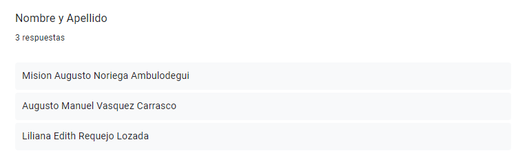
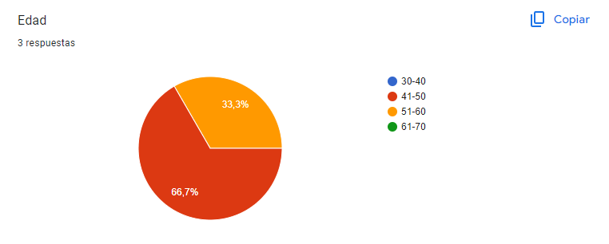
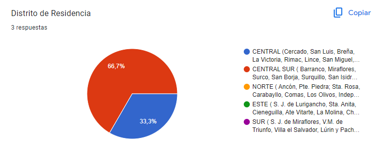
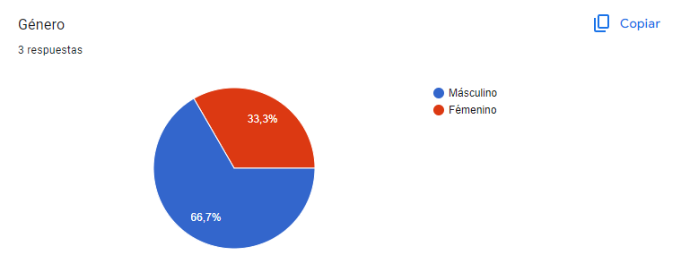
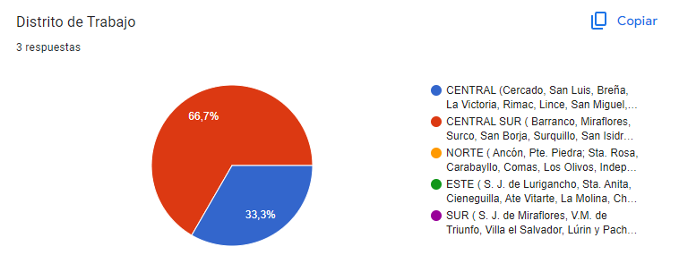
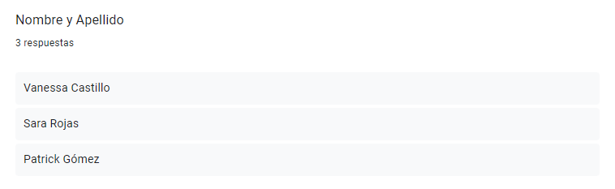
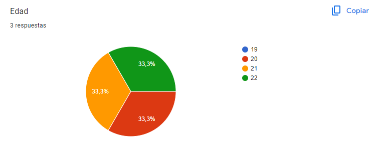
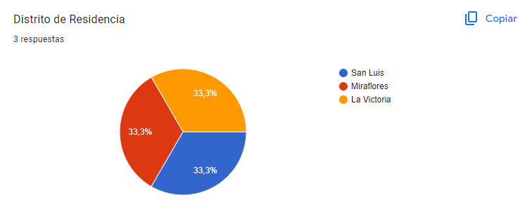
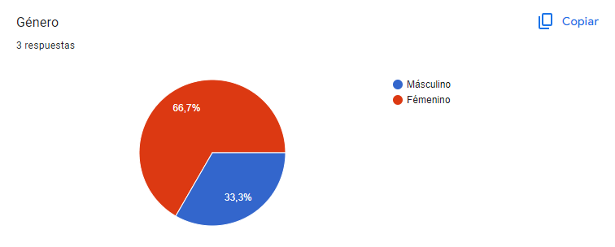
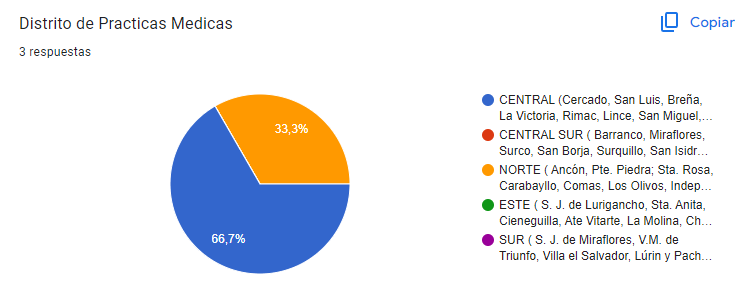

# Capítulo II: Requirements Elicitation & Analysis

## 2.1. Competidores

Nuestros competidores principales seran los siguientes:

| Maconsultor   link: https://maconsultor.com/ | Maconsultor es una aplicación web que ofrece representación y asistencia judicial para profesionales de la salud, así como asesoría en gestión del recurso humano en salud, gestión de cartera en el sector salud, y gestión del riesgo médico legal |
|:---------:|:---------:|
| SEPSA Abogados   link: https://www.sepsaabogados.com/ | SEPSA es una página web cuyo principal objetivo es la protección jurídica y económica de los profesionales de la salud, frente a todos aquellos eventos que tengan que ver con demandas y denuncias que se pueden presentar por su ejercicio profesional. |
| Legify   link:  https://www.legify.es/| Legify es una plataforma para encontrar abogados online en España o cualquier parte del mundo, sin necesidad de moverte de tu casa. Ofrece consultas legales online |

### 2.1.1 Análisis Competitivo

|  Competitive Analysis Landscape |
|:--------------:|

| ¿Por qué llevar a cabo el análisis? | Este análisis nos ayuda a entender las particularidades de cada sitio web o aplicación, identificar la competencia en el mercado y planificar cómo abordar las oportunidades. También nos permite trabajar en la mejora continua de nuestras áreas de desarrollo. |
|:---------:|:---------:|

|  |  |  |  |  |  |
|-----------|-----------|-----------|-----------|-----------|-----------|
| **Perfil** | **Overview** | Es una aplicación donde podrás solicitar los servicios de  nuestros abogados expertos en la medicina legal dentro nuestra plataforma para que te ayuden en caso necesites ayuda legal con algún problema con algún paciente. También puedes pagar subscripciones para tener acceso a consultas ocasionales con los mismos abogados. | Es una aplicación web que ofrece servicios a nivel nacional desde el año 2006, con profesionales formados simultáneamente en áreas médicas y legales. Ofrecen representaciones judiciales así como asesorías en gestión  del riesgo médico legal | Es una aplicación que cuenta con abogados de gran experiencia en el campo de la protección jurídica de los médicos profesionales de la salud, además su misión es el acompañamiento y apoderamiento de sus afiliados para este tipo de contingencias. | Es una aplicación web que ofrece soluciones legales inteligentes para simplificar y agilizar el proceso legal para profesionales médicos y sus equipos legales. |
|  | **Ventaja competitiva ¿Qué valor ofrece a los clientes?** | Contamos con un fuerte seguimiento de todos los casos en nuestro sistema, además contamos con contratos de manera digital para facilitar las solicitudes de nuestros clientes y contamos con un historial para las expedientes de casos anteriores. | Cuentan con médicos formados como abogados, médicos de diferentes especialidades y abogados especialistas en las diferentes ramas del derecho, lo que garantiza un asesoramiento eficiente y a la medida de las necesidades de nuestros clientes. | Cuentan con tiempos de respuesta ágiles, oportunos y eficientes de cara a las asesorías. | Cuentan con la potencia en el vínculo entre un cliente y sus expertos, además cuentan con video consultas las 24 horas del día, y un buen seguimiento del caso de sus usuarios. |
| **Perfil de marketing** | **Mercado objetivo** | 1. Médicos que necesiten ayuda legal por una denuncia o alguna asesoría que necesiten.   2. Profesionales especializados en la medicina legal que busquen oportunidades de trabajo   3. Practicantes o internos en la medicina que deseen consultar sobre la medicina legal. | 1. Profesionales en la medicina donde conseguirán orientación jurídica.   2. Empresas prestadoras del servicio de la salud. | 1. Médicos que necesiten una asesoría legal para mejorar su tranquilidad y bienestar en su trabajo. | 1. Una gran cantidad de personas con algún tipo de denuncia ya sean sobre herencias, derecho animal, multas, extranjeros, así como  también en el área de la medicina. |
|  | **Estrategias de marketing** | Publicidad de nuestro negocio en diversas redes sociales, en periódicos y buscando contactos de abogados y medicos. | Publicidad en algunas redes sociales y  otras en páginas web promocionando sus servicios. | Cuenta con la publicidad de la aplicación en noticieros y periódicos virtuales. | Presentan publicidad en redes sociales, promocionando sus años de experiencia obtenidos. |
| **Perfil de producto** | **Productos & servicios** | Contamos con tres formas de ayudar a nuestros usuarios:  1. Refiere cuando un usuario necesita la ayuda legal para defenderse de una denuncia.  2. La segunda es a través de una suscripción la cual recibirá asesorías con nuestros expertos.  3. Son para los abogados que quieran trabajar con nosotros enviando una solicitud de trabajo. | 1. Cuentan con asesorías en diversos temas como la gestión del riesgo médico legal, gestión del recurso humano en el sector salud, entre otros.  2. Cuentan con representaciones Jurídicas en el derecho administrativo, derecho civil y comercial. | 1. Cuentan con asesoría ilimitada en áreas del derecho como: civil, penal, contencioso administrativo, laboral y ética.  2. Cobertura económica frente a sentencias condenatorias. | 1. Cuentan con la ayuda de procesos en denuncias como suplantación de identidad o reclamación de rentas.  2. Cuentan con servicios de asesorías legales de diversas áreas. |
|  | **Precios y Costos** | Nuestros usuarios tendrán que pagar una suscripción mensual o un pago especial para la ayuda legal por denuncias médicas. | Cuentan con un pago único para asesorías y ayuda legales de diversas áreas. | Cuentan con diversos tipos de planes representados en colores con diferentes beneficios en cada color. | Cuentan con servicios de pago único para sus ayudas legales. |
|  | **Canales de distribución (Web y/o Móvil)** | Aplicación web y móvil | Aplicación web y móvil | Aplicación web y móvil | Aplicación web y móvil |
| **Análisis SWOT** | **Fortalezas** | 1. El precio de nuestros servicios serán más económicos y accesibles en comparación con las nuestras competencias.  2. Brindaremos diversas herramientas necesarias para la facilidad de nuestros para acceder a nuestros servicios. | 1. Ofrecen sus servicios no solo a profesionales en el área de la salud sino también a empresas como hospitales. | 1. Ofrecen una gran variedad de planes para que el precio se adecue a lo que sus usuarios necesitan. | 1.Ofrecen diversas ofertas a sus usuarios al momento de contratar un servicio, por ejemplo cuando pide un servicio por primera vez. |
|  | **Debilidades** | 1. Solo ofrecer ayudas legales o asesorías en el área de la medicina  | 1. No cuentan con diversos planes para sus usuarios | 1. No cuenta con un horario de atención muy accesible. | 1. Cuentan con precios demasiados altos. |
|  | **Oportunidades** | Como somos una empresa nueva que recién está empezando a publicar sus servicios, podemos ver las debilidades de nuestras competencias y ofrecer una solución para nuestros usuarios. | Cuentan con muchos años de experiencia por lo que le genera más confianza a sus usuarios. | Tienen una interfaz creativa y fácil de entender por lo que hay más posibilidad de obtener más clientes. | Atienden casos de todo los lugares del mundo, por lo que tendrán una mayor cantidad de clientes. |
|  | **Amenazas** | Los competidores cuentan con diversos tipos de ayuda legal y varios años de experiencia. | Muy poca entendibilidad en los servicios que ofrece o términos que algunos clientes no entienden. | Muy pocas o casi ninguna oferta en los pagos de sus servicios. | Se dificulta mucho al momento de buscar un servicio específico que necesitan en la página web ya que no cuenta con un filtrador ni un buscador. |

### 2.1.2. Estrategias y tácticas frente a competidores.

Nuestras estrategias y tácticas para hacer frente a nuestros competidores serían las siguientes:
- Para enfrentar a los competidores establecidos en el mercado de asesoramiento legal para profesionales de la salud, nuestra estrategia se centra en la diferenciación mediante la especialización en el nicho de derecho médico. Planeamos ofrecer contenido educativo especializado, una plataforma fácil de usar y acceso a una red de expertos en litigios de salud. Además, implementaremos estrategias de marketing digital focalizadas, estableceremos alianzas estratégicas con instituciones médicas y mantendremos un modelo de precios competitivo. A través de estas tácticas, nuestra aplicación buscará establecerse como una autoridad en el campo, proporcionando soluciones personalizadas y efectivas para las necesidades legales de médicos y estudiantes de medicina.

## 2.2. Entrevistas
La entrevista se realiza con el objetivo de obtener mayor información acerca de los usuarios y del servicio de tecnología. De este modo, podremos conocer cuál es sus puntos de vista respecto a los servicios electrónicos, qué problemas tuvieron y cuáles son sus expectativas frente a los nuevos servicios educativos virtuales.

### 2.2.1 Diseño de entrevistas  

**Preguntas para Doctores**

- Presentación (Nombre, lugar en el que trabaja y rol que desempeña)
- ¿Cuánto tiempo llevas ejerciendo la carrera de medicina y/o especialidad?
- ¿Cómo te sientes cada vez que tienes que intervenir a alguien quirúrgicamente?
- ¿Alguna vez has tenido algún problema medico con algún paciente? En caso que no, ¿Conoces algún caso?
- ¿Conoces a alguien que haya tenido algún problema con algún paciente, o con la familia del mismo por el resultado de su cirugía?
- Si tuviera algún problema con el resultado de la cirugía de tu paciente, ¿Qué harías? ¿Buscarías ayuda profesional?

**Preguntas para Estudiantes de Medicina**

- Presentación (Nombre, edad, centro de estudios)
- ¿Cuánto tiempo llevas estudiando medicina?
- ¿Estás desempeñando prácticas médicas en algún Hospital? ¿En qué hospital?
- ¿Has tenido alguna mala experiencia mientras realizabas tus prácticas médicas? ¿Conociste a alguien que haya tenido una mala experiencia?
- ¿Alguna vez has escuchado sobre las negligencias médicas que ocurren en el país? ¿Qué opinas sobre eso?
- ¿Qué conocimientos tienes sobre la responsabilidad médica y las posibles implicaciones legales que pueden surgir durante la práctica clínica?
- ¿Has recibido alguna formación o orientación específica sobre cómo evitar situaciones que puedan llevar a denuncias por negligencia médica durante tu formación médica? ¿Cómo cuales?
- ¿Algún profesor de tu facultad les ha comentado sobre si tuvo alguna negligencia? En caso de que sí, que hizo al respecto?
- ¿Te gustaría tener acceso a servicios legales especializados en el campo de la medicina para obtener asesoramiento o defensa en caso de enfrentar una denuncia por negligencia médica en el futuro? ¿Cómo cuales: asesorías, cursos, talleres, etc?

### 2.2.2. Registro de entrevistas  

En el proceso de investigación para nuestro proyecto, se llevaron a cabo entrevistas del público objetivo. Cada entrevista se documentó en video y se registraron los siguientes detalles:

**Entrevista 1: Vanessa Castillo (Estudiante de Medicina)**

**Nombre y Apellido:** Vanessa Castillo

**Edad:** 21 años

**Distrito:** La Victoria

**Screenshot de la Entrevista:**

**URL del Video:** [Microsoft Stream](https://upcedupe-my.sharepoint.com/:v:/g/personal/u202216558_upc_edu_pe/Eeu6qaSz9j1CmTn01snZB_oBZfLdUdxlMXrc-6EaichLgg?e=348iVE&nav=eyJyZWZlcnJhbEluZm8iOnsicmVmZXJyYWxBcHAiOiJTdHJlYW1XZWJBcHAiLCJyZWZlcnJhbFZpZXciOiJTaGFyZURpYWxvZy1MaW5rIiwicmVmZXJyYWxBcHBQbGF0Zm9ybSI6IldlYiIsInJlZmVycmFsTW9kZSI6InZpZXcifX0%3D)

**Timing de Inicio y Duración:** [Inicio: 00:00, Duración: 06:13]

**Resumen de la Entrevista:**

Vanessa Castillo, una estudiante de 21 años de la Universidad Privada del Norte, lleva estudiando medicina durante los últimos 2 años y medio. Actualmente, está haciendo prácticas en una clínica en Los Olivos como parte de su formación.

Aunque no ha tenido malas experiencias personales durante sus prácticas, ha escuchado historias de compañeros y profesores sobre situaciones difíciles que han enfrentado en el camino. Esto le ha hecho darse cuenta de la importancia de estar bien preparados como médicos para evitar problemas y cuidar a los pacientes.

Siente tristeza y preocupación por las noticias sobre negligencias médicas en el país. Cree que es fundamental que los médicos estén bien entrenados y actualizados para evitar este tipo de situaciones y garantizar la seguridad de los pacientes.

Aunque reconoce que no sabe mucho sobre temas legales relacionados con la medicina, ha recibido algunas clases sobre primeros auxilios y cómo tratar a los pacientes. Está interesada en aprender más sobre este tema y cree que sería útil tener acceso a asesoramiento legal especializado en medicina en caso de necesitarlo en el futuro.

En resumen, Vanessa muestra un fuerte compromiso con su carrera médica y un interés genuino en mejorar sus habilidades y conocimientos. Está dispuesta a aprender y buscar recursos adicionales para asegurarse de ser una profesional médica preparada y responsable.

**Entrevista 2: Marlene Pachas Torres (Doctora)**

**Nombre y Apellido:** Marlene Pachas Torres

**Edad:** 41 años

**Distrito:** La Victoria

**Screenshot de la Entrevista:**

**URL del Video:** [Microsoft Stream](https://upcedupe-my.sharepoint.com/:v:/g/personal/u202216558_upc_edu_pe/Eeu6qaSz9j1CmTn01snZB_oBZfLdUdxlMXrc-6EaichLgg?e=348iVE&nav=eyJyZWZlcnJhbEluZm8iOnsicmVmZXJyYWxBcHAiOiJTdHJlYW1XZWJBcHAiLCJyZWZlcnJhbFZpZXciOiJTaGFyZURpYWxvZy1MaW5rIiwicmVmZXJyYWxBcHBQbGF0Zm9ybSI6IldlYiIsInJlZmVycmFsTW9kZSI6InZpZXcifX0%3D)

**Timing de Inicio y Duración:** [Inicio: 06:13, Duración: 21:40]

**Resumen de la Entrevista:**

Marlene Pachas Torres, médico anestesiólogo en el Hospital Arzobispo Loayza, cuenta con una experiencia de 7 años como médico general y 3 años como especialista en anestesiología. En cuanto a su desempeño quirúrgico, Marlene se siente confiada gracias a su rigurosa preparación preoperatoria, que incluye una evaluación completa de la historia clínica y antecedentes de cada paciente, así como la verificación minuciosa de los equipos y fármacos necesarios para la intervención. Además, establece una comunicación clara con el paciente y su familia, obteniendo su consentimiento informado y explicando cualquier riesgo potencial. Aunque no ha experimentado problemas médicos personales, Marlene conoce un caso en el que un colega enfrentó complicaciones postoperatorias graves debido a una histerectomía de emergencia, lo que generó conflictos legales con la familia del paciente. Ante la posibilidad de enfrentar una situación similar, Marlene afirma que buscaría asesoramiento profesional, recurriendo al Colegio Médico del Perú y a la Sociedad de Anestesiología para obtener apoyo y orientación legal. Su enfoque proactivo y compromiso con la seguridad y el bienestar de sus pacientes reflejan su dedicación como profesional de la salud.

**Entrevista 3: Sara Rojas (Estudiante de Medicina)**

**Nombre y Apellido:** Sara Rojas

**Edad:** 22 años

**Distrito:** Miraflores

**Screenshot de la Entrevista:**

.png>)

**URL del Video:** [Microsoft Stream](https://upcedupe-my.sharepoint.com/:v:/g/personal/u202216558_upc_edu_pe/Eeu6qaSz9j1CmTn01snZB_oBZfLdUdxlMXrc-6EaichLgg?e=348iVE&nav=eyJyZWZlcnJhbEluZm8iOnsicmVmZXJyYWxBcHAiOiJTdHJlYW1XZWJBcHAiLCJyZWZlcnJhbFZpZXciOiJTaGFyZURpYWxvZy1MaW5rIiwicmVmZXJyYWxBcHBQbGF0Zm9ybSI6IldlYiIsInJlZmVycmFsTW9kZSI6InZpZXcifX0%3D)

**Timing de Inicio y Duración:** [Inicio: 21:40, Duración: 29:07]

**Resumen de la Entrevista:**

Sara Rojas Sojo, de 22 años y estudiante de la Universidad San Martín de Porres, lleva aproximadamente 4 años y medio estudiando medicina. Actualmente realiza prácticas médicas en el hospital Guillermo Armenara de Irigoyen. Aunque no ha tenido problemas con los doctores durante sus prácticas, ha enfrentado algunas dificultades con pacientes que tienen problemas neurológicos. Sara está al tanto de los casos de negligencia médica que se reportan en las noticias y considera que pueden deberse a una falta de evaluación adecuada por parte de algunos médicos. Recientemente, ha recibido formación en ética médica, que incluye aspectos como la comunicación con los pacientes, el respeto a sus derechos y la confidencialidad de la información médica. Aunque no ha tenido experiencia personal con casos de negligencia, cree que sería útil recibir asesoramiento legal especializado en el campo de la medicina en caso de enfrentar una situación similar en el futuro. Considera que talleres o asesorías que promuevan el manejo adecuado de situaciones delicadas en la práctica médica serían beneficiosos para los estudiantes de medicina.

**Entrevista 4: Patrick Gómez (Estudiante de Medicina)**

**Nombre y Apellido:** Patrick Gómez

**Edad:** 20 años

**Distrito:** San Luis

**Screenshot de la Entrevista:**

.png>)

**URL del Video:** [Microsoft Stream](https://upcedupe-my.sharepoint.com/:v:/g/personal/u202216558_upc_edu_pe/Eeu6qaSz9j1CmTn01snZB_oBZfLdUdxlMXrc-6EaichLgg?e=348iVE&nav=eyJyZWZlcnJhbEluZm8iOnsicmVmZXJyYWxBcHAiOiJTdHJlYW1XZWJBcHAiLCJyZWZlcnJhbFZpZXciOiJTaGFyZURpYWxvZy1MaW5rIiwicmVmZXJyYWxBcHBQbGF0Zm9ybSI6IldlYiIsInJlZmVycmFsTW9kZSI6InZpZXcifX0%3D)

**Timing de Inicio y Duración:** [Inicio: 29:07, Duración: 35:10]

**Resumen de la Entrevista:**

Patrick Gómez Palomino, un estudiante de 20 años de la Universidad Norbert Wiener, ha estado estudiando medicina durante aproximadamente cuatro años, encontrándose actualmente en su octavo ciclo académico. Durante su formación, ha participado en prácticas médicas en varios hospitales, incluyendo el Jorge Voto Bernales, El Sabogal y Luis Negreiros. Aunque no ha experimentado incidentes adversos con pacientes durante estas prácticas, ha observado la exigencia de algunos doctores. Aunque no está muy al tanto de los casos de negligencia médica en el país, Patrick reconoce la importancia de la documentación adecuada, como la historia clínica, para respaldar la responsabilidad médica y prevenir consecuencias legales. Destaca la necesidad de cumplir con las normativas legales y éticas en el ejercicio de la medicina. Recuerda una ocasión en la que un profesor mencionó un caso de problemas durante un parto, aunque no puede proporcionar detalles específicos. Además, Patrick considera que sería beneficioso tener acceso a servicios legales especializados en medicina para obtener orientación adicional y continuar aprendiendo sobre responsabilidad y defensa médica. Expresa su interés en recibir charlas y asesoramiento práctico durante su formación, así como en consultar a colegas para obtener diferentes perspectivas sobre situaciones clínicas complejas.

**Entrevista 5: Daniela Chumpitaz (Doctora)**

**Nombre y Apellido:** Daniela Chumpitaz

**Edad:** 44 años

**Distrito:** Breña

**Screenshot de la Entrevista:**

**URL del Video:** [Microsoft Stream](https://upcedupe-my.sharepoint.com/:v:/g/personal/u202216558_upc_edu_pe/Eeu6qaSz9j1CmTn01snZB_oBZfLdUdxlMXrc-6EaichLgg?e=348iVE&nav=eyJyZWZlcnJhbEluZm8iOnsicmVmZXJyYWxBcHAiOiJTdHJlYW1XZWJBcHAiLCJyZWZlcnJhbFZpZXciOiJTaGFyZURpYWxvZy1MaW5rIiwicmVmZXJyYWxBcHBQbGF0Zm9ybSI6IldlYiIsInJlZmVycmFsTW9kZSI6InZpZXcifX0%3D)

**Timing de Inicio y Duración:** [Inicio: 35:10, Duración: 37:50]

**Resumen de la Entrevista:**

Daniela Chumpitaz Pachas, médico asistencial en el Hospital Nacional Azerbispal Luis, lleva 4 años en el ejercicio de la medicina, principalmente en el área de hospitalización. Al enfrentar intervenciones quirúrgicas, describe un proceso meticuloso de preparación, donde se asegura de conocer en detalle el historial médico y condiciones específicas de cada paciente, como antecedentes médicos, uso de medicamentos y posibles complicaciones. Además, destaca la importancia de la coordinación interdisciplinaria con otros profesionales de la salud para garantizar un tratamiento integral. Aunque no ha tenido experiencias negativas con pacientes o familiares hasta el momento, reconoce la posibilidad de enfrentar desafíos en el futuro. Ante esta eventualidad, está dispuesta a buscar ayuda profesional y asesoramiento legal, mencionando su disposición a recurrir al Colegio Médico y a abogados especializados en el ámbito médico para garantizar una adecuada defensa en caso de controversias o problemas con el resultado de alguna cirugía.

### 2.2.3. Análisis de entrevistas

**Segmento 1: Doctores**

Se procede a recopilar las estadísticas de las respuestas de los entrevistados para representarlas mediante gráficos proporcionados por la herramienta, Google Forms.

Se puede interpretar que los doctores se sienten seguros de su trabajo al momento de realizar las intervenciones médicas, pero igual no es imposible que algo inesperado suceda, así que están listos para buscar ayuda profesional de necesitarla. Por ende, acudiendo a nuestra plataforma.

**Segmento 2: Estudiantes de Medicina**

Se procede a recopilar las estadísticas de las respuestas de los entrevistados para representarlas mediante gráficos proporcionados por la herramienta, Google Forms.

Se puede interpretar que, a pesar de tener formación relevante para evitar casos de negligencia, esta sigue siendo muy común en el país, así que con gusto los estudiantes de medicina estarían dispuestos a usar nuestra plataforma.

## 2.3. Needfinding

Posteriormente a las entrevistas, pudimos obtener la información sobre sus deseos, frustraciones, situación y múltiples datos que nos van a servir para satisfacer sus necesidades, mejorando la experiencia a nuestros usuarios.
Esta información también nos ayudará a realizar los esquemas para las secciones de User Personas, User Task Matrix, User Journey Maps y el Empathy Mapping.

### 2.3.1. User Persona

En el proceso de desarrollo de un sitio web para ayudar a médicos que sufren demandas por las familias de sus pacientes debido a problemas que no pueden ser principalmente del médico como negligencias del hospital, etc. Es fundamental comprender en profundidad las necesidades y preferencias de los usuarios finales. Con este fin, hemos llevado a cabo un detallado análisis de entrevistas tanto con potenciales usuarios como con competidores en el ámbito de la seguridad y protección contra incendios. Los datos valiosos obtenidos de estas entrevistas nos han proporcionado información crucial sobre las expectativas y obstáculos de nuestra audiencia objetivo.

Los textos que se presentaron anteriormente detallan las entrevistas realizadas con dos individuos distintos. A través de estas entrevistas, hemos identificado características y necesidades esenciales que guiarán la creación de las fichas de User Persona.

En las fichas de User Persona que se presentarán a continuación, se ampliarán y detallarán las características individuales de estos usuarios ficticios, incluyendo aspectos como su edad, ocupación, habilidades, frustraciones y objetivos. Estas fichas de User Persona servirán como representaciones detalladas de nuestros usuarios objetivo y nos permitirán tomar decisiones informadas en el diseño y desarrollo que se adapten de manera efectiva a sus necesidades y preferencias.

En resumen, los artefactos a presentar en esta sección están estrechamente relacionados con las principales características identificadas en los textos, y las fichas de User Persona son herramientas esenciales para garantizar que nuestras soluciones se centren en los usuarios y se ajusten a sus perfiles y requisitos específicos.

**_Segmento Objetivo 1: Medicos_**

**_Segmento Objetivo 2: Estudiante de Medicina_**

### 2.3.2. User Task Matrix

| Tareas                                                        | Estudiante de Medicina  Importancia   | Estudiante de Medicina Frecuencia               | Médico/a   Importancia    | Médico/a   Frecuencia               |
|---------------------------------------------------------------|--------------------------|--------------------------|--------------------------|--------------------------|
| Acceder a recursos educativos en línea                        | Alta                     | Siempre                  | Media                    | Casi siempre             |
| Participar en prácticas clínicas y adquirir habilidades prácticas | Alta                 | Siempre                  | Media                    | A veces                  |
| Estudiar y comprender implicaciones legales y éticas de la práctica médica | Alta         | Siempre                  | Alta                     | Siempre                  |
| Mantenerse actualizado/a en avances médicos y tecnológicos    | Alta                     | Siempre                  | Alta                     | Siempre                  |
| Buscar apoyo legal en caso de necesidad                       | Media                    | A veces                  | Alta                     | Siempre                  |
| Colaborar con otros profesionales de la salud                 | Baja                     | Casi nunca               | Alta                     | Siempre                  |
| Realizar investigaciones médicas                              | Media                    | A veces                  | Alta                     | Siempre                  |
| Asistir a conferencias y eventos académicos                   | Media                    | A veces                  | Alta                     | Siempre                  |
| Participar en actividades extracurriculares relacionadas con la medicina | Alta            | Siempre                  | Media                    | A veces                  |
| Cumplir con requisitos académicos (exámenes, trabajos)        | Alta                     | Siempre                  | Media                    | A veces                  |
| Utilizar tecnología médica avanzada en prácticas clínicas     | Media                    | A veces                  | Alta                     | Siempre                  |
| Gestionar el tiempo de estudio y prácticas                    | Alta                     | Siempre                  | Media                    | A veces                  |

#### **Explicación y análisis**

**Realizar investigaciones médicas:** Esta tarea es más relevante para el Médico/a, pero el Estudiante de Medicina también puede realizar investigaciones como parte de su formación.

**Asistir a conferencias y eventos académicos:** Ambos User Personas encuentran importante mantenerse al tanto de los avances médicos y participar en eventos académicos para ampliar sus conocimientos.

**Participar en actividades extracurriculares relacionadas con la medicina:** Esta tarea es más relevante para el Estudiante de Medicina, ya que puede participar en actividades extracurriculares para complementar su formación.

**Cumplir con requisitos académicos (exámenes, trabajos):** Esta tarea es de alta importancia para ambos User Personas, ya que necesitan cumplir con los requisitos académicos para avanzar en su formación.

**Utilizar tecnología médica avanzada en prácticas clínicas:** Esta tarea es más relevante para el Médico/a, pero el Estudiante de Medicina también puede tener la oportunidad de utilizar tecnología médica avanzada durante sus prácticas clínicas.

**Gestionar el tiempo de estudio y prácticas:** Esta tarea es crucial para ambos User Personas, ya que necesitan administrar su tiempo eficientemente para cumplir con sus responsabilidades académicas y profesionales.

### 2.3.3. User Journey Mapping

Realizamos una lluvia de ideas e identificamos las fases de acorde a lo propuesto en los User Persona. De tal modo, hemos conseguido realizar los User Journey Mapping para los segmentos dados.

**_Segmento Objetivo 1: Medicos_**

**_Segmento Objetivo 2: Estudiante de Medicina_**

### 2.3.4. Empathy Mapping

Para el desarrollo de los Empathy Map hemos utilizado la información recopilada en base a nuestros dos User Personas que representan nuestro segmento.

**_Clara Diaz - Doctora_**

**_Carlos Orbegozo - Estudiante de Medicina_**

### 2.3.5. As-is Scenario Mapping

Realizamos una lluvia de ideas e identificamos las fases de acorde a lo propuesto en los User Persona. De tal modo, hemos conseguido realizar los As-Is mapping para los segmentos dados.

**_Clara Diaz - Doctora_**

**_Carlos Orbegozo - Estudiante de Medicina_**

### 2.3.6. Ubiquitous Language

**Lex Artis**: Es un término legal que se utiliza para evaluar si un médico ha actuado de acuerdo con los estándares aceptados de la práctica médica.

**Negligencia médica**: Se refiere a un tipo de error médico en el que un médico o profesional de la salud comete un error o actúa de manera negligente en la atención de un paciente, lo que resulta en daño o lesión para el paciente.

**Praxis médica**: Se refiere al conjunto de acciones y procedimientos que un médico realiza en la práctica diaria para diagnosticar, tratar y cuidar a los pacientes.

**Lex artis ad hoc**: Se refiere al conjunto de reglas y estándares que se aplican en una situación específica o ad hoc. En este contexto, se refiere a los estándares y prácticas médicas que se aplican en casos particulares.
