# Capítulo V: Product Implementation, Validation & Deployment

## 5.1. Software Configuration Management

En esta sección se resume toda la información recopilada, analizando el codigo que utilizamos y la arquitectura y principios de ingenieria que empleamos a lo largo de nuestro trabajo

### 5.1.1. Software Development Environment Configuration

En la siguiente sección se describe la ruta de referencia de cada uno de los productos de software para que cualquier miembro del equipo pueda desarrollar cada punto del trabajo.

- **UXPressia:** Plataforma que nos permitirá crear los user stories y también realizar múltiples mapas para evaluar sus prioridades. Además, ofrece opciones gráficas para mejorar el aspecto de nuestro trabajo. Puedes acceder a la plataforma en el siguiente enlace: [UXPressia](https://www.uxpressia.com/)
- **Figma:** Herramienta colaborativa que nos permitirá desarrollar los respectivos Wireframes y Mockups de nuestra Landing Page. Se puede acceder a la plataforma en el siguiente enlace: [Figma](https://www.figma.com/).
- **Vertabelo:** Plataforma que nos permitirá crear nuestro Diagrama de Base de Datos. Se puede acceder a la plataforma en el siguiente enlace: [Vertabelo](https://www.vertabelo.com/).
- **LucidChart:** Aplicación web destinada a la elaboración de Wireflows, Lean UX Canvas, User Flows y Diagramas de clases. Se puede acceder a la plataforma en el siguiente enlace: [LucidChart](https://www.lucidchart.com/).
- **GitHub:** Repositorio colaborativo en la nube utilizado para almacenar los avances de nuestro proyecto. Se puede acceder a la plataforma en el siguiente enlace: [Github](https://github.com/).
- **Visual Studio Code:** Entorno de desarrollo utilizado por nuestro equipo para el desarrollo del proyecto en general, incluido el Informe. Se puede acceder a la plataforma en el siguiente enlace: [Visual Studio Code](https://code.visualstudio.com/).
- **GitHub Pages:** Plataforma que permite hacer deployments sencillos y rápidos para nuestras páginas web. Se puede acceder a la plataforma en el siguiente enlace: [Github Pages](https://pages.github.com/).

- **HTML5:** Lenguaje para la elaboración de nuestra página web.
- **CSS3:** Tecnología para darle estilos a nuestra página web.
- **JavaScript:** Lenguaje de programación orientado a objetos que nos sirvió para implementar funcionalidades en nuestra Landing Page.

### 5.1.2. Source Code Management

Para gestionar las modificaciones en nuestro proyecto, emplearemos GitHub como plataforma y sistema de control de versiones. A continuación, se detallan los repositorios de GitHub para cada uno de nuestros productos:

- Organización del Equipo: https://github.com/Aplicaciones-Web-Grupo-CodeRush
- Repositorio del Informe: https://github.com/Aplicaciones-Web-Grupo-CodeRush/Informe-Final
- Repositorio del Landing Page: https://github.com/Aplicaciones-Web-Grupo-CodeRush/Landing-page-MedicDefense
- Enlace del Landing Page: https://aplicaciones-web-grupo-coderush.github.io/Landing-page-MedicDefense/
- Repositorio del Front-End: https://github.com/Aplicaciones-Web-Grupo-CodeRush/front-end-app
-Enlace del FrontEndWebApp: https://app-web-medicdefense.netlify.app/

Para estructurar nuestro control de versiones, implementaremos el modelo GitFlow como nuestro flujo de trabajo estándar. Esto implicará la creación de las siguientes ramas, además de la rama principal (main):

- Develop Branch: Esta rama contendrá el código en desarrollo y servirá como base para la integración de nuevas funcionalidades.
- Feature Branches: Cada nueva característica que se implemente requerirá su propio branch. Utilizaremos la convención de nombrar los branches de características como "feature/nombre-de-la-caracteristica".
- Release Branches: Antes de lanzar una nueva versión, crearemos una rama de release para realizar pruebas finales y correcciones.
- Hotfix Branches: En caso de surgir problemas en el desarrollo, se crearán branches de hotfix para poder solucionarlos sin afectar la rama principal.

Además, seguiremos el estándar establecido por Conventional Commits para asegurar una estructura clara y consistente en nuestros Commits, facilitando la colaboración y la comprensión del historial de versiones en nuestro equipo.

### 5.1.3. Source Code Style Guide & Conventions

 A continuación, se detallan las referencias y convenciones que adoptaremos para programar en los diferentes lenguajes utilizados en nuestro proyecto:

Utilizaremos las siguientes referencias para establecer nuestras convenciones.
1. **HTML**:
- "HTML Style Guide and Coding Conventions"
- "Google HTML/CSS Style Guide"

2. **CSS**:
- "Google HTML/CSS Style Guide"

3. **JavaScript**:
- "Google JavaScript Style Guide"
- "MDN JavaScript guidelines"
- "W3C JavaScript Style Guide"
- "Vue Style Guide".

4. **C#**: 
- "C# Coding Conventions"
- "Microsoft ASP.NET Core Coding Guidelines".

5. **Gherkin**:
- "Gherkin Conventions for Readable Specifications".

Es importante destacar que todas las convenciones y referencias mencionadas están en inglés, siguiendo las prácticas comunes en el desarrollo de software. De tal modo que, al seguir estas referencias nos ayudará a mantener un código claro, coherente y fácilmente comprensible para todo el equipo de desarrollo.

### 5.1.4. Software Deployment Configuration

Para desplegar nuestra landing page en la plataforma de GitHub, seguimos los siguientes pasos:

1. Creación del Repositorio Remoto en GitHub:
- Creamos un nuevo repositorio en GitHub de nuestro proyecto, el cual se utilizará para el desarrollo y deployment.
2. Inicialización del Repositorio:
- Se utilza el comando "*git init*" para inicializar el repositorio.
3. Subida de Archivos al Repositorio Remoto:
- Añadimos los archivos de nuestra landing page al repositorio local.
- Subimos los archivos al repositorio de GitHub con el comando "*git push -u origin master*" o sino utilizando Github Desktop.
4. Configuración de GitHub Pages:
- Accedemos a la sección de configuración del repositorio en GitHub y entramos al apartado de Github Pages.
- Seleccionamos la rama de GitHub Pages (main) como fuente para el deployment de nuestra Landing Page
5. Despliegue:
- Accedemos a la URL proporcionada por GitHub Pages para verificar que nuestra landing page se haya desplegado correctamente.

De tal modo, nuestra Landing Page estará inicializada utilizando Github Pages y podrá ser visible para cualquier usuario que tenga el enlace.
Enlace del Landing Page: https://aplicaciones-web-grupo-coderush.github.io/Landing-page-MedicDefense/

Para desplegar el primer avance del FrontEnd Web Application se utilizó la plataforma Netlify.
1. Selecciona GitHub como proveedor de Git y autorizamos a Netlify para acceder a tus repositorios.

2. Elegimos el repositorio que contiene el proyecto de Angular.

3. Configura las opciones de compilación:
- Comando de compilación: ng build --prod
- Directorio de publicación: dist/frontendApp
- Hacemos clic en "Deploy site" para iniciar el proceso de despliegue.

4. Netlify compilará y desplegará automáticamente el proyecto Angular. 
- Una vez que el despliegue esté completo, nos proporcionará una URL para el sitio.

Enlace de la primera version del Frontend App: https://app-web-medicdefense.netlify.app/

## 5.2. Landing Page, Services & Applications Implementation
En esta sección se explicará y evidenciará el proceso de implementación, pruebas,
documentación y despliegue del Landing Page.

### 5.2.1. Sprint 1

### 5.2.1.1. Sprint Planning 1

<table>
<tr>
    <th colspan="5">Sprint #</th>
    <th colspan="9">Sprint 1</th>
  </tr>
      <tr>
    <td colspan="13">Sprint Planning Background</td>
  </tr>
  <tr>
    <td colspan="5">Date</td>
    <td colspan="8">2024-04-11</td>
</tr>
  <tr>
    <td colspan="5">Time</td>
    <td colspan="8">11:30 PM</td>
  </tr>
  <tr>
    <td colspan="5">Location</td>
    <td colspan="8">Via Discord y Google Meet</td>
<tr>
    <td colspan="5">Prepared By</td>
    <td colspan="8">Gabriel Garcia</td>
</tr>
<tr>
    <td colspan="5">Attendees (to planning meeting)</td>
    <td colspan="8">Gabriel Garcia, Diego Flores, Fabricio Apaza, Marcelo Renteria, Cesar Castilla</td>
</tr>
<tr>
    <td colspan="5">Sprint n – 1 Review Summary</td>
    <td colspan="8">En esta seccion se planteo el desarrollo del landing page para nuestro proyecto llamado MedicDefense</td>
</tr>
<tr>
    <td colspan="5">Sprint n – 1 Retrospective Summary</td>
    <td colspan="8">En esta seccion todos los integrantes mencionaron tener aciertos en partes del codigo y en otras partes poder mejorar sus habilidades realizando landing pages</td>
</tr>
<tr>
    <td colspan="13">Sprint Goal & User Stories</td>
</tr>
<tr>
    <td colspan="5">Sprint n Goal</td>
    <td colspan="8">Culminar el landing Page</td>
</tr>
<tr>
    <td colspan="5">Sprint n Velocity</td>
    <td colspan="8">6 story points</td>
</tr>
<tr>
    <td colspan="5">Sum of Story Points</td>
    <td colspan="8">9 Story Points</td>
</tr>
</table>

### 5.2.1.2. Sprint Backlog 1

<table>
<tr>
    <th colspan="3">Sprint #</th>
    <th colspan="10">Sprint 1</th>
  </tr>
      <tr>
    <td colspan="3">User Story</td>
    <td colspan="10">Work-Item/Task</td>
  </tr>
  <tr>
    <td colspan="1">Id</td>
    <td colspan="2">Title</td>
    <td colspan="1">Id</td>
    <td colspan="2">Title</td>
    <td colspan="3">Description</td>
    <td colspan="1"> Estimation</td>
    <td colspan="2">Assigned To</td>
    <td colspan="1">Status(To-do /InProcess /To-Review /Done)</td>
</tr>
  <tr>
    <td colspan="1">2</td>
    <td colspan="2">Visualización de lista de tipos de suscripción</td>
    <td colspan="1">Id</td>
    <td colspan="2">Añadir funcion para mostrar lista de tipos de suscrpción</td>
    <td colspan="3">Como visitador del landing page de MedicDefense,quiero visitar la lista de tipos de suscripción para seleccionar alguno.</td>
    <td colspan="1">1</td>
    <td colspan="2">Fabricio</td>
    <td colspan="1">Done</td>
  </tr>
  <tr>
    <td colspan="1">18</td>
    <td colspan="2">Sección de Creadores</td>
    <td colspan="1">Id</td>
    <td colspan="2">Añadir funcion para mostrar los creadores de la empresa</td>
    <td colspan="3">Como visitante de la landing page de MedicDefense, quiero ver una sección de creadores para facilitar tener el conocimiento de los creadores de la empresa.</td>
    <td colspan="1">1</td>
    <td colspan="2">Cesar</td>
    <td colspan="1">Done</td>
<tr>
    <td colspan="1">10</td>
    <td colspan="2">Visualización de servicios</td>
    <td colspan="1">Id</td>
    <td colspan="2">Añadir sección de servicios</td>
    <td colspan="3">Como visitante de la landing page de MedicDefense, quiero ver una sección donde se expliquen los servicios para estar mejor informado a la hora de confiar en su servicio.</td>
    <td colspan="1">1</td>
    <td colspan="2">Marcelo</td>
    <td colspan="1">Done</td>
</tr>
<tr>
    <td colspan="1">11</td>
    <td colspan="2">Sección de contacto</td>
    <td colspan="1">Id</td>
    <td colspan="2">Añadir sección de contacto</td>
    <td colspan="3">Como visitante de la landing page de MedicDefense, quiero ver una sección de contacto para facilitar la comunicación al momento de solicitar el servicio.</td>
    <td colspan="1">1</td>
    <td colspan="2">Gabriel</td>
    <td colspan="1">Done</td>
</tr>
<tr>
    <td colspan="1">12</td>
    <td colspan="2">Sección nosotros</td>
    <td colspan="1">Id</td>
    <td colspan="2">Añadir sección nosotros</td>
    <td colspan="3">Como visitante de la landing page de MedicDefense, quiero ver una sección nosotros para informarme sobre la empresa que está brindando los servicios.</td>
    <td colspan="1">1</td>
    <td colspan="2">Marcelo</td>
    <td colspan="1">Done</td>
</tr>
<tr>
    <td colspan="1">19</td>
    <td colspan="2">Sección de inicio</td>
    <td colspan="1">Id</td>
    <td colspan="2">Añadir sección de inicio</td>
    <td colspan="3">Como visitante de la landing page de MedicDefense, quiero ver una sección de inicio con una barra de navegación para poder desplazarme mejor por la landing page.</td>
    <td colspan="1">1</td>
    <td colspan="2">Diego</td>
    <td colspan="1">Done</td>
</tr>
</table>

### 5.2.1.3. Development Evidence for Sprint Review

<table>
    <tr>
        <th colspan="2">Repository</th>
        <th colspan="2">Branch</th>
        <th colspan="2">Commit Id</th>
        <th colspan="2">Commit Message</th>
        <th colspan="2">Commit Message Body</th>
        <th colspan="2">Commited on (Date)</th>
    </tr>
     <tr>
        <td colspan="2">Aplicaciones-Web-Grupo-CodeRush/Landing-page-MedicDefense</td>
        <td colspan="2">Main</td>
        <td colspan="2">95ea6ec</td>
        <td colspan="2">chore: initial commit</td>
        <td colspan="2">-</td>
        <td colspan="2">06/04/2024</td>
    </tr>
    <tr>
        <td colspan="2">Aplicaciones-Web-Grupo-CodeRush/Landing-page-MedicDefense</td>
        <td colspan="2">Main</td>
        <td colspan="2">0046215</td>
        <td colspan="2">feat: Added "Our Services"</td>
        <td colspan="2">-</td>
        <td colspan="2">05/04/2024</td>
    </tr>
    <tr>
        <td colspan="2">Aplicaciones-Web-Grupo-CodeRush/Landing-page-MedicDefense</td>
        <td colspan="2">Main</td>
        <td colspan="2">9ce3c18</td>
        <td colspan="2">feat: added contact section</td>
        <td colspan="2">-</td>
        <td colspan="2">07/04/2024</td>
    </tr>
    <tr>
        <td colspan="2">Aplicaciones-Web-Grupo-CodeRush/Landing-page-MedicDefense</td>
        <td colspan="2">Main</td>
        <td colspan="2">2d479db</td>
        <td colspan="2">feat: Added -" Nosotros "- section</td>
        <td colspan="2">-</td>
        <td colspan="2">06/04/2024</td>
    </tr>
    <tr>
        <td colspan="2">Aplicaciones-Web-Grupo-CodeRush/Landing-page-MedicDefense</td>
        <td colspan="2">Main</td>
        <td colspan="2">8b47667</td>
        <td colspan="2">feat: Added -" Servicios "- section</td>
        <td colspan="2">-</td>
        <td colspan="2">06/04/2024</td>
    </tr>
    <tr>
        <td colspan="2">Aplicaciones-Web-Grupo-CodeRush/Landing-page-MedicDefense</td>
        <td colspan="2">Main</td>
        <td colspan="2">555441b</td>
        <td colspan="2">feat: Added "Creators" and "Footer"</td>
        <td colspan="2">-</td>
        <td colspan="2">06/04/2024</td>
    </tr>
</table>

### 5.2.1.4. Testing Suite Evidence for Sprint Review

**Unit Tests**

Test de visualización de lista de tipos de suscripción

- Clase relacionada: SubscriptionService

- Comportamiento: Verificar que la función para mostrar la lista de tipos de suscripción funciona correctamente.

Test de visualización de servicios

- Clase relacionada: ServiceController

- Comportamiento: Verificar que la sección de servicios se muestra correctamente en la página principal.

Test de visualización de sección de contacto

- Clase relacionada: ContactController

- Comportamiento: Verificar que la sección de contacto se muestra correctamente en la página principal.

Test de visualización de sección nosotros

- Clase relacionada: AboutUsController

- Comportamiento: Verificar que la sección nosotros se muestra correctamente en la página principal.

Test de visualización de sección de inicio

- Clase relacionada: NavigationController

- Comportamiento: Verificar que la barra de navegación se muestra correctamente en la página principal.

<table>
  <thead>
    <tr>
      <th>Repository</th>
      <th>Branch</th>
      <th>Commit Id</th>
      <th>Commit Message</th>
      <th>Commit Message Body</th>
      <th>Committed on (Date)</th>
    </tr>
  </thead>
  <tbody>
    <tr>
      <td>Aplicaciones-Web-Grupo-CodeRush/Landing-page-MedicDefense</td>
      <td>main</td>
      <td>95ea6ecec2e5827ae101f01cad61c13dd5daa33c</td>
      <td>initial commit</td>
      <td>- Create initial commit for landing page</td>
      <td>2024-04-06</td>
    </tr>
    <tr>
      <td>Aplicaciones-Web-Grupo-CodeRush/Landing-page-MedicDefense</td>
      <td>main</td>
      <td>00462150d5287a4258b542352094d75185dcca68</td>
      <td>Added "Our Services"</td>
      <td>- created our services section to landing page</td>
      <td>2024-04-06</td>
    </tr>
    <tr>
      <td>Aplicaciones-Web-Grupo-CodeRush/Landing-page-MedicDefense</td>
      <td>main</td>
      <td>9ce3c181693874c2881eb5611cca452a51c780a2</td>
      <td>added contact section</td>
      <td>- created our contact section to landing page</td>
      <td>2024-04-06</td>
    </tr>
    <tr>
      <td>Aplicaciones-Web-Grupo-CodeRush/Landing-page-MedicDefense</td>
      <td>main</td>
      <td>555441bd8dc434640170aae69d2f517df739251a</td>
      <td>Added "Creators" and "Footer"</td>
      <td>- Created creators and footer to landing page</td>
      <td>2024-04-06</td>
    </tr>
    <tr>
      <td>Aplicaciones-Web-Grupo-CodeRush/Landing-page-MedicDefense</td>
      <td>main</td>
      <td>7182467edc1fe044277a21634c87ccc3dfcdfe9c</td>
      <td>Added necessary images for some sections</td>
      <td>- update necessary images for landing page</td>
      <td>2024-04-07</td>
    </tr>
    <tr>
      <td>Aplicaciones-Web-Grupo-CodeRush/Landing-page-MedicDefense</td>
      <td>main</td>
      <td>2d479db24e63fa3b3e24f141b8bfc56d5efc2883</td>
      <td>Added -" Nosotros "- section</td>
      <td>- Created Nosotros to landing page</td>
      <td>2024-04-07</td>
    </tr>
    <tr>
      <td>Aplicaciones-Web-Grupo-CodeRush/Landing-page-MedicDefense</td>
      <td>main</td>
      <td>382027e552d5c3069f9324fd755811540e74b791</td>
      <td>Added CSS for " Nosotros "</td>
      <td>- created CSS to Nosotros section in landing page</td>
      <td>2024-04-07</td>
    </tr>
    <tr>
      <td>Aplicaciones-Web-Grupo-CodeRush/Landing-page-MedicDefense</td>
      <td>main</td>
      <td>4d30c10cd54c3843b8627b75bb33ef758f639385</td>
      <td>Fixed incorrect class names in -" Nosotros "-</td>
      <td>- Addressed incorrect class names within the 'Nosotros' section, ensuring code consistency and functionality</td>
      <td>2024-04-07</td>
    </tr>
    <tr>
      <td>Aplicaciones-Web-Grupo-CodeRush/Landing-page-MedicDefense</td>
      <td>main</td>
      <td>8b47667d776ce19d6bd3e68689a150c371032beb</td>
      <td>Added -" Servicios "- section</td>
      <td>- Implemented the 'Servicios' section, enhancing the landing page with information about services offered</td>
      <td>2024-04-07</td>
    </tr>
    <tr>
      <td>Aplicaciones-Web-Grupo-CodeRush/Landing-page-MedicDefense</td>
      <td>main</td>
      <td>09d031e15e6f291e05a313eb14bec9768183ab1e</td>
      <td>Added CSS to -" Nuestros Servicios "-</td>
      <td>- Introduced CSS styling for the 'Nuestros Servicios' section to enhance its visual presentation</td>
      <td>2024-04-07</td>
    </tr>
  </tbody>
</table>

### 5.2.1.5. Execution Evidence for Sprint Review

Para esta primera entrega, nuestro equipo a conseguido elaborar la Landing Page del proyecto "MedicDefense". De tal modo, se podrá visualizar la información necesaria de lo que ofrece nuestro proyecto de acorde al Sprint desarrollado.

**Sección de inicio**: Se implementó el Header de nuestra Landing Page.

**Sección de Nosotros**: Se implementó la sección de nosotros para describir un poco sobre quienes somos.

**Sección de Servicios**: Se implementó la sección de los servicios ofrecidos.

**Sección de Planes**: Se implementó la sección de ver los tipos de suscripción.
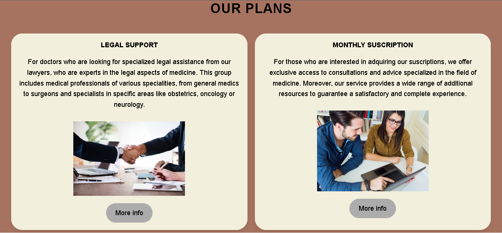
**Sección de contacto**: Se añadió la sección de contacto para facilitar la comunicación con los usuarios.

**Sección de Creadores**: Se agregaron secciones de información sobre los creadores del proyecto y un footer para la navegación y contacto.

Video Explicativo: https://upcedupe-my.sharepoint.com/:v:/g/personal/u201922146_upc_edu_pe/EQ4snKHPWYhHowHKJbvQWzIBLOZSsgR9XA3dIKyP3StIEw?e=IiwaMH&nav=eyJyZWZlcnJhbEluZm8iOnsicmVmZXJyYWxBcHAiOiJTdHJlYW1XZWJBcHAiLCJyZWZlcnJhbFZpZXciOiJTaGFyZURpYWxvZy1MaW5rIiwicmVmZXJyYWxBcHBQbGF0Zm9ybSI6IldlYiIsInJlZmVycmFsTW9kZSI6InZpZXcifX0%3D

### 5.2.1.6. Services Documentation Evidence for Sprint Review

### 5.2.1.7. Software Deployment Evidence for Sprint Review

Para el despliegue del Landing Page, hemos utilizado la herramienta de Github Pages para poder hacer un deployment. Para eso, hemos creado un repositorio donde hemos colocado el código de desarrollo de nuestra Landing Page.

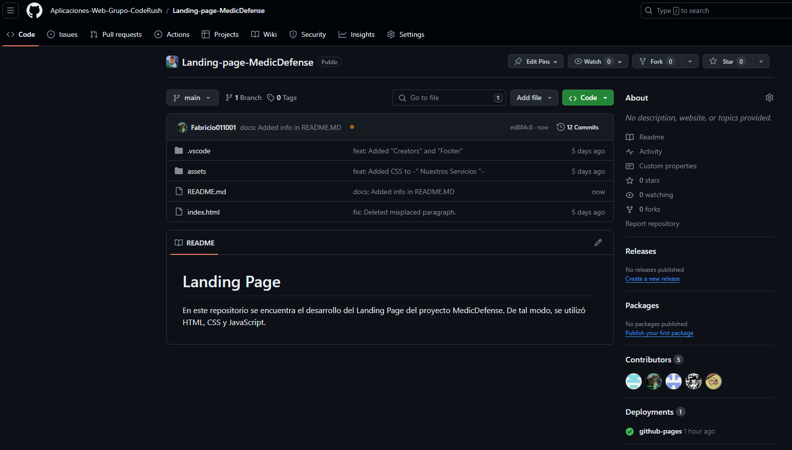

Una vez creado el repositorio, entraremos a configuración del repositorio y escogemos el apartado de Pages. Se coloca la información necesaria, como la fuente del branch a utilizar para realizar el deployment. Luego de eso, Github Pages nos brindará el link y desplegará nuestra landing page en la Web.

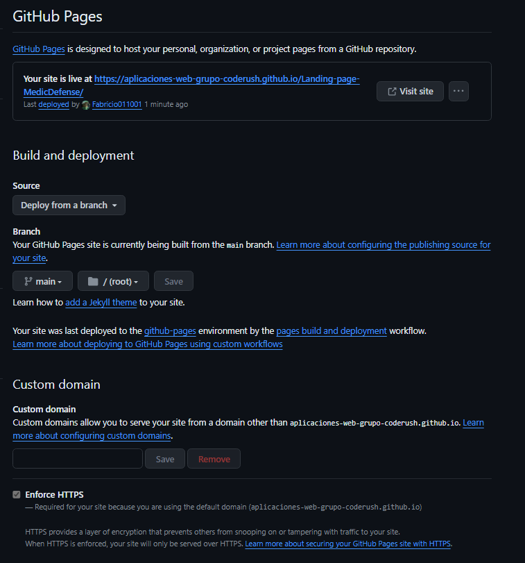

### 5.2.1.8. Team Collaboration Insights during Sprint

Para el desarrollo de este primer sprint, todos los miembros del equipo desarrollaron y colaboraron de manera activa y continua. De tal modo, se muestra como evidencia los insights de cada miembro del equipo.

Commits:

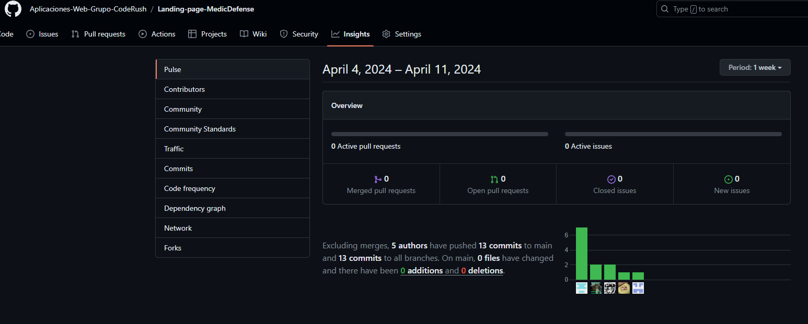

Analiticas de Colaboración:

### 5.2.2. Sprint 2

### 5.2.2.1. Sprint Planning 2

Para este segundo sprint nos enfocaremos en los tasks para la
elaboración de Frontend Web Application. Nos dividiremos entre nosotros cada
una de las tareas identificadas para el sprint.

<table>
<tr>
    <th colspan="5">Sprint #</th>
    <th colspan="9">Sprint 2</th>
  </tr>
      <tr>
    <td colspan="13">**Sprint Planning Background**</td>
  </tr>
  <tr>
    <td colspan="5">Date</td>
    <td colspan="8">2024-04-28</td>
</tr>
  <tr>
    <td colspan="5">Time</td>
    <td colspan="8">8:40 PM</td>
  </tr>
  <tr>
    <td colspan="5">Location</td>
    <td colspan="8">Via Discord y Google Meet</td>
<tr>
    <td colspan="5">Prepared By</td>
    <td colspan="8">Gabriel Garcia</td>
</tr>
<tr>
    <td colspan="5">Attendees (to planning meeting)</td>
    <td colspan="8">Gabriel Garcia, Diego Flores, Fabricio Apaza, Marcelo Renteria, Cesar Castilla</td>
</tr>
<tr>
    <td colspan="5">Sprint n – 2 Review Summary</td>
    <td colspan="8">En esta seccion se planteo el desarrollo la  primera version del frontend para nuestro proyecto llamado MedicDefense</td>
</tr>
<tr>
    <td colspan="5">Sprint n – 2 Retrospective Summary</td>
    <td colspan="8">En esta seccion todos los integrantes mencionaron tener aciertos en partes del codigo y en otras partes poder mejorar sus habilidades realizando el FrontEnd Web Application</td>
</tr>
<tr>
    <td colspan="13">**Sprint Goal & User Stories**</td>
</tr>
<tr>
    <td colspan="5">Sprint n Goal</td>
    <td colspan="8">Avance del FrontEnd Web Application</td>
</tr>
<tr>
    <td colspan="5">Sprint n Velocity</td>
    <td colspan="8">45 story points</td>
</tr>
<tr>
    <td colspan="5">Sum of Story Points</td>
    <td colspan="8">49 Story Points</td>
</tr>
</table>

### 5.2.2.2. Sprint Backlog 2

<table>
<tr>
    <th colspan="3">Sprint #</th>
    <th colspan="10">Sprint 2</th>
  </tr>
      <tr>
    <td colspan="3">User Story</td>
    <td colspan="10">Work-Item/Task</td>
  </tr>
  <tr>
    <td colspan="1">Id</td>
    <td colspan="2">Title</td>
    <td colspan="1">Id</td>
    <td colspan="2">Title</td>
    <td colspan="3">Description</td>
    <td colspan="1"> Estimation</td>
    <td colspan="2">Assigned To</td>
    <td colspan="1">Status(To-do /InProcess /To-Review /Done)</td>
</tr>
  <tr>
    <td colspan="1">26</td>
    <td colspan="2">Soporte para múltiples navegadores</td>
    <td colspan="1">1</td>
    <td colspan="2">Añadir soporte para múltiples navegadores</td>
    <td colspan="3">Como desarrollador, quiero garantizar la compatibilidad en múltiples navegadores, para una experiencia de usuario uniforme.</td>
    <td colspan="1">5</td>
    <td colspan="2">Gabriel</td>
    <td colspan="1">Done</td>
  </tr>
  <tr>
    <td colspan="1">27</td>
    <td colspan="2">Configuración de la base de datos</td>
    <td colspan="1">2</td>
    <td colspan="2">Configurar la base de datos como Fake-Api</td>
    <td colspan="3">Como usuario de la plataforma, confío en que se configure la base de datos de manera adecuada para garantizar la integridad y seguridad de la información de los abogados.</td>
    <td colspan="1">3</td>
    <td colspan="2">Gabriel</td>
    <td colspan="1">Done</td>
  </tr>
  <tr>
    <td colspan="1">28</td>
    <td colspan="2">Desarrollo del frontend para la lista de abogados</td>
    <td colspan="1">3</td>
    <td colspan="2">Añadir visualización de la lista de abogados</td>
    <td colspan="3">Como usuario de la plataforma, espero que se desarrolle el frontend para mostrar la lista de abogados de forma clara y que la interfaz sea amigable para facilitar la búsqueda.</td>
    <td colspan="1">3</td>
    <td colspan="2">Gabriel</td>
    <td colspan="1">Done</td>
  </tr>
  <tr>
    <td colspan="1">30</td>
    <td colspan="2">Integración del toolbar	</td>
    <td colspan="1">4</td>
    <td colspan="2">Añadir visualización del Toolbar</td>
    <td colspan="3">Como usuario de la plataforma, deseo tener un toolbar integrado que facilite la navegación entre las diferentes secciones de la aplicación.</td>
    <td colspan="1">3</td>
    <td colspan="2">Gabriel</td>
    <td colspan="1">Done</td>
  </tr>
  <tr>
    <td colspan="1">31</td>
    <td colspan="2">Implementación de la funcionalidad de búsqueda de abogados</td>
    <td colspan="1">5</td>
    <td colspan="2">Añadir Implementación de la funcionalidad de búsqueda de abogados</td>
    <td colspan="3">Como usuario de la plataforma, deseo tener una función de búsqueda en la página de lista de abogados para encontrar fácilmente profesionales por nombre o especialidad.	</td>
    <td colspan="1">3</td>
    <td colspan="2">Gabriel</td>
    <td colspan="1">Done</td>
  </tr>
  <tr>
    <td colspan="1">32</td>
    <td colspan="2">Implementación de la paginación de resultados</td>
    <td colspan="1">6</td>
    <td colspan="2">Añadir Implementación de la paginación de resultados</td>
    <td colspan="3">Como usuario de la plataforma, quiero que se agregue funcionalidad de paginación en la página de lista de abogados para facilitar la navegación cuando hay muchos resultados.	</td>
    <td colspan="1">3</td>
    <td colspan="2">Gabriel</td>
    <td colspan="1">Done</td>
  </tr>
  <tr>
    <td colspan="1">06</td>
    <td colspan="2">Perfil de abogado médico</td>
    <td colspan="1">7</td>
    <td colspan="2">Visualizar Perfil de abogado médico	</td>
    <td colspan="3">Como usuario, quiero poder acceder al perfil completo de un abogado específico al hacer clic en el botón "Perfil".	</td>
    <td colspan="1">2</td>
    <td colspan="2">Fabricio</td>
    <td colspan="1">Done</td>
  </tr>
  <tr>
    <td colspan="1">33</td>
    <td colspan="2">Implementar card que se superpone para mostrar perfiles de abogados</td>
    <td colspan="1">8</td>
    <td colspan="2">Añadir Implementacion de card que se superpone para mostrar perfiles de abogados</td>
    <td colspan="3">Como desarrollador quiero implementar un card que se superpone para mostrar los perfiles completos de los abogados seleccionados.	</td>
    <td colspan="1">3</td>
    <td colspan="2">Fabricio</td>
    <td colspan="1">Done</td>
  </tr>
  <tr>
    <td colspan="1">34</td>
    <td colspan="2">Implementar método para cargar información de abogado en el card que se superpone	</td>
    <td colspan="1">9</td>
    <td colspan="2">Añadir implementación de método para cargar información de abogado en el card que se superpone	</td>
    <td colspan="3">Como usuario de la plataforma, quiero que se implemente un método para cargar de manera fluida la información completa de un abogado seleccionado cuando visualizo su perfil.	</td>
    <td colspan="1">3</td>
    <td colspan="2">Fabricio</td>
    <td colspan="1">Done</td>
  </tr>
  <tr>
    <td colspan="1">35</td>
    <td colspan="2">Implementación de la Entidad de Usuario	</td>
    <td colspan="1">10</td>
    <td colspan="2">Añadir implementacion de la entidad de usuario</td>
    <td colspan="3">Como usuario de la plataforma, espero que se implemente una entidad de usuario para garantizar la gestión adecuada de mi información personal en el sistema.	</td>
    <td colspan="1">2</td>
    <td colspan="2">Cesar</td>
    <td colspan="1">Done</td>
  </tr>
  <tr>
    <td colspan="1">36</td>
    <td colspan="2">Diseño de la Sección de Perfil de Usuario</td>
    <td colspan="1">11</td>
    <td colspan="2">Añadir Diseño de la Sección de Perfil de Usuario </td>
    <td colspan="3">Como usuario de la plataforma, quiero una sección de perfil que me permita gestionar mi información personal de manera eficiente.	</td>
    <td colspan="1">3</td>
    <td colspan="2">Cesar</td>
    <td colspan="1">Done</td>
  </tr>
  <tr>
    <td colspan="1">37</td>
    <td colspan="2">Diseño de la Interfaz de Edición de Perfil de Usuario	</td>
    <td colspan="1">12</td>
    <td colspan="2">Añadir Diseño de la Interfaz de Edición de Perfil de Usuario	</td>
    <td colspan="3">Como usuario de la plataforma, quiero una interfaz de edición de perfil intuitiva que me permita modificar fácilmente los campos de mi perfil.	</td>
    <td colspan="1">5</td>
    <td colspan="2">Cesar</td>
    <td colspan="1">Done</td>
  </tr>
  <tr>
    <td colspan="1">39</td>
    <td colspan="2">Diseño de la sección Suscripciones</td>
    <td colspan="1">13</td>
    <td colspan="2">Añadir Diseño de la sección Suscripciones</td>
    <td colspan="3">Como desarrollador, quiero implementar la sección de suscripción para obtener ayuda legal en caso de cometer alguna negligencia médica, para estar protegido legalmente.	</td>
    <td colspan="1">3</td>
    <td colspan="2">Diego</td>
    <td colspan="1">Done</td>
  </tr>
  <tr>
    <td colspan="1">40</td>
    <td colspan="2">Diseño de la interfaz Suscripciones</td>
    <td colspan="1">14</td>
    <td colspan="2">Añadir Diseño de la interfaz Suscripciones</td>
    <td colspan="3">Como usuario de la plataforma, quiero una sección de suscripción que me brinde la posibilidad de obtener ayuda legal en caso de cometer alguna negligencia médica, para sentirme protegido legalmente.	</td>
    <td colspan="1">2</td>
    <td colspan="2">Diego</td>
    <td colspan="1">Done</td>
  </tr>
  <tr>
    <td colspan="1">41</td>
    <td colspan="2">Diseño de la interfaz de pago Suscripciones</td>
    <td colspan="1">15</td>
    <td colspan="2">Añadir Diseño de la interfaz de pago Suscripciones</td>
    <td colspan="3">Como usuario de la plataforma, quiero una interfaz donde pueda ver claramente los detalles de mi suscripción actual, para tener acceso rápido a la información sobre mi plan seleccionado.</td>
    <td colspan="1">3</td>
    <td colspan="2">Diego</td>
    <td colspan="1">Done</td>
  </tr>
  <tr>
    <td colspan="1">03</td>
    <td colspan="2">Visualizar actividades del Usuario</td>
    <td colspan="1">16</td>
    <td colspan="2">Añadir Visualización de actividades del Usuario</td>
    <td colspan="3">Como usuario de la plataforma de MedicDefense,quiero visualizar la lista de las actividades que realizo para tener un control y orden en las acciones que realizo.	</td>
    <td colspan="1">3</td>
    <td colspan="2">Marcelo</td>
    <td colspan="1">Done</td>
  </tr>
</table>

### 5.2.2.3. Development Evidence for Sprint Review

<table>
    <tr>
        <th colspan="2">Repository</th>
        <th colspan="2">Branch</th>
        <th colspan="2">Commit Id</th>
        <th colspan="2">Commit Message</th>
        <th colspan="2">Commit Message Body</th>
        <th colspan="2">Commited on (Date)</th>
    </tr>
        <tr>
        <td colspan="2">Aplicaciones-Web-Grupo-CodeRush/Landing-page-MedicDefense</td>
        <td colspan="2">Develop</td>
        <td colspan="2">5a902ceb2b8fc480cb3c3fad05cb4ea6d1656ac1</td>
        <td colspan="2">feat: added lawyers.entity
</td>
        <td colspan="2">-</td>
        <td colspan="2">1/05/24</td>
    </tr>
        <tr>
        <td colspan="2">Aplicaciones-Web-Grupo-CodeRush/Landing-page-MedicDefense</td>
        <td colspan="2">Develop</td>
        <td colspan="2">1a3a5a54820e5c0c10687b280f43c6988d564f62</td>
        <td colspan="2">feat(lawyerlist): added lawyer-list component.</td>
        <td colspan="2">-</td>
        <td colspan="2">1/05/24</td>
    </tr>
    <tr>
        <td colspan="2">Aplicaciones-Web-Grupo-CodeRush/Landing-page-MedicDefense</td>
        <td colspan="2">Develop</td>
        <td colspan="2">c3520a7f63f736d4bb629967a64435b20026786b</td>
        <td colspan="2">feat(main-view): implemented main view within navigation.</td>
        <td colspan="2">-</td>
        <td colspan="2">1/05/24</td>
    </tr>
    <tr>
        <td colspan="2">Aplicaciones-Web-Grupo-CodeRush/Landing-page-MedicDefense</td>
        <td colspan="2">Develop</td>
        <td colspan="2">7926d1c6de5f70e87e9d8d37976fc53cd1970897</td>
        <td colspan="2">feat(lawyer-list): added dependencies with lawyer profile</td>
        <td colspan="2">-</td>
        <td colspan="2">1/05/24</td>
    </tr>
    <tr>
        <td colspan="2">Aplicaciones-Web-Grupo-CodeRush/Landing-page-MedicDefense</td>
        <td colspan="2">Develop</td>
        <td colspan="2">b6c5ad6556800b554a9b404695d1deceffa969ae</td>
        <td colspan="2">feat(lawyer-profile): implemented lawyer profile view with navigation</td>
        <td colspan="2">-</td>
        <td colspan="2">1/05/24</td>
    </tr>
    <tr>
        <td colspan="2">Aplicaciones-Web-Grupo-CodeRush/Landing-page-MedicDefense</td>
        <td colspan="2">Develop</td>
        <td colspan="2">c711a4b78d12f212e76d120aaa76cff23238cd84</td>
        <td colspan="2">feat(subscription): added subscription component.</td>
        <td colspan="2">-</td>
        <td colspan="2">1/05/24</td>
    </tr>
    <tr>
        <td colspan="2">Aplicaciones-Web-Grupo-CodeRush/Landing-page-MedicDefense</td>
        <td colspan="2">Develop</td>
        <td colspan="2">e3bc57c85021126f22eccbe676016e8bc495c462</td>
        <td colspan="2">feat(subscription-pay): added subscription pay component.</td>
        <td colspan="2">-</td>
        <td colspan="2">1/05/24</td>
    </tr>
    <tr>
        <td colspan="2">Aplicaciones-Web-Grupo-CodeRush/Landing-page-MedicDefense</td>
        <td colspan="2">Develop</td>
        <td colspan="2">ac223cb670df90559da08d292bf2c2b2931b208a</td>
        <td colspan="2">feat(profile-user): added profile-user component</td>
        <td colspan="2">-</td>
        <td colspan="2">1/05/24</td>
    </tr>
    <tr>
        <td colspan="2">Aplicaciones-Web-Grupo-CodeRush/Landing-page-MedicDefense</td>
        <td colspan="2">Develop</td>
        <td colspan="2">19dfb1110d3a2fa352ac182190aa86c6b9ae5476</td>
        <td colspan="2">feat: add profile user component</td>
        <td colspan="2">-</td>
        <td colspan="2">1/05/24</td>
    </tr>
    <tr>
        <td colspan="2">Aplicaciones-Web-Grupo-CodeRush/Landing-page-MedicDefense</td>
        <td colspan="2">Develop</td>
        <td colspan="2">8460d76f1dbca5da71c88d2a8f4f8b391d695929</td>
        <td colspan="2">feat(review): Added review list component.</td>
        <td colspan="2">-</td>
        <td colspan="2">1/05/24</td>
    </tr>
</table>

### 5.2.2.4. Testing Suite Evidence for Sprint Review
<table>
    <tr>
        <th colspan="2">Repository</th>
        <th colspan="2">Branch</th>
        <th colspan="2">Commit Id</th>
        <th colspan="2">Commit Message</th>
        <th colspan="2">Commit Message Body</th>
        <th colspan="2">Commited on (Date)</th>
    </tr>
        <tr>
        <td colspan="2">Aplicaciones-Web-Grupo-CodeRush/Landing-page-MedicDefense</td>
        <td colspan="2">Develop</td>
        <td colspan="2">5a902ceb2b8fc480cb3c3fad05cb4ea6d1656ac1</td>
        <td colspan="2">feat: added lawyers.entity
</td>
        <td colspan="2">-</td>
        <td colspan="2">1/05/24</td>
    </tr>
        <tr>
        <td colspan="2">Aplicaciones-Web-Grupo-CodeRush/Landing-page-MedicDefense</td>
        <td colspan="2">Develop</td>
        <td colspan="2">1a3a5a54820e5c0c10687b280f43c6988d564f62</td>
        <td colspan="2">feat(lawyerlist): added lawyer-list component.</td>
        <td colspan="2">-</td>
        <td colspan="2">1/05/24</td>
    </tr>
    <tr>
        <td colspan="2">Aplicaciones-Web-Grupo-CodeRush/Landing-page-MedicDefense</td>
        <td colspan="2">Develop</td>
        <td colspan="2">c3520a7f63f736d4bb629967a64435b20026786b</td>
        <td colspan="2">feat(main-view): implemented main view within navigation.</td>
        <td colspan="2">-</td>
        <td colspan="2">1/05/24</td>
    </tr>
    <tr>
        <td colspan="2">Aplicaciones-Web-Grupo-CodeRush/Landing-page-MedicDefense</td>
        <td colspan="2">Develop</td>
        <td colspan="2">7926d1c6de5f70e87e9d8d37976fc53cd1970897</td>
        <td colspan="2">feat(lawyer-list): added dependencies with lawyer profile</td>
        <td colspan="2">-</td>
        <td colspan="2">1/05/24</td>
    </tr>
    <tr>
        <td colspan="2">Aplicaciones-Web-Grupo-CodeRush/Landing-page-MedicDefense</td>
        <td colspan="2">Develop</td>
        <td colspan="2">b6c5ad6556800b554a9b404695d1deceffa969ae</td>
        <td colspan="2">feat(lawyer-profile): implemented lawyer profile view with navigation</td>
        <td colspan="2">-</td>
        <td colspan="2">1/05/24</td>
    </tr>
    <tr>
        <td colspan="2">Aplicaciones-Web-Grupo-CodeRush/Landing-page-MedicDefense</td>
        <td colspan="2">Develop</td>
        <td colspan="2">c711a4b78d12f212e76d120aaa76cff23238cd84</td>
        <td colspan="2">feat(subscription): added subscription component.</td>
        <td colspan="2">-</td>
        <td colspan="2">1/05/24</td>
    </tr>
    <tr>
        <td colspan="2">Aplicaciones-Web-Grupo-CodeRush/Landing-page-MedicDefense</td>
        <td colspan="2">Develop</td>
        <td colspan="2">e3bc57c85021126f22eccbe676016e8bc495c462</td>
        <td colspan="2">feat(subscription-pay): added subscription pay component.</td>
        <td colspan="2">-</td>
        <td colspan="2">1/05/24</td>
    </tr>
    <tr>
        <td colspan="2">Aplicaciones-Web-Grupo-CodeRush/Landing-page-MedicDefense</td>
        <td colspan="2">Develop</td>
        <td colspan="2">ac223cb670df90559da08d292bf2c2b2931b208a</td>
        <td colspan="2">feat(profile-user): added profile-user component</td>
        <td colspan="2">-</td>
        <td colspan="2">1/05/24</td>
    </tr>
    <tr>
        <td colspan="2">Aplicaciones-Web-Grupo-CodeRush/Landing-page-MedicDefense</td>
        <td colspan="2">Develop</td>
        <td colspan="2">19dfb1110d3a2fa352ac182190aa86c6b9ae5476</td>
        <td colspan="2">feat: add profile user component</td>
        <td colspan="2">-</td>
        <td colspan="2">1/05/24</td>
    </tr>
    <tr>
        <td colspan="2">Aplicaciones-Web-Grupo-CodeRush/Landing-page-MedicDefense</td>
        <td colspan="2">Develop</td>
        <td colspan="2">8460d76f1dbca5da71c88d2a8f4f8b391d695929</td>
        <td colspan="2">feat(review): Added review list component.</td>
        <td colspan="2">-</td>
        <td colspan="2">1/05/24</td>
    </tr>
</table>

### 5.2.2.5. Execution Evidence for Sprint Review

Para esta segunda entrega, nuestro equipo a conseguido elaborar la primera versión de Frontend Web Application del proyecto "MedicDefense". De tal modo, se podrá visualizar la información necesaria de lo que ofrece nuestro proyecto.

**Lista de Abogados y Toolbar:**

**Perfil Abogado:**

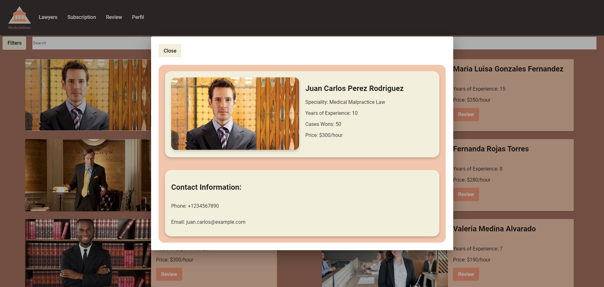

**Busqueda Abogados:**

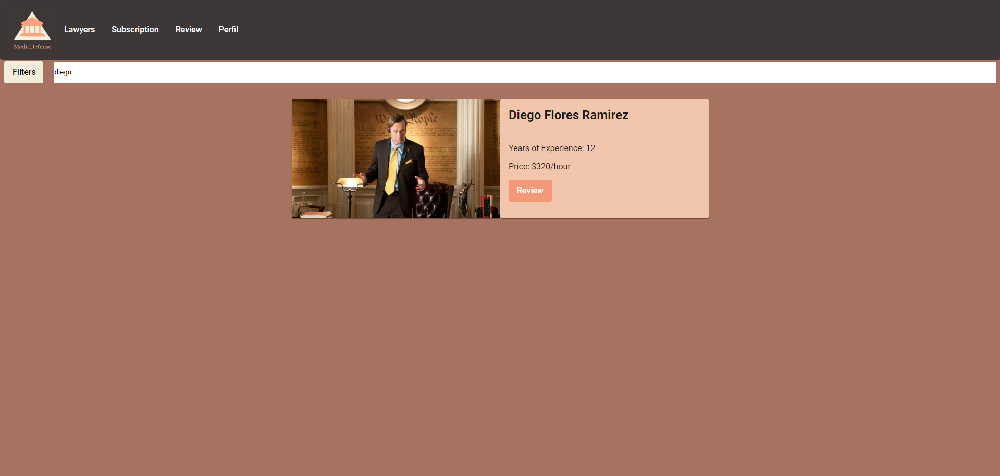

**Sección Suscripción:**

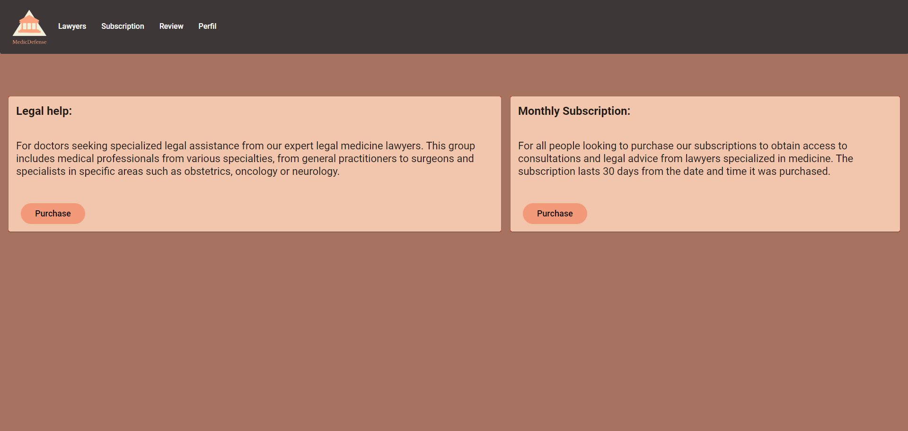

**Suscripción Pago:**

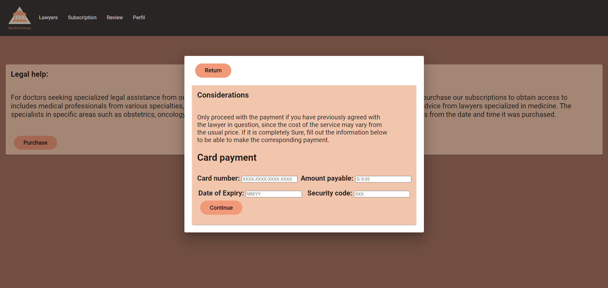

**Sección Perfil Usuario:**

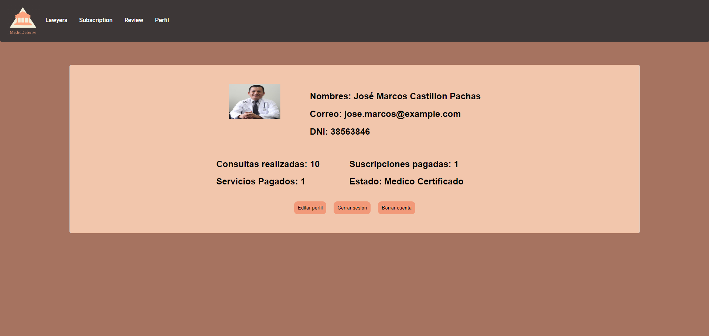

**Sección Resumen:**

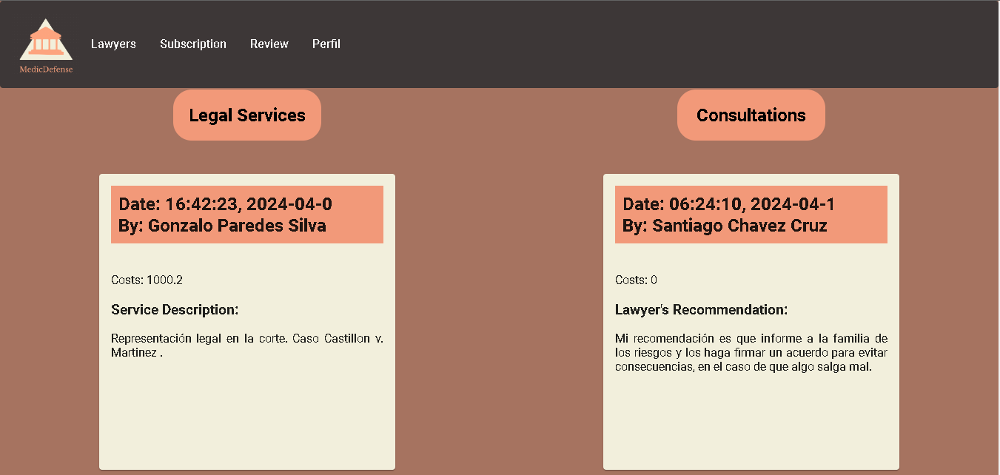

**Enlace al video de Evidencia:** https://upcedupe-my.sharepoint.com/:v:/g/personal/u201922146_upc_edu_pe/EaHLohGbAkZFhhbRy31NFhMBFDwinPOpdOT29ApoGxUt9A?nav=eyJyZWZlcnJhbEluZm8iOnsicmVmZXJyYWxBcHAiOiJTdHJlYW1XZWJBcHAiLCJyZWZlcnJhbFZpZXciOiJTaGFyZURpYWxvZy1MaW5rIiwicmVmZXJyYWxBcHBQbGF0Zm9ybSI6IldlYiIsInJlZmVycmFsTW9kZSI6InZpZXcifX0%3D&e=8xeAhH

### 5.2.2.6. Services Documentation Evidence for Sprint Review

Durante este sprint, se ha desarrollado una Fake API de abogados que proporciona información sobre abogados ficticios. La API incluye detalles como el nombre del abogado, años de experiencia, especialización, casos ganados, tarifa por hora, correo electrónico y número de teléfono.

<table>
  <tr>
    <th>Endpoint</th>
    <th>Acción</th>
    <th>Verbo HTTP</th>
    <th>Sintaxis de Llamada</th>
    <th>Parámetros</th>
    <th>Ejemplo de Llamada</th>
    <th>Explicación del Response</th>
  </tr>
  <tr>
    <td>/lawyers</td>
    <td>Listar</td>
    <td>GET</td>
    <td>/api/lawyers</td>
    <td>-</td>
    <td>GET /api/lawyers</td>
    <td>200 OK: Devuelve una lista de todos los abogados.</td>
  </tr>
  <tr>
    <td>/lawyers</td>
    <td>Obtener	</td>
    <td>GET</td>
    <td>/api/lawyers/{id}</td>
    <td>ID del abogado</td>
    <td>GET /api/lawyers/1</td>
    <td>200 OK: Devuelve los detalles del abogado con el ID especificado.</td>
  </tr>
  <tr>
    <td>/users</td>
    <td>Obtener</td>
    <td>GET</td>
    <td>/api/users/{id}</td>
    <td>Id de usuario</td>
    <td>GET /api/users/1</td>
    <td>200 OK: Devuelve los detalles del user con el ID especificado.</td>
  </tr>
  <tr>
    <td>/reviews</td>
    <td>Listar</td>
    <td>GET</td>
    <td>/api/reviews</td>
    <td>-</td>
    <td>GET /api/reviews</td>
    <td>200 OK: Devuelve una lista de todos los reviews.</td>
  </tr>
</table>

**Capturas de interaccion:** 

Edpoint Lawyers:

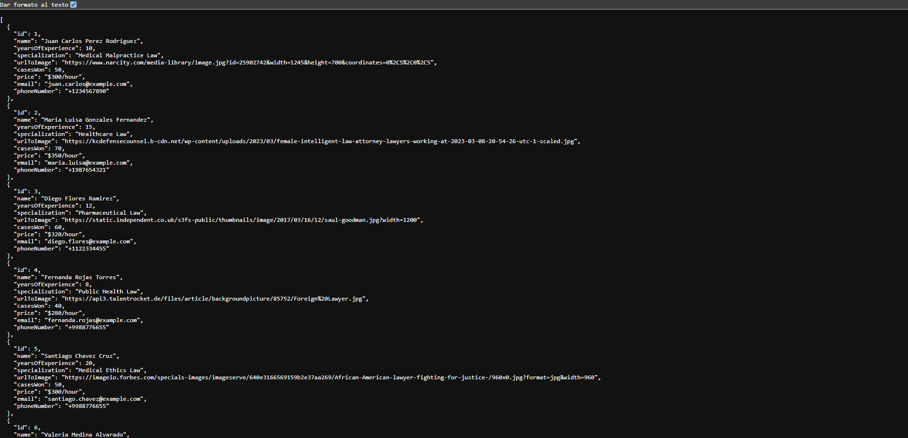

Endpoint Users:

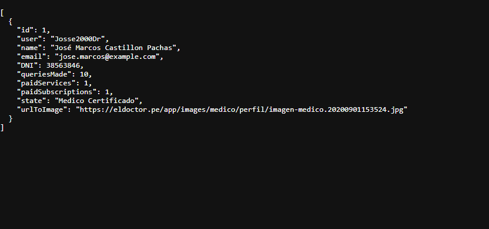

Endpoint Reviews:

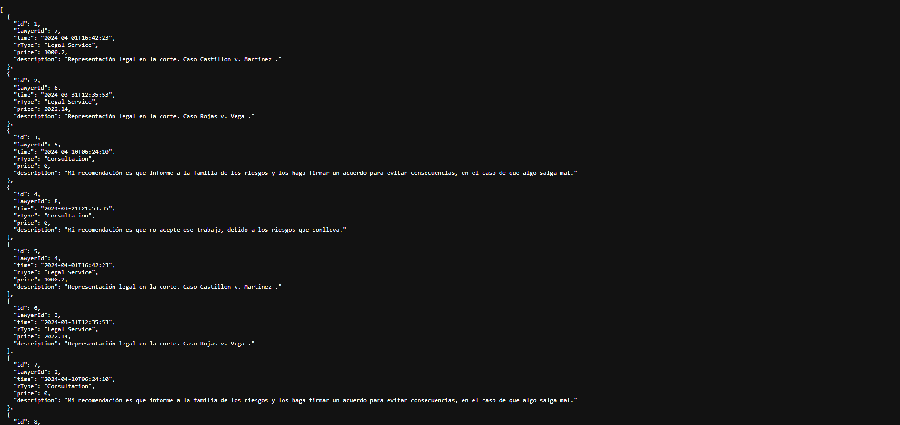

**Url del repositorio:**

Enlace al repositorio del Fake-Api: https://github.com/Aplicaciones-Web-Grupo-CodeRush/Consultation

Enlace del Endpoint de Lawyers: https://my-json-server.typicode.com/Aplicaciones-Web-Grupo-CodeRush/Consultation/lawyers

Enlace del Endpoint de Users: https://my-json-server.typicode.com/Aplicaciones-Web-Grupo-CodeRush/Consultation/users

Enlace del Endpoint de Reviews: https://my-json-server.typicode.com/Aplicaciones-Web-Grupo-CodeRush/Consultation/reviews

**Commits relacionados:**

<table>
    <tr>
        <th colspan="2">Repository</th>
        <th colspan="2">Branch</th>
        <th colspan="2">Commit Id</th>
        <th colspan="2">Commit Message</th>
    </tr>
        <tr>
        <td colspan="2">Aplicaciones-Web-Grupo-CodeRush/Landing-page-MedicDefense</td>
        <td colspan="2">Develop</td>
        <td colspan="2">4a874c69127c181a451c8fef31dd114ba04f7baf</td>
        <td colspan="2">feat: Lawyers Database.</td>
    </tr>
        <tr>
        <td colspan="2">Aplicaciones-Web-Grupo-CodeRush/Landing-page-MedicDefense</td>
        <td colspan="2">Develop</td>
        <td colspan="2">4310676715ba26e7d7cd15213779fb0460e76803</td>
        <td colspan="2">feat: Users Database.
</td>
    </tr>
    </tr>
        <tr>
        <td colspan="2">Aplicaciones-Web-Grupo-CodeRush/Landing-page-MedicDefense</td>
        <td colspan="2">Develop</td>
        <td colspan="2">e84c20b205e07a15c2ed28275007dd5a7d07c6e8</td>
        <td colspan="2">feat: Added Reviews database.</td>
    </tr>
    </tr>
        <tr>
        <td colspan="2">Aplicaciones-Web-Grupo-CodeRush/Landing-page-MedicDefense</td>
        <td colspan="2">Develop</td>
        <td colspan="2">2c6e78ac8351076f81bb30cd9e0db34bdad85547</td>
        <td colspan="2">feat: Users Database</td>
    </tr>
</table>    

### 5.2.2.7. Software Deployment Evidence for Sprint Review
Para el despliegue de la primera version del Frontend Web Application hemos utilizado la plataforma de terceros llamada Netlify. Esta plataforma nos permite el facil acceso a nuestro repositorio de Github, el cual por medio de ciertas configuraciones podemos tener como resultado el despliegue de nuestra primera version del Frontend Web Application.

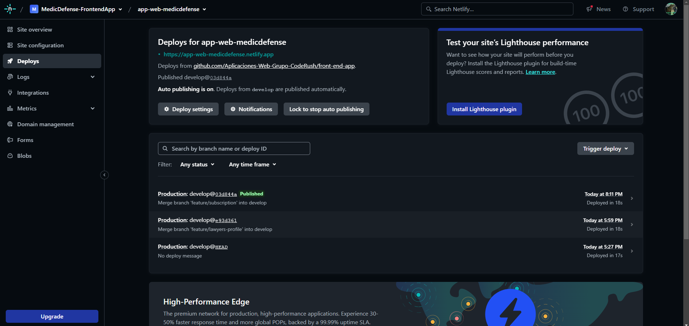

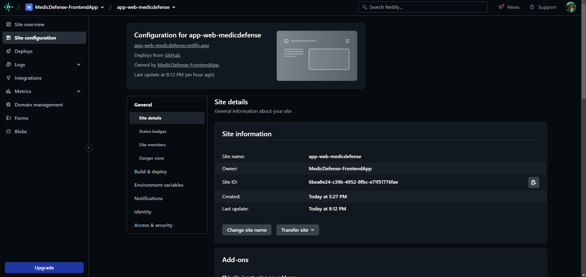

### 5.2.2.8. Team Collaboration Insights during Sprint

Para el desarrollo de este segundo sprint, todos los miembros del equipo desarrollaron y colaboraron de manera activa y continua. De tal modo, se muestra como evidencia los insights de cada miembro del equipo.

**Commits:**

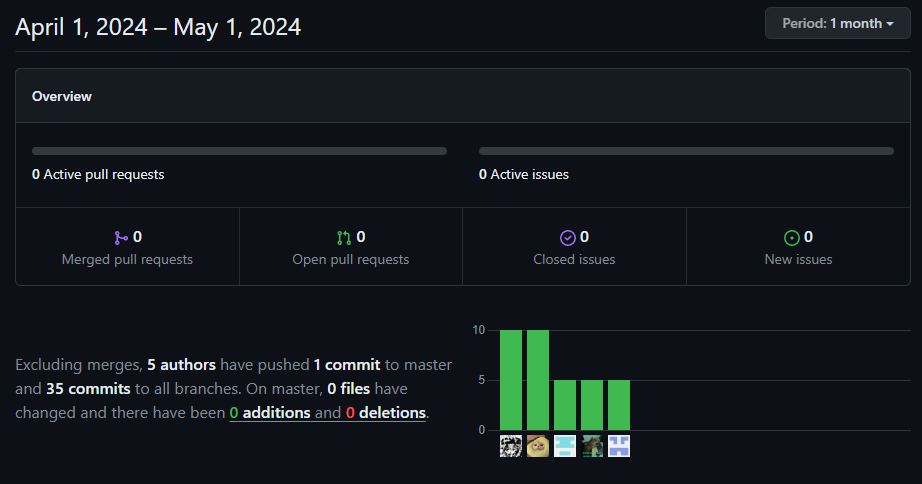

**Network Graph:**

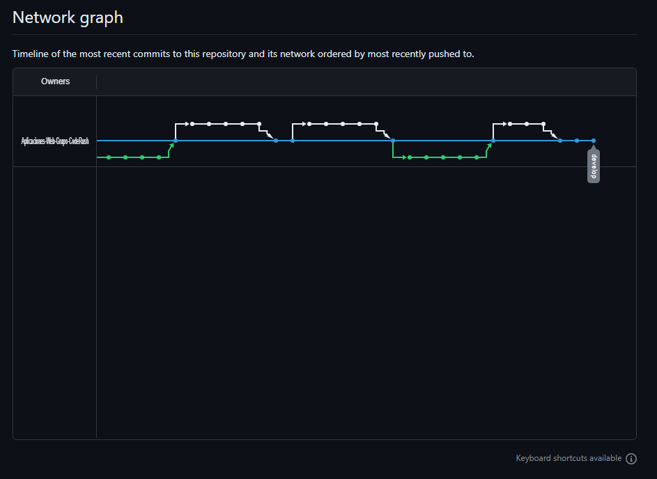

### 5.2.3. Sprint 3

### 5.2.3.1. Sprint Planning 3

<table>
<tr>
    <th colspan="5">Sprint #</th>
    <th colspan="9">Sprint 3</th>
  </tr>
      <tr>
    <td colspan="13">Sprint Planning Background</td>
  </tr>
  <tr>
    <td colspan="5">Date</td>
    <td colspan="8">2024-06-05</td>
</tr>
  <tr>
    <td colspan="5">Time</td>
    <td colspan="8">4:20 PM</td>
  </tr>
  <tr>
    <td colspan="5">Location</td>
    <td colspan="8">Via Discord y Google Meet</td>
<tr>
    <td colspan="5">Prepared By</td>
    <td colspan="8">Gabriel Garcia</td>
</tr>
<tr>
    <td colspan="5">Attendees (to planning meeting)</td>
    <td colspan="8">Gabriel Garcia, Diego Flores, Fabricio Apaza, Marcelo Renteria, Cesar Castilla</td>
</tr>
<tr>
    <td colspan="5">Sprint n – 3 Review Summary</td>
    <td colspan="8">En esta seccion se planteo el desarrollo de los Web Services para nuestro proyecto llamado MedicDefense</td>
</tr>
<tr>
    <td colspan="5">Sprint n – 3 Retrospective Summary</td>
    <td colspan="8">En esta seccion todos los integrantes mencionaron tener aciertos en algunas partes del codigo desarrollado. Sin embargo, se pudo hacer un concenso, y a la vez, mejoramos nuestras habilidades realizando el Web Services</td>
</tr>
<tr>
    <td colspan="13">Sprint Goal & User Stories</td>
</tr>
<tr>
    <td colspan="5">Sprint n Goal</td>
    <td colspan="8">Desplegar la primera version de Web Services.</td>
</tr>
<tr>
    <td colspan="5">Sprint n Velocity</td>
    <td colspan="8">X story points</td>
</tr>
<tr>
    <td colspan="5">Sum of Story Points</td>
    <td colspan="8">X Story Points</td>
</tr>
</table>

## 5.3. Conclusiones

1. Existe una clara necesidad en el mercado médico de servicios especializados en asesoramiento legal y oportunidades laborales específicas en el campo de la anestesiología. La falta de acceso a expertos legales especializados y recursos para una defensa adecuada crea un ambiente de incertidumbre y estrés para los médicos que enfrentan desafíos legales, lo que afecta negativamente su bienestar emocional, su calidad de atención médica y la confianza del paciente. Esta necesidad presenta una oportunidad para la startup de llenar este vacío en el mercado, proporcionando una plataforma tecnológica que conecte a médicos, estudiantes y profesionales del peritaje en anestesiología con peritos, recursos educativos y oportunidades laborales.

2. La estrategia de la startup, que incluye ofrecer opciones de suscripción flexibles y asequibles, establecer asociaciones estratégicas con instituciones médicas y empresas del sector de la salud, y optimizar la experiencia de usuario, está diseñada para abordar las necesidades identificadas en el mercado y lograr el éxito comercial. Al centrarse en proporcionar un valor significativo a los usuarios a través de servicios especializados, contenido de alta calidad y una experiencia de usuario excepcional, la startup puede diferenciarse de la competencia y establecerse como líder en el mercado de servicios de anestesiología.

## 5.4 Anexos

**Vídeo de Exposición:**
*TB1:*
https://upcedupe-my.sharepoint.com/:v:/g/personal/u201922146_upc_edu_pe/EToKgX1-b79Gl24DN7O6NvcB9bgYmvifhVFbTGhN1dOhqQ?e=vIhEvy&nav=eyJyZWZlcnJhbEluZm8iOnsicmVmZXJyYWxBcHAiOiJTdHJlYW1XZWJBcHAiLCJyZWZlcnJhbFZpZXciOiJTaGFyZURpYWxvZy1MaW5rIiwicmVmZXJyYWxBcHBQbGF0Zm9ybSI6IldlYiIsInJlZmVycmFsTW9kZSI6InZpZXcifX0%3D 

## 5.5 Bibliografia

- Tuesta, P(2023). _Existe un déficit de 2417 médicos anestesiólogos en 20 regiones del país_. Convoca.pe. Recuperado de: https://convoca.pe/agenda-propia/existe-un-deficit-de-2417-medicos-anestesiologos-en-20-regiones-del-pais

- Conne, M(2024). _The Markdown Guide_. MarkdownGuide. Recuperado de: https://www.markdownguide.org/

- Gothelf, J (2016). _Lean UX, 2nd Edition_. O'reilly. Recuperado de: https://learning.oreilly.com/library/view/lean-ux-2nd/9781491953594/foreword01.html
