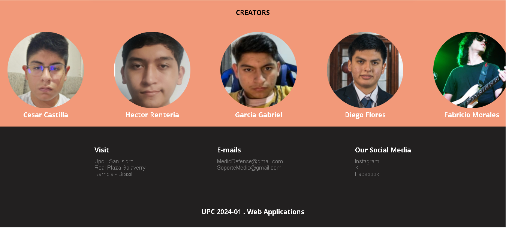

# Capítulo V: Product Implementation, Validation & Deployment

## 5.1. Software Configuration Management

En esta sección se resume toda la información recopilada, analizando el codigo que utilizamos y la arquitectura y principios de ingenieria que empleamos a lo largo de nuestro trabajo

### 5.1.1. Software Development Environment Configuration

En la siguiente sección se describe la ruta de referencia de cada uno de los productos de software para que cualquier miembro del equipo pueda desarrollar cada punto del trabajo.

- **UXPressia:** Plataforma que nos permitirá crear los user stories y también realizar múltiples mapas para evaluar sus prioridades. Además, ofrece opciones gráficas para mejorar el aspecto de nuestro trabajo. Puedes acceder a la plataforma en el siguiente enlace: [UXPressia](https://www.uxpressia.com/)
- **Figma:** Herramienta colaborativa que nos permitirá desarrollar los respectivos Wireframes y Mockups de nuestra Landing Page. Se puede acceder a la plataforma en el siguiente enlace: [Figma](https://www.figma.com/).
- **Vertabelo:** Plataforma que nos permitirá crear nuestro Diagrama de Base de Datos. Se puede acceder a la plataforma en el siguiente enlace: [Vertabelo](https://www.vertabelo.com/).
- **LucidChart:** Aplicación web destinada a la elaboración de Wireflows, Lean UX Canvas, User Flows y Diagramas de clases. Se puede acceder a la plataforma en el siguiente enlace: [LucidChart](https://www.lucidchart.com/).
- **GitHub:** Repositorio colaborativo en la nube utilizado para almacenar los avances de nuestro proyecto. Se puede acceder a la plataforma en el siguiente enlace: [Github](https://github.com/).
- **Visual Studio Code:** Entorno de desarrollo utilizado por nuestro equipo para el desarrollo del proyecto en general, incluido el Informe. Se puede acceder a la plataforma en el siguiente enlace: [Visual Studio Code](https://code.visualstudio.com/).
- **GitHub Pages:** Plataforma que permite hacer deployments sencillos y rápidos para nuestras páginas web. Se puede acceder a la plataforma en el siguiente enlace: [Github Pages](https://pages.github.com/).

- **HTML5:** Lenguaje para la elaboración de nuestra página web.
- **CSS3:** Tecnología para darle estilos a nuestra página web.
- **JavaScript:** Lenguaje de programación orientado a objetos que nos sirvió para implementar funcionalidades en nuestra Landing Page.

### 5.1.2. Source Code Management

Para gestionar las modificaciones en nuestro proyecto, emplearemos GitHub como plataforma y sistema de control de versiones. A continuación, se detallan los repositorios de GitHub para cada uno de nuestros productos:

- Organización del Equipo: https://github.com/Aplicaciones-Web-Grupo-CodeRush
- Repositorio del Informe: https://github.com/Aplicaciones-Web-Grupo-CodeRush/Informe-Final
- Repositorio del Landing Page: https://github.com/Aplicaciones-Web-Grupo-CodeRush/Landing-page-MedicDefense
- Enlace del Landing Page: https://aplicaciones-web-grupo-coderush.github.io/Landing-page-MedicDefense/
- Repositorio del Front-End: https://github.com/Aplicaciones-Web-Grupo-CodeRush/front-end-app
  -Enlace del FrontEndWebApp: https://app-web-medicdefense.netlify.app/

Para estructurar nuestro control de versiones, implementaremos el modelo GitFlow como nuestro flujo de trabajo estándar. Esto implicará la creación de las siguientes ramas, además de la rama principal (main):

- Develop Branch: Esta rama contendrá el código en desarrollo y servirá como base para la integración de nuevas funcionalidades.
- Feature Branches: Cada nueva característica que se implemente requerirá su propio branch. Utilizaremos la convención de nombrar los branches de características como "feature/nombre-de-la-caracteristica".
- Release Branches: Antes de lanzar una nueva versión, crearemos una rama de release para realizar pruebas finales y correcciones.
- Hotfix Branches: En caso de surgir problemas en el desarrollo, se crearán branches de hotfix para poder solucionarlos sin afectar la rama principal.

Además, seguiremos el estándar establecido por Conventional Commits para asegurar una estructura clara y consistente en nuestros Commits, facilitando la colaboración y la comprensión del historial de versiones en nuestro equipo.

### 5.1.3. Source Code Style Guide & Conventions

A continuación, se detallan las referencias y convenciones que adoptaremos para programar en los diferentes lenguajes utilizados en nuestro proyecto:

Utilizaremos las siguientes referencias para establecer nuestras convenciones.

1. **HTML**:

- "HTML Style Guide and Coding Conventions"
- "Google HTML/CSS Style Guide"

2. **CSS**:

- "Google HTML/CSS Style Guide"

3. **JavaScript**:

- "Google JavaScript Style Guide"
- "MDN JavaScript guidelines"
- "W3C JavaScript Style Guide"
- "Vue Style Guide".

4. **C#**:

- "C# Coding Conventions"
- "Microsoft ASP.NET Core Coding Guidelines".

5. **Gherkin**:

- "Gherkin Conventions for Readable Specifications".

Es importante destacar que todas las convenciones y referencias mencionadas están en inglés, siguiendo las prácticas comunes en el desarrollo de software. De tal modo que, al seguir estas referencias nos ayudará a mantener un código claro, coherente y fácilmente comprensible para todo el equipo de desarrollo.

### 5.1.4. Software Deployment Configuration

Para desplegar nuestra landing page en la plataforma de GitHub, seguimos los siguientes pasos:

1. Creación del Repositorio Remoto en GitHub:

- Creamos un nuevo repositorio en GitHub de nuestro proyecto, el cual se utilizará para el desarrollo y deployment.

2. Inicialización del Repositorio:

- Se utilza el comando "_git init_" para inicializar el repositorio.

3. Subida de Archivos al Repositorio Remoto:

- Añadimos los archivos de nuestra landing page al repositorio local.
- Subimos los archivos al repositorio de GitHub con el comando "_git push -u origin master_" o sino utilizando Github Desktop.

4. Configuración de GitHub Pages:

- Accedemos a la sección de configuración del repositorio en GitHub y entramos al apartado de Github Pages.
- Seleccionamos la rama de GitHub Pages (main) como fuente para el deployment de nuestra Landing Page

5. Despliegue:

- Accedemos a la URL proporcionada por GitHub Pages para verificar que nuestra landing page se haya desplegado correctamente.

De tal modo, nuestra Landing Page estará inicializada utilizando Github Pages y podrá ser visible para cualquier usuario que tenga el enlace.
Enlace del Landing Page: https://aplicaciones-web-grupo-coderush.github.io/Landing-page-MedicDefense/

Para desplegar el primer avance del FrontEnd Web Application se utilizó la plataforma Netlify.

1. Selecciona GitHub como proveedor de Git y autorizamos a Netlify para acceder a tus repositorios.

2. Elegimos el repositorio que contiene el proyecto de Angular.

3. Configura las opciones de compilación:

- Comando de compilación: ng build --prod
- Directorio de publicación: dist/frontendApp
- Hacemos clic en "Deploy site" para iniciar el proceso de despliegue.

4. Netlify compilará y desplegará automáticamente el proyecto Angular.

- Una vez que el despliegue esté completo, nos proporcionará una URL para el sitio.

Enlace de la primera version del Frontend App: https://app-web-medicdefense.netlify.app/

## 5.2. Landing Page, Services & Applications Implementation

En esta sección se explicará y evidenciará el proceso de implementación, pruebas,
documentación y despliegue del Landing Page.

### 5.2.1. Sprint 1

### 5.2.1.1. Sprint Planning 1

<table>
<tr>
    <th colspan="5">Sprint #</th>
    <th colspan="9">Sprint 1</th>
  </tr>
      <tr>
    <td colspan="13">Sprint Planning Background</td>
  </tr>
  <tr>
    <td colspan="5">Date</td>
    <td colspan="8">2024-04-11</td>
</tr>
  <tr>
    <td colspan="5">Time</td>
    <td colspan="8">11:30 PM</td>
  </tr>
  <tr>
    <td colspan="5">Location</td>
    <td colspan="8">Via Discord y Google Meet</td>
<tr>
    <td colspan="5">Prepared By</td>
    <td colspan="8">Gabriel Garcia</td>
</tr>
<tr>
    <td colspan="5">Attendees (to planning meeting)</td>
    <td colspan="8">Gabriel Garcia, Diego Flores, Fabricio Apaza, Marcelo Renteria, Cesar Castilla</td>
</tr>
<tr>
    <td colspan="5">Sprint n – 1 Review Summary</td>
    <td colspan="8">En esta seccion se planteo el desarrollo del landing page para nuestro proyecto llamado MedicDefense</td>
</tr>
<tr>
    <td colspan="5">Sprint n – 1 Retrospective Summary</td>
    <td colspan="8">En esta seccion todos los integrantes mencionaron tener aciertos en partes del codigo y en otras partes poder mejorar sus habilidades realizando landing pages</td>
</tr>
<tr>
    <td colspan="13">Sprint Goal & User Stories</td>
</tr>
<tr>
    <td colspan="5">Sprint n Goal</td>
    <td colspan="8">Culminar el landing Page</td>
</tr>
<tr>
    <td colspan="5">Sprint n Velocity</td>
    <td colspan="8">6 story points</td>
</tr>
<tr>
    <td colspan="5">Sum of Story Points</td>
    <td colspan="8">9 Story Points</td>
</tr>
</table>

### 5.2.1.2. Sprint Backlog 1

<table>
<tr>
    <th colspan="3">Sprint #</th>
    <th colspan="10">Sprint 1</th>
  </tr>
      <tr>
    <td colspan="3">User Story</td>
    <td colspan="10">Work-Item/Task</td>
  </tr>
  <tr>
    <td colspan="1">Id</td>
    <td colspan="2">Title</td>
    <td colspan="1">Id</td>
    <td colspan="2">Title</td>
    <td colspan="3">Description</td>
    <td colspan="1"> Estimation</td>
    <td colspan="2">Assigned To</td>
    <td colspan="1">Status(To-do /InProcess /To-Review /Done)</td>
</tr>
  <tr>
    <td colspan="1">US02</td>
    <td colspan="2">Visualización de lista de tipos de suscripción</td>
    <td colspan="1">T01</td>
    <td colspan="2">Añadir funcion para mostrar lista de tipos de suscrpción</td>
    <td colspan="3">Como visitante de la landing page de MedicDefense, quiero visitar la lista de tipos de suscripción para seleccionar alguno.</td>
    <td colspan="1">1</td>
    <td colspan="2">Fabricio</td>
    <td colspan="1">Done</td>
  </tr>
  <tr>
    <td colspan="1">Us18</td>
    <td colspan="2">Sección de Creadores</td>
    <td colspan="1">T02</td>
    <td colspan="2">Añadir funcion para mostrar los creadores de la empresa</td>
    <td colspan="3">Como visitante de la landing page de MedicDefense, quiero ver una sección de creadores para facilitar tener el conocimiento de los creadores de la empresa.</td>
    <td colspan="1">1</td>
    <td colspan="2">Cesar</td>
    <td colspan="1">Done</td>
<tr>
    <td colspan="1">US10</td>
    <td colspan="2">Visualización de servicios</td>
    <td colspan="1">T03</td>
    <td colspan="2">Añadir sección de servicios</td>
    <td colspan="3">Como visitante de la landing page de MedicDefense, quiero ver una sección donde se expliquen los servicios para estar mejor informado a la hora de confiar en su servicio.</td>
    <td colspan="1">1</td>
    <td colspan="2">Marcelo</td>
    <td colspan="1">Done</td>
</tr>
<tr>
    <td colspan="1">US11</td>
    <td colspan="2">Sección de contacto</td>
    <td colspan="1">T04</td>
    <td colspan="2">Añadir sección de contacto</td>
    <td colspan="3">Como visitante de la landing page de MedicDefense, quiero ver una sección de contacto para facilitar la comunicación al momento de solicitar el servicio.</td>
    <td colspan="1">1</td>
    <td colspan="2">Gabriel</td>
    <td colspan="1">Done</td>
</tr>
<tr>
    <td colspan="1">US12</td>
    <td colspan="2">Sección nosotros</td>
    <td colspan="1">T05</td>
    <td colspan="2">Añadir sección nosotros</td>
    <td colspan="3">Como visitante de la landing page de MedicDefense, quiero ver una sección de about us para informarme sobre la empresa que está brindando los servicios.</td>
    <td colspan="1">1</td>
    <td colspan="2">Marcelo</td>
    <td colspan="1">Done</td>
</tr>
<tr>
    <td colspan="1">US19</td>
    <td colspan="2">Sección de inicio</td>
    <td colspan="1">T06</td>
    <td colspan="2">Añadir sección de inicio</td>
    <td colspan="3">Como visitante de la landing page de MedicDefense, quiero ver una sección de inicio con una barra de navegación para poder desplazarme mejor por la landing page.</td>
    <td colspan="1">1</td>
    <td colspan="2">Diego</td>
    <td colspan="1">Done</td>
</tr>
</table>

### 5.2.1.3. Development Evidence for Sprint Review

<table>
    <tr>
        <th colspan="2">Repository</th>
        <th colspan="2">Branch</th>
        <th colspan="2">Commit Id</th>
        <th colspan="2">Commit Message</th>
        <th colspan="2">Commit Message Body</th>
        <th colspan="2">Commited on (Date)</th>
    </tr>
     <tr>
        <td colspan="2">Aplicaciones-Web-Grupo-CodeRush/Landing-page-MedicDefense</td>
        <td colspan="2">Main</td>
        <td colspan="2">95ea6ec</td>
        <td colspan="2">chore: initial commit</td>
        <td colspan="2">-</td>
        <td colspan="2">06/04/2024</td>
    </tr>
    <tr>
        <td colspan="2">Aplicaciones-Web-Grupo-CodeRush/Landing-page-MedicDefense</td>
        <td colspan="2">Main</td>
        <td colspan="2">0046215</td>
        <td colspan="2">feat: Added "Our Services"</td>
        <td colspan="2">-</td>
        <td colspan="2">05/04/2024</td>
    </tr>
    <tr>
        <td colspan="2">Aplicaciones-Web-Grupo-CodeRush/Landing-page-MedicDefense</td>
        <td colspan="2">Main</td>
        <td colspan="2">9ce3c18</td>
        <td colspan="2">feat: added contact section</td>
        <td colspan="2">-</td>
        <td colspan="2">07/04/2024</td>
    </tr>
    <tr>
        <td colspan="2">Aplicaciones-Web-Grupo-CodeRush/Landing-page-MedicDefense</td>
        <td colspan="2">Main</td>
        <td colspan="2">2d479db</td>
        <td colspan="2">feat: Added -" Nosotros "- section</td>
        <td colspan="2">-</td>
        <td colspan="2">06/04/2024</td>
    </tr>
    <tr>
        <td colspan="2">Aplicaciones-Web-Grupo-CodeRush/Landing-page-MedicDefense</td>
        <td colspan="2">Main</td>
        <td colspan="2">8b47667</td>
        <td colspan="2">feat: Added -" Servicios "- section</td>
        <td colspan="2">-</td>
        <td colspan="2">06/04/2024</td>
    </tr>
    <tr>
        <td colspan="2">Aplicaciones-Web-Grupo-CodeRush/Landing-page-MedicDefense</td>
        <td colspan="2">Main</td>
        <td colspan="2">555441b</td>
        <td colspan="2">feat: Added "Creators" and "Footer"</td>
        <td colspan="2">-</td>
        <td colspan="2">06/04/2024</td>
    </tr>
</table>

### 5.2.1.4. Testing Suite Evidence for Sprint Review

**Unit Tests**

Test de visualización de lista de tipos de suscripción

- Clase relacionada: SubscriptionService

- Comportamiento: Verificar que la función para mostrar la lista de tipos de suscripción funciona correctamente.

Test de visualización de servicios

- Clase relacionada: ServiceController

- Comportamiento: Verificar que la sección de servicios se muestra correctamente en la página principal.

Test de visualización de sección de contacto

- Clase relacionada: ContactController

- Comportamiento: Verificar que la sección de contacto se muestra correctamente en la página principal.

Test de visualización de sección nosotros

- Clase relacionada: AboutUsController

- Comportamiento: Verificar que la sección nosotros se muestra correctamente en la página principal.

Test de visualización de sección de inicio

- Clase relacionada: NavigationController

- Comportamiento: Verificar que la barra de navegación se muestra correctamente en la página principal.

<table>
  <thead>
    <tr>
      <th>Repository</th>
      <th>Branch</th>
      <th>Commit Id</th>
      <th>Commit Message</th>
      <th>Commit Message Body</th>
      <th>Committed on (Date)</th>
    </tr>
  </thead>
  <tbody>
    <tr>
      <td>Aplicaciones-Web-Grupo-CodeRush/Landing-page-MedicDefense</td>
      <td>main</td>
      <td>95ea6ecec2e5827ae101f01cad61c13dd5daa33c</td>
      <td>initial commit</td>
      <td>- Create initial commit for landing page</td>
      <td>2024-04-06</td>
    </tr>
    <tr>
      <td>Aplicaciones-Web-Grupo-CodeRush/Landing-page-MedicDefense</td>
      <td>main</td>
      <td>00462150d5287a4258b542352094d75185dcca68</td>
      <td>Added "Our Services"</td>
      <td>- created our services section to landing page</td>
      <td>2024-04-06</td>
    </tr>
    <tr>
      <td>Aplicaciones-Web-Grupo-CodeRush/Landing-page-MedicDefense</td>
      <td>main</td>
      <td>9ce3c181693874c2881eb5611cca452a51c780a2</td>
      <td>added contact section</td>
      <td>- created our contact section to landing page</td>
      <td>2024-04-06</td>
    </tr>
    <tr>
      <td>Aplicaciones-Web-Grupo-CodeRush/Landing-page-MedicDefense</td>
      <td>main</td>
      <td>555441bd8dc434640170aae69d2f517df739251a</td>
      <td>Added "Creators" and "Footer"</td>
      <td>- Created creators and footer to landing page</td>
      <td>2024-04-06</td>
    </tr>
    <tr>
      <td>Aplicaciones-Web-Grupo-CodeRush/Landing-page-MedicDefense</td>
      <td>main</td>
      <td>7182467edc1fe044277a21634c87ccc3dfcdfe9c</td>
      <td>Added necessary images for some sections</td>
      <td>- update necessary images for landing page</td>
      <td>2024-04-07</td>
    </tr>
    <tr>
      <td>Aplicaciones-Web-Grupo-CodeRush/Landing-page-MedicDefense</td>
      <td>main</td>
      <td>2d479db24e63fa3b3e24f141b8bfc56d5efc2883</td>
      <td>Added -" Nosotros "- section</td>
      <td>- Created Nosotros to landing page</td>
      <td>2024-04-07</td>
    </tr>
    <tr>
      <td>Aplicaciones-Web-Grupo-CodeRush/Landing-page-MedicDefense</td>
      <td>main</td>
      <td>382027e552d5c3069f9324fd755811540e74b791</td>
      <td>Added CSS for " Nosotros "</td>
      <td>- created CSS to Nosotros section in landing page</td>
      <td>2024-04-07</td>
    </tr>
    <tr>
      <td>Aplicaciones-Web-Grupo-CodeRush/Landing-page-MedicDefense</td>
      <td>main</td>
      <td>4d30c10cd54c3843b8627b75bb33ef758f639385</td>
      <td>Fixed incorrect class names in -" Nosotros "-</td>
      <td>- Addressed incorrect class names within the 'Nosotros' section, ensuring code consistency and functionality</td>
      <td>2024-04-07</td>
    </tr>
    <tr>
      <td>Aplicaciones-Web-Grupo-CodeRush/Landing-page-MedicDefense</td>
      <td>main</td>
      <td>8b47667d776ce19d6bd3e68689a150c371032beb</td>
      <td>Added -" Servicios "- section</td>
      <td>- Implemented the 'Servicios' section, enhancing the landing page with information about services offered</td>
      <td>2024-04-07</td>
    </tr>
    <tr>
      <td>Aplicaciones-Web-Grupo-CodeRush/Landing-page-MedicDefense</td>
      <td>main</td>
      <td>09d031e15e6f291e05a313eb14bec9768183ab1e</td>
      <td>Added CSS to -" Nuestros Servicios "-</td>
      <td>- Introduced CSS styling for the 'Nuestros Servicios' section to enhance its visual presentation</td>
      <td>2024-04-07</td>
    </tr>
  </tbody>
</table>

### 5.2.1.5. Execution Evidence for Sprint Review

Para esta primera entrega, nuestro equipo a conseguido elaborar la Landing Page del proyecto "MedicDefense". De tal modo, se podrá visualizar la información necesaria de lo que ofrece nuestro proyecto de acorde al Sprint desarrollado.

**Sección de inicio**: Se implementó el Header de nuestra Landing Page.

**Sección de Nosotros**: Se implementó la sección de nosotros para describir un poco sobre quienes somos.

**Sección de Servicios**: Se implementó la sección de los servicios ofrecidos.

**Sección de Planes**: Se implementó la sección de ver los tipos de suscripción.

**Sección de contacto**: Se añadió la sección de contacto para facilitar la comunicación con los usuarios.

**Sección de Creadores**: Se agregaron secciones de información sobre los creadores del proyecto y un footer para la navegación y contacto.

Video Explicativo: https://upcedupe-my.sharepoint.com/:v:/g/personal/u201922146_upc_edu_pe/EQ4snKHPWYhHowHKJbvQWzIBLOZSsgR9XA3dIKyP3StIEw?e=IiwaMH&nav=eyJyZWZlcnJhbEluZm8iOnsicmVmZXJyYWxBcHAiOiJTdHJlYW1XZWJBcHAiLCJyZWZlcnJhbFZpZXciOiJTaGFyZURpYWxvZy1MaW5rIiwicmVmZXJyYWxBcHBQbGF0Zm9ybSI6IldlYiIsInJlZmVycmFsTW9kZSI6InZpZXcifX0%3D

### 5.2.1.6. Services Documentation Evidence for Sprint Review

### 5.2.1.7. Software Deployment Evidence for Sprint Review

Para el despliegue del Landing Page, hemos utilizado la herramienta de Github Pages para poder hacer un deployment. Para eso, hemos creado un repositorio donde hemos colocado el código de desarrollo de nuestra Landing Page.

Una vez creado el repositorio, entraremos a configuración del repositorio y escogemos el apartado de Pages. Se coloca la información necesaria, como la fuente del branch a utilizar para realizar el deployment. Luego de eso, Github Pages nos brindará el link y desplegará nuestra landing page en la Web.

### 5.2.1.8. Team Collaboration Insights during Sprint

Para el desarrollo de este primer sprint, todos los miembros del equipo desarrollaron y colaboraron de manera activa y continua. De tal modo, se muestra como evidencia los insights de cada miembro del equipo.

Commits:

Analiticas de Colaboración:

### 5.2.2. Sprint 2

### 5.2.2.1. Sprint Planning 2

Para este segundo sprint nos enfocaremos en los tasks para la
elaboración de Frontend Web Application. Nos dividiremos entre nosotros cada
una de las tareas identificadas para el sprint.

<table>
<tr>
    <th colspan="5">Sprint #</th>
    <th colspan="9">Sprint 2</th>
  </tr>
      <tr>
    <td colspan="13">**Sprint Planning Background**</td>
  </tr>
  <tr>
    <td colspan="5">Date</td>
    <td colspan="8">2024-04-28</td>
</tr>
  <tr>
    <td colspan="5">Time</td>
    <td colspan="8">8:40 PM</td>
  </tr>
  <tr>
    <td colspan="5">Location</td>
    <td colspan="8">Via Discord y Google Meet</td>
<tr>
    <td colspan="5">Prepared By</td>
    <td colspan="8">Gabriel Garcia</td>
</tr>
<tr>
    <td colspan="5">Attendees (to planning meeting)</td>
    <td colspan="8">Gabriel Garcia, Diego Flores, Fabricio Apaza, Marcelo Renteria, Cesar Castilla</td>
</tr>
<tr>
    <td colspan="5">Sprint n – 2 Review Summary</td>
    <td colspan="8">En esta seccion se planteo el desarrollo la  primera version del frontend para nuestro proyecto llamado MedicDefense</td>
</tr>
<tr>
    <td colspan="5">Sprint n – 2 Retrospective Summary</td>
    <td colspan="8">En esta seccion todos los integrantes mencionaron tener aciertos en partes del codigo y en otras partes poder mejorar sus habilidades realizando el FrontEnd Web Application</td>
</tr>
<tr>
    <td colspan="13">**Sprint Goal & User Stories**</td>
</tr>
<tr>
    <td colspan="5">Sprint n Goal</td>
    <td colspan="8">Avance del FrontEnd Web Application</td>
</tr>
<tr>
    <td colspan="5">Sprint n Velocity</td>
    <td colspan="8">45 story points</td>
</tr>
<tr>
    <td colspan="5">Sum of Story Points</td>
    <td colspan="8">49 Story Points</td>
</tr>
</table>

### 5.2.2.2. Sprint Backlog 2

<table>
<tr>
    <th colspan="3">Sprint #</th>
    <th colspan="10">Sprint 2</th>
  </tr>
      <tr>
    <td colspan="3">User Story</td>
    <td colspan="10">Work-Item/Task</td>
  </tr>
  <tr>
    <td colspan="1">Id</td>
    <td colspan="2">Title</td>
    <td colspan="1">Id</td>
    <td colspan="2">Title</td>
    <td colspan="3">Description</td>
    <td colspan="1"> Estimation</td>
    <td colspan="2">Assigned To</td>
    <td colspan="1">Status(To-do /InProcess /To-Review /Done)</td>
</tr>
  <tr>
    <td colspan="1">US26</td>
    <td colspan="2">Soporte para múltiples navegadores</td>
    <td colspan="1">T01</td>
    <td colspan="2">Añadir soporte para múltiples navegadores</td>
    <td colspan="3">Como desarrollador, quiero garantizar la compatibilidad en múltiples navegadores, para una experiencia de usuario uniforme.</td>
    <td colspan="1">5</td>
    <td colspan="2">Gabriel</td>
    <td colspan="1">Done</td>
  </tr>
  <tr>
    <td colspan="1">US27</td>
    <td colspan="2">Configuración de la base de datos</td>
    <td colspan="1">T02</td>
    <td colspan="2">Configurar la base de datos como Fake-Api</td>
    <td colspan="3">Como desarrollador de la plataforma MedicDefense, quiero diseñar y configurar correctamente la estructura de la base de datos para almacenar la información de los abogados de forma óptima.</td>
    <td colspan="1">3</td>
    <td colspan="2">Gabriel</td>
    <td colspan="1">Done</td>
  </tr>
  <tr>
    <td colspan="1">US28</td>
    <td colspan="2">Desarrollo del frontend para la lista de abogados</td>
    <td colspan="1">T03</td>
    <td colspan="2">Añadir visualización de la lista de abogados</td>
    <td colspan="3">Como desarrollador de la plataforma MedicDefense, quiero crear componentes en el frontend para mostrar la lista de abogados de manera clara y que la interfaz de usuario sea fácil de usar.</td>
    <td colspan="1">3</td>
    <td colspan="2">Gabriel</td>
    <td colspan="1">Done</td>
  </tr>
  <tr>
    <td colspan="1">US29</td>
    <td colspan="2">Integración del toolbar	</td>
    <td colspan="1">T04</td>
    <td colspan="2">Añadir visualización del Toolbar</td>
    <td colspan="3">Como desarrollador de la plataforma MedicDefense, quiero implementar un toolbar en el frontend para navegar fácilmente entre las diferentes secciones de la aplicación.</td>
    <td colspan="1">3</td>
    <td colspan="2">Gabriel</td>
    <td colspan="1">Done</td>
  </tr>
  <tr>
    <td colspan="1">US31</td>
    <td colspan="2">Implementación de la funcionalidad de búsqueda de abogados</td>
    <td colspan="1">T05</td>
    <td colspan="2">Añadir Implementación de la funcionalidad de búsqueda de abogados</td>
    <td colspan="3">Como desarrollador de la plataforma MedicDefense, quiero agregar una función de búsqueda en la página de lista de abogados para que pueda encontrar abogados por nombre o especialidad de manera fácil y rápida.	</td>
    <td colspan="1">3</td>
    <td colspan="2">Gabriel</td>
    <td colspan="1">Done</td>
  </tr>
  <tr>
    <td colspan="1">US32</td>
    <td colspan="2">Implementación de la paginación de resultados</td>
    <td colspan="1">T06</td>
    <td colspan="2">Añadir Implementación de la paginación de resultados</td>
    <td colspan="3">Como desarrollador de la plataforma MedicDefense, quiero agregaar funcionalidad de paginación en la página de lista de abogados para que pueda navegar fácilmente por una larga lista de abogados.	</td>
    <td colspan="1">3</td>
    <td colspan="2">Gabriel</td>
    <td colspan="1">Done</td>
  </tr>
  <tr>
    <td colspan="1">US06</td>
    <td colspan="2">Visualización de Perfil de Abogado Médico</td>
    <td colspan="1">T07</td>
    <td colspan="2">Visualizar Perfil de abogado médico	</td>
    <td colspan="3">Como usuario de la plataforma MedicDefense, quiero tener la capacidad de poder visualizar el perfil del abogado médico para ver la información de sus datos y experiencia.	</td>
    <td colspan="1">2</td>
    <td colspan="2">Fabricio</td>
    <td colspan="1">Done</td>
  </tr>
  <tr>
    <td colspan="1">US33</td>
    <td colspan="2">Implementar card que se superpone para mostrar perfiles de abogados</td>
    <td colspan="1">T08</td>
    <td colspan="2">Añadir Implementacion de card que se superpone para mostrar perfiles de abogados</td>
    <td colspan="3">Como desarrollador de la plataforma MedicDefense, quiero implementar un card que se superpone para mostrar los perfiles completos de los abogados seleccionados de manera clara y organizada.	</td>
    <td colspan="1">3</td>
    <td colspan="2">Fabricio</td>
    <td colspan="1">Done</td>
  </tr>
  <tr>
    <td colspan="1">US34</td>
    <td colspan="2">Implementar método para cargar información de abogado en el card que se superpone	</td>
    <td colspan="1">T09</td>
    <td colspan="2">Añadir implementación de método para cargar información de abogado en el card que se superpone	</td>
    <td colspan="3">Como desarrollador de la plataforma MedicDefense, quiero implementar un método para cargar dinámicamente la información completa de un abogado seleccionado en el card que se superpone, para una experiencia de usuario fluida y sin problemas al explorar perfiles de abogados.	</td>
    <td colspan="1">3</td>
    <td colspan="2">Fabricio</td>
    <td colspan="1">Done</td>
  </tr>
  <tr>
    <td colspan="1">US35</td>
    <td colspan="2">Implementación de la Entidad de Usuario	</td>
    <td colspan="1">T10</td>
    <td colspan="2">Añadir implementacion de la entidad de usuario</td>
    <td colspan="3">Como desarrollador de la plataforma MedicDefense, quiero crear la entidad de usuario con todos los atributos necesarios para asegurar una gestión adecuada de la información.	</td>
    <td colspan="1">2</td>
    <td colspan="2">Cesar</td>
    <td colspan="1">Done</td>
  </tr>
  <tr>
    <td colspan="1">US36</td>
    <td colspan="2">Diseño de la Sección de Perfil de Usuario</td>
    <td colspan="1">T11</td>
    <td colspan="2">Añadir Diseño de la Sección de Perfil de Usuario </td>
    <td colspan="3">Como desarrollador de la plataforma MedicDefense, quiero diseñar la sección de perfil para que muestre claramente la información de médico o estudiante de medicina de manera organizada y fácil de entender.	</td>
    <td colspan="1">3</td>
    <td colspan="2">Cesar</td>
    <td colspan="1">Done</td>
  </tr>
  <tr>
    <td colspan="1">US37</td>
    <td colspan="2">Diseño de la Interfaz de Edición de Perfil de Usuario	</td>
    <td colspan="1">T12</td>
    <td colspan="2">Añadir Diseño de la Interfaz de Edición de Perfil de Usuario	</td>
    <td colspan="3">Como desarrollador de la plataforma MedicDefense, quiero diseñar la interfaz de edición de perfil para que se pueda ver claramente los campos que modificar en el perfil y realizar cambios fácilmente.	</td>
    <td colspan="1">5</td>
    <td colspan="2">Cesar</td>
    <td colspan="1">Done</td>
  </tr>
  <tr>
    <td colspan="1">US39</td>
    <td colspan="2">Diseño de la sección Suscripciones</td>
    <td colspan="1">T13</td>
    <td colspan="2">Añadir Diseño de la sección Suscripciones</td>
    <td colspan="3">Como desarrollador de la plataforma MedicDefense, quiero implementar la sección de suscripción para que pueda obtener ayuda legal en caso de necesitarlo, lo que brindará seguridad y tranquilidad al usuario.	</td>
    <td colspan="1">3</td>
    <td colspan="2">Diego</td>
    <td colspan="1">Done</td>
  </tr>
  <tr>
    <td colspan="1">US40</td>
    <td colspan="2">Diseño de la interfaz Suscripciones</td>
    <td colspan="1">T14</td>
    <td colspan="2">Añadir Diseño de la interfaz Suscripciones</td>
    <td colspan="3">Como desarrollador de la plataforma MedicDefense, quiero implementar una interfaz donde se pueda ver claramente los detalles de la suscripción actual y el plan seleccionado.	</td>
    <td colspan="1">2</td>
    <td colspan="2">Diego</td>
    <td colspan="1">Done</td>
  </tr>
  <tr>
    <td colspan="1">US41</td>
    <td colspan="2">Diseño de la interfaz de pago Suscripciones</td>
    <td colspan="1">T15</td>
    <td colspan="2">Añadir Diseño de la interfaz de pago Suscripciones</td>
    <td colspan="3">Como desarrollador de la plataforma MedicDefense, quiero implementar una interfaz donde se pueda ingresar fácilmente los detalles de tarjeta de crédito y el monto a pagar para completar el proceso de pago de la suscripción de manera segura y sin complicaciones.</td>
    <td colspan="1">3</td>
    <td colspan="2">Diego</td>
    <td colspan="1">Done</td>
  </tr>
  <tr>
    <td colspan="1">US03</td>
    <td colspan="2">Visualizar actividades del Usuario</td>
    <td colspan="1">T16</td>
    <td colspan="2">Añadir Visualización de actividades del Usuario</td>
    <td colspan="3">Como usuario de la plataforma de MedicDefense, quiero visualizar la lista de las actividades que realizo para tener un control y orden en las acciones que realizo.	</td>
    <td colspan="1">3</td>
    <td colspan="2">Marcelo</td>
    <td colspan="1">Done</td>
  </tr>
</table>

### 5.2.2.3. Development Evidence for Sprint Review

<table>
    <tr>
        <th colspan="2">Repository</th>
        <th colspan="2">Branch</th>
        <th colspan="2">Commit Id</th>
        <th colspan="2">Commit Message</th>
        <th colspan="2">Commit Message Body</th>
        <th colspan="2">Commited on (Date)</th>
    </tr>
        <tr>
        <td colspan="2">Aplicaciones-Web-Grupo-CodeRush/Landing-page-MedicDefense</td>
        <td colspan="2">Develop</td>
        <td colspan="2">5a902ceb2b8fc480cb3c3fad05cb4ea6d1656ac1</td>
        <td colspan="2">feat: added lawyers.entity
</td>
        <td colspan="2">-</td>
        <td colspan="2">1/05/24</td>
    </tr>
        <tr>
        <td colspan="2">Aplicaciones-Web-Grupo-CodeRush/Landing-page-MedicDefense</td>
        <td colspan="2">Develop</td>
        <td colspan="2">1a3a5a54820e5c0c10687b280f43c6988d564f62</td>
        <td colspan="2">feat(lawyerlist): added lawyer-list component.</td>
        <td colspan="2">-</td>
        <td colspan="2">1/05/24</td>
    </tr>
    <tr>
        <td colspan="2">Aplicaciones-Web-Grupo-CodeRush/Landing-page-MedicDefense</td>
        <td colspan="2">Develop</td>
        <td colspan="2">c3520a7f63f736d4bb629967a64435b20026786b</td>
        <td colspan="2">feat(main-view): implemented main view within navigation.</td>
        <td colspan="2">-</td>
        <td colspan="2">1/05/24</td>
    </tr>
    <tr>
        <td colspan="2">Aplicaciones-Web-Grupo-CodeRush/Landing-page-MedicDefense</td>
        <td colspan="2">Develop</td>
        <td colspan="2">7926d1c6de5f70e87e9d8d37976fc53cd1970897</td>
        <td colspan="2">feat(lawyer-list): added dependencies with lawyer profile</td>
        <td colspan="2">-</td>
        <td colspan="2">1/05/24</td>
    </tr>
    <tr>
        <td colspan="2">Aplicaciones-Web-Grupo-CodeRush/Landing-page-MedicDefense</td>
        <td colspan="2">Develop</td>
        <td colspan="2">b6c5ad6556800b554a9b404695d1deceffa969ae</td>
        <td colspan="2">feat(lawyer-profile): implemented lawyer profile view with navigation</td>
        <td colspan="2">-</td>
        <td colspan="2">1/05/24</td>
    </tr>
    <tr>
        <td colspan="2">Aplicaciones-Web-Grupo-CodeRush/Landing-page-MedicDefense</td>
        <td colspan="2">Develop</td>
        <td colspan="2">c711a4b78d12f212e76d120aaa76cff23238cd84</td>
        <td colspan="2">feat(subscription): added subscription component.</td>
        <td colspan="2">-</td>
        <td colspan="2">1/05/24</td>
    </tr>
    <tr>
        <td colspan="2">Aplicaciones-Web-Grupo-CodeRush/Landing-page-MedicDefense</td>
        <td colspan="2">Develop</td>
        <td colspan="2">e3bc57c85021126f22eccbe676016e8bc495c462</td>
        <td colspan="2">feat(subscription-pay): added subscription pay component.</td>
        <td colspan="2">-</td>
        <td colspan="2">1/05/24</td>
    </tr>
    <tr>
        <td colspan="2">Aplicaciones-Web-Grupo-CodeRush/Landing-page-MedicDefense</td>
        <td colspan="2">Develop</td>
        <td colspan="2">ac223cb670df90559da08d292bf2c2b2931b208a</td>
        <td colspan="2">feat(profile-user): added profile-user component</td>
        <td colspan="2">-</td>
        <td colspan="2">1/05/24</td>
    </tr>
    <tr>
        <td colspan="2">Aplicaciones-Web-Grupo-CodeRush/Landing-page-MedicDefense</td>
        <td colspan="2">Develop</td>
        <td colspan="2">19dfb1110d3a2fa352ac182190aa86c6b9ae5476</td>
        <td colspan="2">feat: add profile user component</td>
        <td colspan="2">-</td>
        <td colspan="2">1/05/24</td>
    </tr>
    <tr>
        <td colspan="2">Aplicaciones-Web-Grupo-CodeRush/Landing-page-MedicDefense</td>
        <td colspan="2">Develop</td>
        <td colspan="2">8460d76f1dbca5da71c88d2a8f4f8b391d695929</td>
        <td colspan="2">feat(review): Added review list component.</td>
        <td colspan="2">-</td>
        <td colspan="2">1/05/24</td>
    </tr>
</table>

### 5.2.2.4. Testing Suite Evidence for Sprint Review

<table>
    <tr>
        <th colspan="2">Repository</th>
        <th colspan="2">Branch</th>
        <th colspan="2">Commit Id</th>
        <th colspan="2">Commit Message</th>
        <th colspan="2">Commit Message Body</th>
        <th colspan="2">Commited on (Date)</th>
    </tr>
        <tr>
        <td colspan="2">Aplicaciones-Web-Grupo-CodeRush/Landing-page-MedicDefense</td>
        <td colspan="2">Develop</td>
        <td colspan="2">5a902ceb2b8fc480cb3c3fad05cb4ea6d1656ac1</td>
        <td colspan="2">feat: added lawyers.entity
</td>
        <td colspan="2">-</td>
        <td colspan="2">1/05/24</td>
    </tr>
        <tr>
        <td colspan="2">Aplicaciones-Web-Grupo-CodeRush/Landing-page-MedicDefense</td>
        <td colspan="2">Develop</td>
        <td colspan="2">1a3a5a54820e5c0c10687b280f43c6988d564f62</td>
        <td colspan="2">feat(lawyerlist): added lawyer-list component.</td>
        <td colspan="2">-</td>
        <td colspan="2">1/05/24</td>
    </tr>
    <tr>
        <td colspan="2">Aplicaciones-Web-Grupo-CodeRush/Landing-page-MedicDefense</td>
        <td colspan="2">Develop</td>
        <td colspan="2">c3520a7f63f736d4bb629967a64435b20026786b</td>
        <td colspan="2">feat(main-view): implemented main view within navigation.</td>
        <td colspan="2">-</td>
        <td colspan="2">1/05/24</td>
    </tr>
    <tr>
        <td colspan="2">Aplicaciones-Web-Grupo-CodeRush/Landing-page-MedicDefense</td>
        <td colspan="2">Develop</td>
        <td colspan="2">7926d1c6de5f70e87e9d8d37976fc53cd1970897</td>
        <td colspan="2">feat(lawyer-list): added dependencies with lawyer profile</td>
        <td colspan="2">-</td>
        <td colspan="2">1/05/24</td>
    </tr>
    <tr>
        <td colspan="2">Aplicaciones-Web-Grupo-CodeRush/Landing-page-MedicDefense</td>
        <td colspan="2">Develop</td>
        <td colspan="2">b6c5ad6556800b554a9b404695d1deceffa969ae</td>
        <td colspan="2">feat(lawyer-profile): implemented lawyer profile view with navigation</td>
        <td colspan="2">-</td>
        <td colspan="2">1/05/24</td>
    </tr>
    <tr>
        <td colspan="2">Aplicaciones-Web-Grupo-CodeRush/Landing-page-MedicDefense</td>
        <td colspan="2">Develop</td>
        <td colspan="2">c711a4b78d12f212e76d120aaa76cff23238cd84</td>
        <td colspan="2">feat(subscription): added subscription component.</td>
        <td colspan="2">-</td>
        <td colspan="2">1/05/24</td>
    </tr>
    <tr>
        <td colspan="2">Aplicaciones-Web-Grupo-CodeRush/Landing-page-MedicDefense</td>
        <td colspan="2">Develop</td>
        <td colspan="2">e3bc57c85021126f22eccbe676016e8bc495c462</td>
        <td colspan="2">feat(subscription-pay): added subscription pay component.</td>
        <td colspan="2">-</td>
        <td colspan="2">1/05/24</td>
    </tr>
    <tr>
        <td colspan="2">Aplicaciones-Web-Grupo-CodeRush/Landing-page-MedicDefense</td>
        <td colspan="2">Develop</td>
        <td colspan="2">ac223cb670df90559da08d292bf2c2b2931b208a</td>
        <td colspan="2">feat(profile-user): added profile-user component</td>
        <td colspan="2">-</td>
        <td colspan="2">1/05/24</td>
    </tr>
    <tr>
        <td colspan="2">Aplicaciones-Web-Grupo-CodeRush/Landing-page-MedicDefense</td>
        <td colspan="2">Develop</td>
        <td colspan="2">19dfb1110d3a2fa352ac182190aa86c6b9ae5476</td>
        <td colspan="2">feat: add profile user component</td>
        <td colspan="2">-</td>
        <td colspan="2">1/05/24</td>
    </tr>
    <tr>
        <td colspan="2">Aplicaciones-Web-Grupo-CodeRush/Landing-page-MedicDefense</td>
        <td colspan="2">Develop</td>
        <td colspan="2">8460d76f1dbca5da71c88d2a8f4f8b391d695929</td>
        <td colspan="2">feat(review): Added review list component.</td>
        <td colspan="2">-</td>
        <td colspan="2">1/05/24</td>
    </tr>
</table>

### 5.2.2.5. Execution Evidence for Sprint Review

Para esta segunda entrega, nuestro equipo a conseguido elaborar la primera versión de Frontend Web Application del proyecto "MedicDefense". De tal modo, se podrá visualizar la información necesaria de lo que ofrece nuestro proyecto.

**Lista de Abogados y Toolbar:**

**Perfil Abogado:**

**Busqueda Abogados:**

**Sección Suscripción:**

**Suscripción Pago:**

**Sección Perfil Usuario:**

**Sección Resumen:**

**Enlace al video de Evidencia:** https://upcedupe-my.sharepoint.com/:v:/g/personal/u201922146_upc_edu_pe/EaHLohGbAkZFhhbRy31NFhMBFDwinPOpdOT29ApoGxUt9A?nav=eyJyZWZlcnJhbEluZm8iOnsicmVmZXJyYWxBcHAiOiJTdHJlYW1XZWJBcHAiLCJyZWZlcnJhbFZpZXciOiJTaGFyZURpYWxvZy1MaW5rIiwicmVmZXJyYWxBcHBQbGF0Zm9ybSI6IldlYiIsInJlZmVycmFsTW9kZSI6InZpZXcifX0%3D&e=8xeAhH

### 5.2.2.6. Services Documentation Evidence for Sprint Review

Durante este sprint, se ha desarrollado una Fake API de abogados que proporciona información sobre abogados ficticios. La API incluye detalles como el nombre del abogado, años de experiencia, especialización, casos ganados, tarifa por hora, correo electrónico y número de teléfono.

<table>
  <tr>
    <th>Endpoint</th>
    <th>Acción</th>
    <th>Verbo HTTP</th>
    <th>Sintaxis de Llamada</th>
    <th>Parámetros</th>
    <th>Ejemplo de Llamada</th>
    <th>Explicación del Response</th>
  </tr>
  <tr>
    <td>/lawyers</td>
    <td>Listar</td>
    <td>GET</td>
    <td>/api/lawyers</td>
    <td>-</td>
    <td>GET /api/lawyers</td>
    <td>200 OK: Devuelve una lista de todos los abogados.</td>
  </tr>
  <tr>
    <td>/lawyers</td>
    <td>Obtener	</td>
    <td>GET</td>
    <td>/api/lawyers/{id}</td>
    <td>ID del abogado</td>
    <td>GET /api/lawyers/1</td>
    <td>200 OK: Devuelve los detalles del abogado con el ID especificado.</td>
  </tr>
  <tr>
    <td>/users</td>
    <td>Obtener</td>
    <td>GET</td>
    <td>/api/users/{id}</td>
    <td>Id de usuario</td>
    <td>GET /api/users/1</td>
    <td>200 OK: Devuelve los detalles del user con el ID especificado.</td>
  </tr>
  <tr>
    <td>/reviews</td>
    <td>Listar</td>
    <td>GET</td>
    <td>/api/reviews</td>
    <td>-</td>
    <td>GET /api/reviews</td>
    <td>200 OK: Devuelve una lista de todos los reviews.</td>
  </tr>
</table>

**Capturas de interaccion:**

Edpoint Lawyers:

Endpoint Users:

Endpoint Reviews:

**Url del repositorio:**

Enlace al repositorio del Fake-Api: https://github.com/Aplicaciones-Web-Grupo-CodeRush/Consultation

Enlace del Endpoint de Lawyers: https://my-json-server.typicode.com/Aplicaciones-Web-Grupo-CodeRush/Consultation/lawyers

Enlace del Endpoint de Users: https://my-json-server.typicode.com/Aplicaciones-Web-Grupo-CodeRush/Consultation/users

Enlace del Endpoint de Reviews: https://my-json-server.typicode.com/Aplicaciones-Web-Grupo-CodeRush/Consultation/reviews

**Commits relacionados:**

<table>
    <tr>
        <th colspan="2">Repository</th>
        <th colspan="2">Branch</th>
        <th colspan="2">Commit Id</th>
        <th colspan="2">Commit Message</th>
    </tr>
        <tr>
        <td colspan="2">Aplicaciones-Web-Grupo-CodeRush/Landing-page-MedicDefense</td>
        <td colspan="2">Develop</td>
        <td colspan="2">4a874c69127c181a451c8fef31dd114ba04f7baf</td>
        <td colspan="2">feat: Lawyers Database.</td>
    </tr>
        <tr>
        <td colspan="2">Aplicaciones-Web-Grupo-CodeRush/Landing-page-MedicDefense</td>
        <td colspan="2">Develop</td>
        <td colspan="2">4310676715ba26e7d7cd15213779fb0460e76803</td>
        <td colspan="2">feat: Users Database.
</td>
    </tr>
    </tr>
        <tr>
        <td colspan="2">Aplicaciones-Web-Grupo-CodeRush/Landing-page-MedicDefense</td>
        <td colspan="2">Develop</td>
        <td colspan="2">e84c20b205e07a15c2ed28275007dd5a7d07c6e8</td>
        <td colspan="2">feat: Added Reviews database.</td>
    </tr>
    </tr>
        <tr>
        <td colspan="2">Aplicaciones-Web-Grupo-CodeRush/Landing-page-MedicDefense</td>
        <td colspan="2">Develop</td>
        <td colspan="2">2c6e78ac8351076f81bb30cd9e0db34bdad85547</td>
        <td colspan="2">feat: Users Database</td>
    </tr>
</table>

### 5.2.2.7. Software Deployment Evidence for Sprint Review

Para el despliegue de la primera version del Frontend Web Application hemos utilizado la plataforma de terceros llamada Netlify. Esta plataforma nos permite el facil acceso a nuestro repositorio de Github, el cual por medio de ciertas configuraciones podemos tener como resultado el despliegue de nuestra primera version del Frontend Web Application.

### 5.2.2.8. Team Collaboration Insights during Sprint

Para el desarrollo de este segundo sprint, todos los miembros del equipo desarrollaron y colaboraron de manera activa y continua. De tal modo, se muestra como evidencia los insights de cada miembro del equipo.

**Commits:**

**Network Graph:**

### 5.2.3. Sprint 3

### 5.2.3.1. Sprint Planning 3

<table>
<tr>
    <th colspan="5">Sprint #</th>
    <th colspan="9">Sprint 3</th>
  </tr>
      <tr>
    <td colspan="13">Sprint Planning Background</td>
  </tr>
  <tr>
    <td colspan="5">Date</td>
    <td colspan="8">2024-06-05</td>
</tr>
  <tr>
    <td colspan="5">Time</td>
    <td colspan="8">4:20 PM</td>
  </tr>
  <tr>
    <td colspan="5">Location</td>
    <td colspan="8">Via Discord y Google Meet</td>
<tr>
    <td colspan="5">Prepared By</td>
    <td colspan="8">Gabriel Garcia</td>
</tr>
<tr>
    <td colspan="5">Attendees (to planning meeting)</td>
    <td colspan="8">Gabriel Garcia, Diego Flores, Fabricio Apaza, Marcelo Renteria, Cesar Castilla</td>
</tr>
<tr>
    <td colspan="5">Sprint n – 3 Review Summary</td>
    <td colspan="8">En esta seccion se planteo el desarrollo de los Web Services para nuestro proyecto llamado MedicDefense</td>
</tr>
<tr>
    <td colspan="5">Sprint n – 3 Retrospective Summary</td>
    <td colspan="8">En esta seccion todos los integrantes mencionaron tener aciertos en algunas partes del codigo desarrollado. Sin embargo, se pudo hacer un concenso, y a la vez, mejoramos nuestras habilidades realizando el Web Services</td>
</tr>
<tr>
    <td colspan="13">Sprint Goal & User Stories</td>
</tr>
<tr>
    <td colspan="5">Sprint n Goal</td>
    <td colspan="8">Desplegar la primera version de Web Services.</td>
</tr>
<tr>
    <td colspan="5">Sprint n Velocity</td>
    <td colspan="8">X story points</td>
</tr>
<tr>
    <td colspan="5">Sum of Story Points</td>
    <td colspan="8">X Story Points</td>
</tr>
</table>

### 5.2.3.2. Sprint Backlog 3

<table>
<tr>
    <th colspan="3">Sprint #</th>
    <th colspan="10">Sprint 3</th>
  </tr>
      <tr>
    <td colspan="3">User Story</td>
    <td colspan="10">Work-Item/Task</td>
  </tr>
  <tr>
    <td colspan="1">Id</td>
    <td colspan="2">Title</td>
    <td colspan="1">Id</td>
    <td colspan="2">Title</td>
    <td colspan="3">Description</td>
    <td colspan="1"> Estimation</td>
    <td colspan="2">Assigned To</td>
    <td colspan="1">Status(To-do /InProcess /To-Review /Done)</td>
</tr>
  <tr>
    <td colspan="1">US51</td>
    <td colspan="2">Creación y gestión de recursos de casos legales</td>
    <td colspan="1">T01</td>
    <td colspan="2">Creación y gestión de recursos de casos legales</td>
    <td colspan="3">Como desarrollador backend, quiero implementar la creación y gestión de casos legales para que los administradores puedan gestionar los casos legales.</td>
    <td colspan="1">5</td>
    <td colspan="2">Fabricio</td>
    <td colspan="1">Done</td>
  </tr>
  <tr>
    <td colspan="1">US45</td>
    <td colspan="2">Creación y Gestión de Recursos Educativos</td>
    <td colspan="1">T02</td>
    <td colspan="2">Creación y Gestión de Recursos Educativos</td>
    <td colspan="3">Como desarrollador backend, quiero implementar la creación y gestión de recursos educativos en la base de datos para que los administradores puedan añadir, actualizar y eliminar recursos.</td>
    <td colspan="1">5</td>
    <td colspan="2">Gabriel</td>
    <td colspan="1">Done</td>
<tr>
<tr>
    <td colspan="1">US46</td>
    <td colspan="2">Implementación de Categorías de Recursos</td>
    <td colspan="1">T03</td>
    <td colspan="2">Implementación de Categorías de Recursos</td>
    <td colspan="3">Como desarrollador backend, quiero implementar la funcionalidad para gestionar categorías y etiquetas de recursos educativos para organizar los recursos de manera eficiente.</td>
    <td colspan="1">3</td>
    <td colspan="2">Gabriel</td>
    <td colspan="1">Done</td>
<tr>
<tr>
    <td colspan="1">US47</td>
    <td colspan="2">Funcionalidad de Búsqueda Avanzada de Recursos Educativos</td>
    <td colspan="1">T04</td>
    <td colspan="2">Funcionalidad de Búsqueda Avanzada de Recursos Educativos</td>
    <td colspan="3">Como desarrollador backend, quiero implementar una funcionalidad de búsqueda avanzada para que los usuarios puedan buscar recursos educativos por diferentes criterios.</td>
    <td colspan="1">5</td>
    <td colspan="2">Gabriel</td>
    <td colspan="1">Done</td>
<tr>
<tr>
    <td colspan="1">US48</td>
    <td colspan="2">Obtener todas las notificaciones</td>
    <td colspan="1">T05</td>
    <td colspan="2">Obtener todas las notificaciones</td>
    <td colspan="3">Como desarrollador backend, quiero implementar un endpoint GET para obtener todas las notificaciones para permitir a los usuarios recuperar la lista completa de notificaciones almacenadas en el sistema.</td>
    <td colspan="1">5</td>
    <td colspan="2">Diego</td>
    <td colspan="1">Done</td>
<tr>
<tr>
    <td colspan="1">US49</td>
    <td colspan="2">Crear una nueva notificación</td>
    <td colspan="1">T06</td>
    <td colspan="2">Crear una nueva notificación</td>
    <td colspan="3">Como desarrollador backend, quiero implementar un endpoint POST para crear una nueva notificación para permitir a los usuarios enviar nuevas notificaciones que se almacenarán en el sistema.</td>
    <td colspan="1">5</td>
    <td colspan="2">Diego</td>
    <td colspan="1">Done</td>
<tr>
<tr>
    <td colspan="1">US50</td>
    <td colspan="2">Obtener una notificación por ID</td>
    <td colspan="1">T07</td>
    <td colspan="2">Obtener una notificación por ID</td>
    <td colspan="3">Como desarrollador backend, quiero implementar un endpoint GET para obtener una notificación específica por su ID para permitir a los usuarios recuperar los detalles de una notificación particular basada en su identificador único.</td>
    <td colspan="1">5</td>
    <td colspan="2">Diego</td>
    <td colspan="1">Done</td>
<tr>
<tr>
    <td colspan="1">US20</td>
    <td colspan="2">Integración de pagos</td>
    <td colspan="1">T08</td>
    <td colspan="2">Integración de pagos</td>
    <td colspan="3">Como desarrollador, quiero integrar un sistema de pagos seguro para gestionar las suscripciones y compras en la plataforma.</td>
    <td colspan="1">8</td>
    <td colspan="2">Marcelo</td>
    <td colspan="1">Done</td>
<tr>
<tr>
    <td colspan="1">US43</td>
    <td colspan="2">Backend de pagos</td>
    <td colspan="1">T09</td>
    <td colspan="2">Backend de pagos</td>
    <td colspan="3">Como desarrollador del sistema MedicDefense, quiero tener un servicio centralizado para la gestión de pagos, de modo que pueda manejar almacenar los datos relevantes en los diferentes repositorios, asegurando la integración con el sistema de localización y la base de datos relacional.</td>
    <td colspan="1">5</td>
    <td colspan="2">Marcelo</td>
    <td colspan="1">Done</td>
<tr>
<tr>
    <td colspan="1">US42</td>
    <td colspan="2">Gestión de Consultas Médicas</td>
    <td colspan="1">T10</td>
    <td colspan="2">Gestión de Consultas Médicas</td>
    <td colspan="3">Como desarrollador del sistema MedicDefense, quiero un servicio centralizado para la gestión de consultas médicas, para manejar eficientemente la creación, actualización, y almacenamiento de datos de consultas médicas en los diferentes repositorios, asegurando la integración con el sistema de localización y la base de datos relacional.</td>
    <td colspan="1">3</td>
    <td colspan="2">Cesar</td>
    <td colspan="1">Done</td>
<tr>
<tr>
    <td colspan="1">US44</td>
    <td colspan="2">Integración MySQL</td>
    <td colspan="1">T11</td>
    <td colspan="2">Integración MySQL</td>
    <td colspan="3">Como desarrollador del sistema MedicDefense, quiero que mis sistemas de backend se puedan conectar con una base de datos MySQL para tener la información importante en una base de datos relacional.</td>
    <td colspan="1">2</td>
    <td colspan="2">Cesar</td>
    <td colspan="1">Done</td>
<tr>

</table>

### 5.2.3.3. Development Evidence for Sprint Review

<table>
  <thead>
    <tr>
      <th>Repository</th>
      <th>Branch</th>
      <th>Commit Id</th>
      <th>Commit Message</th>
      <th>Commit Message Body</th>
      <th>Committed on (Date)</th>
    </tr>
  </thead>
  <tbody>
    <tr>
      <td>Aplicaciones-web-Grupo-CodeRush/Backend-MedicDefense</td>
      <td>/Cesar-Castilla</td>
      <td>3e287a71e1ff6549c81e4a3b9b0fd86617a78b32</td>
      <td>Merge Bounded Context of Consultation</td>
      <td>-</td>
      <td>05/06/2024</td>
    </tr>
    <tr>
      <td>Aplicaciones-web-Grupo-CodeRush/Backend-MedicDefense</td>
      <td>/Gabriel-Garcia</td>
      <td>55a25e832e95ba643de160ce8cf4660d4870b989</td>
      <td>Merge Bounded Context of Educational</td>
      <td>-</td>
      <td>05/06/2024</td>
    </tr>
    <tr>
      <td>Aplicaciones-web-Grupo-CodeRush/Backend-MedicDefense</td>
      <td>/Diego-Flores</td>
      <td>52350acaf305a805995854aae4700b75fdbd5d74</td>
      <td>Merge Bounded Context of Communication</td>
      <td>-</td>
      <td>05/06/2024</td>
    </tr>
     <tr>
      <td>Aplicaciones-web-Grupo-CodeRush/Backend-MedicDefense</td>
      <td>/Fabricio-Apaza</td>
      <td>de50f842bd92a11fa7c8a39fa3b06f5e16dd5c1e</td>
      <td>Merge Bounded Context of Legal Case</td>
      <td>-</td>
      <td>05/06/2024</td>
    </tr>
    <tr>
      <td>Aplicaciones-web-Grupo-CodeRush/Backend-MedicDefense</td>
      <td>/Marcelo-Renteria</td>
      <td>bd918ffe1dfe06d6fc7abc74757a1c83b62c86ef</td>
      <td>Merge Bounded Context of Payment</td>
      <td>-</td>
      <td>05/06/2024</td>
    </tr>
  </tbody>
</table>

### 5.2.3.4. Testing Suite Evidence for Sprint Review

<table>
  <thead>
    <tr>
      <th>Repository</th>
      <th>Branch</th>
      <th>Commit Id</th>
      <th>Commit Message</th>
      <th>Commit Message Body</th>
      <th>Committed on (Date)</th>
    </tr>
  </thead>
  <tbody>
    <tr>
      <td>Aplicaciones-web-Grupo-CodeRush/Backend-MedicDefense</td>
      <td>/Cesar-Castilla</td>
      <td>3e287a71e1ff6549c81e4a3b9b0fd86617a78b32</td>
      <td>Merge Bounded Context of Consultation</td>
      <td>-</td>
      <td>05/06/2024</td>
    </tr>
    <tr>
      <td>Aplicaciones-web-Grupo-CodeRush/Backend-MedicDefense</td>
      <td>/Gabriel-Garcia</td>
      <td>55a25e832e95ba643de160ce8cf4660d4870b989</td>
      <td>Merge Bounded Context of Educational</td>
      <td>-</td>
      <td>05/06/2024</td>
    </tr>
    <tr>
      <td>Aplicaciones-web-Grupo-CodeRush/Backend-MedicDefense</td>
      <td>/Diego-Flores</td>
      <td>52350acaf305a805995854aae4700b75fdbd5d74</td>
      <td>Merge Bounded Context of Communication</td>
      <td>-</td>
      <td>05/06/2024</td>
    </tr>
     <tr>
      <td>Aplicaciones-web-Grupo-CodeRush/Backend-MedicDefense</td>
      <td>/Fabricio-Apaza</td>
      <td>de50f842bd92a11fa7c8a39fa3b06f5e16dd5c1e</td>
      <td>Merge Bounded Context of Legal Case</td>
      <td>-</td>
      <td>05/06/2024</td>
    </tr>
    <tr>
      <td>Aplicaciones-web-Grupo-CodeRush/Backend-MedicDefense</td>
      <td>/Marcelo-Renteria</td>
      <td>bd918ffe1dfe06d6fc7abc74757a1c83b62c86ef</td>
      <td>Merge Bounded Context of Payment</td>
      <td>-</td>
      <td>05/06/2024</td>
    </tr>
  </tbody>
</table>

### 5.2.3.5. Execution Evidence for Sprint Review

Para esta tercera entrega, nuestro equipo a conseguido elaborar la primera versión del Web Services del proyecto "MedicDefense".

### 5.2.3.6. Services Documentation Evidence for Sprint Review

Durante este sprint, se ha desarrollado el back-end de una API de abogados utilizando Java, JPA (Java Persistence API), y siguiendo los principios de Domain-Driven Design (DDD). La API proporciona información sobre abogados ficticios, incluyendo detalles como el nombre del abogado, años de experiencia, especialización, casos ganados, tarifa por hora, correo electrónico y número de teléfono, utilizando la convención de nomenclatura snake_case para los campos. Además, la API también proporciona información sobre recursos educativos (educational_resources), pagos (payments), casos legales (legal_cases) y consultas (consultations).

<table>
  <tr>
    <th>Endpoint</th>
    <th>Acción</th>
    <th>Verbo HTTP</th>
    <th>Sintaxis de Llamada</th>
    <th>Parámetros</th>
    <th>Ejemplo de Llamada</th>
    <th>Explicación del Response</th>
  </tr>
  <tr>
    <td>/api/v1/lawyers</td>
    <td>Listar</td>
    <td>GET</td>
    <td>/api/lawyers</td>
    <td>-</td>
    <td>GET /api/lawyers</td>
    <td>200 OK: Devuelve una lista de todos los abogados.</td>
  </tr>
  <tr>
    <td>/api/v1/lawyers/{id}</td>
    <td>Obtener</td>
    <td>GET</td>
    <td>/api/lawyers/{id}</td>
    <td>ID del abogado</td>
    <td>GET /api/lawyers/1</td>
    <td>200 OK: Devuelve los detalles del abogado con el ID especificado.</td>
  </tr>
  <tr>
    <td>/api/v1/legal-consultations/{legalConsultaationId}</td>
    <td>Obtener</td>
    <td>GET</td>
    <td>/api/v1/legal-consultations/{legalConsultaationId}</td>
    <td>ID del legal consultation</td>
    <td>GET /api/legal-consultations/{legalConsultaationId}</td>
    <td>200 OK: Devuelve los detalles de los legal consultations.</td>
  </tr>
  <tr>
    <td>/api/v1/legal-consultations/{legalConsultaationId}</td>
    <td>Recibir</td>
    <td>POST</td>
    <td>/api/v1/legal-consultations/{legalConsultaationId}</td>
    <td>ID del legal consultations</td>
    <td>POST/api/legal-consultations/{legalConsultaationId}</td>
    <td>200 OK: Devuelve los detalles del abogado con el ID especificado.</td>
  </tr>
  <tr>
    <td>/api/v1/legal-consultations/{legalConsultaationId}</td>
    <td>Eliminar</td>
    <td>Delete</td>
    <td>/api/v1/legal-consultations/{legalConsultaationId}</td>
    <td>ID del legaal consultations</td>
    <td>Delete /api/lawyers/1</td>
    <td>200 OK: Devuelve los detalles del abogado con el ID especificado.</td>
  </tr>
  <tr>
    <td>/api/v1/notifications/{notificationId}</td>
    <td>Obtener</td>
    <td>GET</td>
    <td>/api/v1/notifications/{notificationId}</td>
    <td>ID del notification</td>
    <td>GET /api/notifications/1</td>
    <td>200 OK: Devuelve los detalles del abogado con el ID especificado.</td>
  </tr>
  <tr>
    <td>/api/v1/notifications/{notificationId}</td>
    <td>Recibir</td>
    <td>POST</td>
    <td>/api/v1/notifications/{notificationId}</td>
    <td>ID de la notificacion</td>
    <td>POST /api/v1/notifications/1</td>
    <td>200 OK: Devuelve los detalles del abogado con el ID especificado.</td>
  </tr>
  <tr>
    <td>/api/v1/legalcases/{Id}</td>
    <td>Recibir</td>
    <td>POST</td>
    <td>/api/v1/legalcases/{Id}</td>
    <td>ID del legal cases</td>
    <td>POST /api/v1/legalcases/1</td>
    <td>200 OK: Devuelve los detalles del abogado con el ID especificado.</td>
  </tr>
  <tr>
    <td>/api/v1/payments/{paymentId}</td>
    <td>Obtener</td>
    <td>GET</td>
    <td>/api/v1/payments/{paymentId}</td>
    <td>ID del payment</td>
    <td>POST /api/v1/payments/1</td>
    <td>200 OK: Devuelve los detalles del pago con el ID especificado.</td>
  </tr>
 <tr>
    <td>/api/v1/cards/{cardId}</td>
    <td>Obtener</td>
    <td>GET</td>
    <td>/api/v1/cards/{cardId}</td>
    <td>ID de la tarjeta</td>
    <td>POST /api/v1/cards/1</td>
    <td>200 OK: Devuelve los detalles de la tarjeta con el ID especificado.</td>
  </tr>
 <tr>
    <td>/api/v1/prices/{priceId}</td>
    <td>Obtener</td>
    <td>GET</td>
    <td>/api/v1/payments/{priceId}</td>
    <td>ID del precio</td>
    <td>POST /api/v1/prices/1</td>
    <td>200 OK: Devuelve los detalles de precio con el ID especificado.</td>
  </tr>
  <tr>
    <td>/api/v1/educaational-resources/{id}</td>
    <td>Recibir</td>
    <td>POST</td>
    <td>/api/v1/educaational-resources/{notificationId}</td>
    <td>ID del educational resource</td>
    <td>GET /api/v1/educaational-resources/1</td>
    <td>200 OK: Devuelve los detalles del abogado con el ID especificado.</td>
  </tr>

</table>

Capturas de interaccion:

- Visualización de los endpoints:

- Controller del bounded context Notification

- Controller del bounded context Consultation

- Controller del bounded context educational resource

- Controller del bounded context legal case

Url del repositorio: https://github.com/Aplicaciones-Web-Grupo-CodeRush/backend-medicdefense

Commits relacionados:

<table>
    <tr>
        <th colspan="2">Repository</th>
        <th colspan="2">Branch</th>
        <th colspan="2">Commit Id</th>
        <th colspan="2">Commit Message</th>
    </tr>
        <tr>
        <td colspan="2">Aplicaciones-web-Grupo-CodeRush/Backend-MedicDefense</td>
        <td colspan="2"></td>
        <td colspan="2">ef480ccd255b89447523f90e8efc7a947a490001</td>
        <td colspan="2">Merge pull request</td>
    </tr>
        <tr>
        <td colspan="2">Aplicaciones-web-Grupo-CodeRush/Backend-MedicDefense</td>
        <td colspan="2"></td>
        <td colspan="2">b268969f824061e227a7d9c98ed91b53f0b11d66</td>
        <td colspan="2">Merge pull request</td>
    </tr>
    <tr>
        <td colspan="2">Aplicaciones-web-Grupo-CodeRush/Backend-MedicDefense</td>
        <td colspan="2"></td>
        <td colspan="2">6e6603067d73c88a7e96dd0ecec0a71fd2f683aa</td>
        <td colspan="2">Merge pull request</td>
    </tr>
    <tr>
        <td colspan="2">Aplicaciones-web-Grupo-CodeRush/Backend-MedicDefense</td>
        <td colspan="2"></td>
        <td colspan="2">4b47b3d13182b9ad5f00b1eb2603b3e9fb5c3fe1</td>
        <td colspan="2">Merge pull request</td>
    </tr>
    <tr>
        <td colspan="2">Aplicaciones-web-Grupo-CodeRush/Backend-MedicDefense</td>
        <td colspan="2"></td>
        <td colspan="2">df35dfbd4c1b012e244eb905bb03d8cde62e29f7</td>
        <td colspan="2">Merge pull request</td>
    </tr>
</table>

### 5.2.3.7. Software Deployment Evidence for Sprint Review

Para el desarrollo de la primera version de Web Services, hemos utilizado la plataforma Github para poder almacenar el avance realizado.

### 5.2.3.8. Team Collaboration Insights during Sprint

Para el desarrollo de este tercer sprint, todos los miembros del equipo desarrollaron y colaboraron de manera activa y continua. De tal modo, se muestra como evidencia los insights de cada miembro del equipo.

**Commits:**

**Analiticas de Colaboración:**

### 5.2.4. Sprint 4

### 5.2.4.1. Sprint Planning 4

<table>
<tr>
    <th colspan="5">Sprint #</th>
    <th colspan="9">Sprint 4</th>
  </tr>
      <tr>
    <td colspan="13">Sprint Planning Background</td>
  </tr>
  <tr>
    <td colspan="5">Date</td>
    <td colspan="8">2024-06-19</td>
</tr>
  <tr>
    <td colspan="5">Time</td>
    <td colspan="8">8:30 PM</td>
  </tr>
  <tr>
    <td colspan="5">Location</td>
    <td colspan="8">Via Discord</td>
<tr>
    <td colspan="5">Prepared By</td>
    <td colspan="8">Gabriel Garcia</td>
</tr>
<tr>
    <td colspan="5">Attendees (to planning meeting)</td>
    <td colspan="8">Gabriel Garcia, Diego Flores, Fabricio Apaza, Anatoly Noriega, Mathias Vasquez, Carlos Avellaneda</td>
</tr>
<tr>
    <td colspan="5">Sprint n – 4 Review Summary</td>
    <td colspan="8">En esta sección se corrigieron los errores dentro del informe, se mejoró el front y el back para hacer la conexión con la API y el sitio web.</td>
</tr>
<tr>
    <td colspan="5">Sprint n – 4 Retrospective Summary</td>
    <td colspan="8">En esta sección todos los integrantes mencionaron tener aciertos en algunas partes del código desarrollado. Sin embargo, se pudo hacer un consenso y mejorar nuestras habilidades al realizar la conexión con la API y el sitio web.</td>
</tr>
<tr>
    <td colspan="13">Sprint Goal & User Stories</td>
</tr>
<tr>
    <td colspan="5">Sprint n Goal</td>
    <td colspan="8">Corregir errores e implementar la conexión entre el front y el back con la API y el sitio web.</td>
</tr>
<tr>
    <td colspan="5">Sprint n Velocity</td>
    <td colspan="8">88 story points</td>
</tr>
<tr>
    <td colspan="5">Sum of Story Points</td>
    <td colspan="8">88 Story Points</td>
</tr>
</table>

### 5.2.4.2. Sprint Backlog 4

<table>
<tr>
    <th colspan="3">Sprint #</th>
    <th colspan="10">Sprint 4</th>
</tr>
<tr>
    <td colspan="3">User Story</td>
    <td colspan="10">Work-Item/Task</td>
</tr>
<tr>
    <td colspan="1">Id</td>
    <td colspan="2">Title</td>
    <td colspan="1">Id</td>
    <td colspan="2">Title</td>
    <td colspan="3">Description</td>
    <td colspan="1">Estimation</td>
    <td colspan="2">Assigned To</td>
    <td colspan="1">Status (To-do /InProcess /To-Review /Done)</td>
</tr>
<tr>
    <td colspan="1">US52</td>
    <td colspan="2">Integración Consultas</td>
    <td colspan="1">T01</td>
    <td colspan="2">Integrar frontend con backend de Consultas</td>
    <td colspan="3">Como desarrollador, quiero conectar el frontend de creación de consultas con el backend para almacenar las consultas realizadas.</td>
    <td colspan="1">5</td>
    <td colspan="2">Cesar</td>
    <td colspan="1">Done</td>
</tr>
<tr>
    <td colspan="1">US53</td>
    <td colspan="2">Integración Casos</td>
    <td colspan="1">T02</td>
    <td colspan="2">Integrar frontend con backend de Casos Legales</td>
    <td colspan="3">Como desarrollador, quiero conectar el frontend de envío de casos legalos con el backend para almacenar los casos iniciados.</td>
    <td colspan="1">5</td>
    <td colspan="2">Fabricio</td>
    <td colspan="1">Done</td>
</tr>
  <tr>
    <td colspan="1">US54</td>
    <td colspan="2">Integración Pagos</td>
    <td colspan="1">T03</td>
    <td colspan="2">Integrar frontend con backend de Pagos</td>
    <td colspan="3">Como desarrollador, quiero conectar el frontend de pagos con el backend para almacenar los pagos realizados.</td>
    <td colspan="1">5</td>
    <td colspan="2">Marcelo</td>
    <td colspan="1">Done</td>
</tr>
  <tr>
    <td colspan="1">US55</td>
    <td colspan="2">Integración Recursos</td>
    <td colspan="1">T04</td>
    <td colspan="2">Integrar frontend con backend de Recursos Educacionales</td>
    <td colspan="3">Como desarrollador, quiero conectar el frontend de lectura de recursos educacionales con el backend para leer los recursos disponibles.</td>
    <td colspan="1">5</td>
    <td colspan="2">Gabriel</td>
    <td colspan="1">Done</td>
</tr>
  <tr>
    <td colspan="1">US56</td>
    <td colspan="2">Integración Abogados</td>
    <td colspan="1">T05</td>
    <td colspan="2">Integrar frontend con backend de Abogados</td>
    <td colspan="3">Como desarrollador, quiero conectar el frontend de listado de abogados con el backend para ver los abogados disponibles.</td>
    <td colspan="1">5</td>
    <td colspan="2">Diego</td>
    <td colspan="1">Done</td>
</tr>
</table>

### 5.2.4.3. Development Evidence for Sprint Review

<table>
  <thead>
    <tr>
      <th>Repository</th>
      <th>Branch</th>
      <th>Commit Id</th>
      <th>Commit Message</th>
      <th>Commit Message Body</th>
      <th>Committed on (Date)</th>
    </tr>
  </thead>
  <tbody>
    <tr>
      <td>Aplicaciones-Web-Grupo-CodeRush/Backend-MedicDefense</td>
      <td>Cesar </td>
      <td>3e287a71e1ff6549c81e4a3b9b0fd86617a78b32</td>
      <td>Merge Bounded Context of Consultation</td>
      <td>-</td>
      <td>05/06/2024</td>
    </tr>
    <tr>
      <td>Aplicaciones-Web-Grupo-CodeRush/Backend-MedicDefense</td>
      <td>Gabriel Garcia</td>
      <td>55a25e832e95ba643de160ce8cf4660d4870b989</td>
      <td>Merge Bounded Context of Educational</td>
      <td>-</td>
      <td>05/06/2024</td>
    </tr>
    <tr>
      <td>Aplicaciones-Web-Grupo-CodeRush/Backend-MedicDefense</td>
      <td>Marcelo Renteria</td>
      <td>52c3cd9a179993aa444d28cc7295e4d78f104686</td>
      <td>Merge Bounded Context of Payment</td>
      <td>-</td>
      <td>05/06/2024</td>
    </tr>
    <tr>
      <td>Aplicaciones-Web-Grupo-CodeRush/Backend-MedicDefense</td>
      <td>Diego Flores</td>
      <td>4b47b3d13182b9ad5f00b1eb2603b3e9fb5c3fe1</td>
      <td>Merge Bounded Context of Communication</td>
      <td>-</td>
      <td>05/06/2024</td>
    </tr>
     <tr>
      <td>Aplicaciones-Web-Grupo-CodeRush/Backend-MedicDefense</td>
      <td> Fabricio Apaza</td>
      <td>df35dfbd4c1b012e244eb905bb03d8cde62e29f7</td>
      <td>Merge Bounded Context of IAM</td>
      <td>-</td>
      <td>05/06/2024</td>
    </tr>
  </tbody>
</table>

### 5.2.4.4. Testing Suite Evidence for Sprint Review

<table>
  <thead>
    <tr>
      <th>Repository</th>
      <th>Branch</th>
      <th>Commit Id</th>
      <th>Commit Message</th>
      <th>Commit Message Body</th>
      <th>Committed on (Date)</th>
    </tr>
  </thead>
  <tbody>
    <tr>
      <td>Aplicaciones-Web-Grupo-CodeRush/Backend-MedicDefense</td>
      <td>main</td>
      <td>59e769c513a378a4414d879133e867bef833a636</td>
      <td>add "bounded context paymentv"</td>
      <td>created bounded context paymentv to backend</td>
      <td>2024-06-06</td>
    </tr>
    <tr>
      <td>Aplicaciones-Web-Grupo-CodeRush/Backend-MedicDefense</td>
      <td>main</td>
      <td>92ae3c6157480b0c09b72a35ae45aeabae1d58d1</td>
      <td>Merge branch 'main' into Gabriel Garcia</td>
      <td>Merge branch 'main' into Gabriel Garcia in backend</td>
      <td>2024-06-06</td>
    </tr>
    <tr>
      <td>Aplicaciones-Web-Grupo-CodeRush/Backend-MedicDefense</td>
      <td>main</td>
      <td>07a639f7b3df3895f07d7d323f8fd1280cc0f015</td>
      <td>fix errors in the bounded context of resources</td>
      <td>fix errors in the bounded context of resources in backend</td>
      <td>2024-06-06</td>
    </tr>
    <tr>
      <td>Aplicaciones-Web-Grupo-CodeRush/Backend-MedicDefense</td>
      <td>main</td>
      <td>69d929c606ff00c95dc2b2508692f83b11858fc1</td>
      <td>Afixed almost everything</td>
      <td>fixed almost everything in backend</td>
      <td>2024-06-21</td>
    </tr>
    <tr>
      <td>Aplicaciones-Web-Grupo-CodeRush/Backend-MedicDefense</td>
      <td>main</td>
      <td>1af5038874aca02427713272e838f675e19d94d2</td>
      <td>fixed minor errors</td>
      <td>fixed minor errors in legalcase on backend</td>
      <td>2024-06-21</td>
    </tr>
    <tr>
      <td>Aplicaciones-Web-Grupo-CodeRush/Backend-MedicDefense</td>
      <td>main</td>
      <td>4d965678671a66d81506d51ae4b1a610fa4b34b5</td>
      <td>updated application properties adding connection to database from azure</td>
      <td>Added: updated application properties adding connection to database from azure.</td>
      <td>2024-06-22</td>
    </tr>
    <tr>
      <td>Aplicaciones-Web-Grupo-CodeRush/Backend-MedicDefense</td>
      <td>main</td>
      <td>378b8b5e689a646c8ac8b7c22168967ba509a3b9</td>
      <td>fixed minor errors</td>
      <td>fixed minor errors in connsultation on backend</td>
      <td>2024-06-22</td>
    </tr>
    <tr>
      <td>Aplicaciones-Web-Grupo-CodeRush/Backend-MedicDefense</td>
      <td>main</td>
      <td>65bb95a2bc2c22263a0af59a452b72a29b4f320b</td>
      <td>Merge remote-tracking branch 'origin/main'</td>
      <td>Merge remote-tracking branch 'origin/main' in backend</td>
      <td>2024-06-22</td>
    </tr>
    <tr>
      <td>Aplicaciones-Web-Grupo-CodeRush/Backend-MedicDefense</td>
      <td>main</td>
      <td>3123427451ba19f869aa6941f2d89524e12bacca</td>
      <td>fixed minor errors</td>
      <td>fixed minor errors in consultation on backend</td>
      <td>2024-06-22</td>
    </tr>
    <tr>
      <td>Aplicaciones-Web-Grupo-CodeRush/Backend-MedicDefense</td>
      <td>main</td>
      <td>80d203139ffadda99327f4660fb5694ca9577c8f</td>
      <td>fixed mayor errors</td>
      <td>fixed mayor errors in ALLPROJECT on backend</td>
      <td>2024-06-22</td>
    </tr>
    <tr>
      <td>Aplicaciones-Web-Grupo-CodeRush/Backend-MedicDefense</td>
      <td>main</td>
      <td>a4f05f726cdac2a809b62d48ccf977b4d5e46566</td>
      <td>fixed mayor errors</td>
      <td>fixed mayor errors in profile on backend</td>
      <td>2024-06-22</td>
    </tr>
    <tr>
    </tr>
    <tr>
      <td>Aplicaciones-Web-Grupo-CodeRush/Backend-MedicDefense</td>
      <td>main</td>
      <td>99ca7e43cbfd5bcd9ac7240bbc41a1433f6499ce</td>
      <td>fixed mayor errors in profile on backend</td>
      <td>fixed minor errors</td>
      <td>2024-06-23</td>
    </tr>
    <tr>
      <td>Aplicaciones-Web-Grupo-CodeRush/Backend-MedicDefense</td>
      <td>main</td>
      <td>492fd88a91194fd9edc8eed218e62fe8e333f947</td>
      <td>fixed mayor errors</td>
      <td>fixed mayor errors in profile on backend</td>
      <td>2024-06-23</td>
    </tr>
    <tr>
      <td>Aplicaciones-Web-Grupo-CodeRush/Backend-MedicDefense</td>
      <td>main</td>
      <td>ecc7c4b00e8b4fc68d838d1891b4ea9dab4773cb</td>
      <td>added code comments</td>
      <td>Added: code comments in profile</td>
      <td>2024-06-23</td>
    </tr>
    <tr>
      <td>Aplicaciones-Web-Grupo-CodeRush/Backend-MedicDefense</td>
      <td>main</td>
      <td>c0bdc48626362d0007ac174c53a11abb21bb429c</td>
      <td>added summary and sizes parameters</td>
      <td>Added: summary and sizes parameters in legal case on backend</td>
      <td>2024-06-23</td>
    </tr>
    <tr>
      <td>Aplicaciones-Web-Grupo-CodeRush/Backend-MedicDefense</td>
      <td>main</td>
      <td>65bb95a2bc2c22263a0af59a452b72a29b4f320b</td>
      <td>fixed mayor errors</td>
      <td>fixed mayor errors in configuration</td>
      <td>2024-06-24</td>
    </tr>
  </tbody>
</table>

### 5.2.4.5. Execution Evidence for Sprint Review
Para esta cuarta entrega, nuestro equipo ha mejorado y pulido tanto la parte de backend como la de frontend del proyecto "MedicDefense". Además, hemos logrado la conexión entre ambas partes, asegurando una integración fluida y funcional. Esto permite a los usuarios interactuar con las funcionalidades de la plataforma de manera eficiente y coherente.

Endpoints:

Lawyers:

### 5.2.4.6. Services Documentation Evidence for Sprint Review

Durante este sprint, se ha mejorado el back-end y front-end de una API integral utilizando C# y siguiendo los principios de Domain-Driven Design (DDD). Además, se ha realizado la conexión entre ambos. Esta API proporciona una amplia gama de funcionalidades, incluyendo la gestión de abogados, recursos educativos, pagos, casos legales, consultas, notificaciones, perfiles, especialidades, roles, usuarios y universidades. La información detallada sobre estos elementos se maneja mediante diversos endpoints que permiten operaciones como listar, crear, actualizar y eliminar registros, utilizando la convención de nomenclatura snake_case para los campos. Estas mejoras aseguran una cobertura completa y eficiente de las necesidades del sistema, facilitando tanto la interacción de los usuarios con la plataforma como la gestión interna de los datos.

<table>
  <tr>
    <th>Endpoint</th>
    <th>Acción</th>
    <th>Verbo HTTP</th>
    <th>Sintaxis de Llamada</th>
    <th>Parámetros</th>
    <th>Ejemplo de Llamada</th>
    <th>Explicación del Response</th>
  </tr>
  <tr>
    <td>/api/v1/medic/{recordId}/add-one-to-consultation</td>
    <td>Añadir consulta</td>
    <td>PUT</td>
    <td>/api/v1/medic/{recordId}/add-one-to-consultation</td>
    <td>recordId</td>
    <td>PUT /api/v1/medic/1/add-one-to-consultation</td>
    <td>200 OK: Añade una consulta al registro especificado.</td>
  </tr>
  <tr>
    <td>/api/v1/medic</td>
    <td>Listar</td>
    <td>GET</td>
    <td>/api/v1/medic</td>
    <td>-</td>
    <td>GET /api/v1/medic</td>
    <td>200 OK: Devuelve una lista de todos los médicos.</td>
  </tr>
  <tr>
    <td>/api/v1/medic</td>
    <td>Crear</td>
    <td>POST</td>
    <td>/api/v1/medic</td>
    <td>-</td>
    <td>POST /api/v1/medic</td>
    <td>201 Created: Crea un nuevo médico.</td>
  </tr>
  <tr>
    <td>/api/v1/medic/{userId}/user</td>
    <td>Obtener por usuario</td>
    <td>GET</td>
    <td>/api/v1/medic/{userId}/user</td>
    <td>userId</td>
    <td>GET /api/v1/medic/1/user</td>
    <td>200 OK: Devuelve los detalles del médico para el usuario especificado.</td>
  </tr>
  <tr>
    <td>/api/v1/medic/{recordId}/medic-defense-record</td>
    <td>Obtener registro de defensa médica</td>
    <td>GET</td>
    <td>/api/v1/medic/{recordId}/medic-defense-record</td>
    <td>recordId</td>
    <td>GET /api/v1/medic/1/medic-defense-record</td>
    <td>200 OK: Devuelve el registro de defensa médica para el ID especificado.</td>
  </tr>
  <tr>
    <td>/api/v1/medic/{profileId}/profile</td>
    <td>Obtener perfil</td>
    <td>GET</td>
    <td>/api/v1/medic/{profileId}/profile</td>
    <td>profileId</td>
    <td>GET /api/v1/medic/1/profile</td>
    <td>200 OK: Devuelve el perfil del médico para el ID especificado.</td>
  </tr>
  <tr>
    <td>/api/v1/legal-consultation/{legalConsultationId}/LegalIssue/{legalIssueId}/{respond}</td>
    <td>Responder a una cuestión legal</td>
    <td>PUT</td>
    <td>/api/v1/legal-consultation/{legalConsultationId}/LegalIssue/{legalIssueId}/{respond}</td>
    <td>legalConsultationId, legalIssueId, respond</td>
    <td>PUT /api/v1/legal-consultation/1/LegalIssue/1/respond</td>
    <td>200 OK: Responde a la cuestión legal especificada.</td>
  </tr>
  <tr>
    <td>/api/v1/legal-consultation/{legalConsultationId}/LegalIssue/{legalIssueId}/close</td>
    <td>Cerrar cuestión legal</td>
    <td>PUT</td>
    <td>/api/v1/legal-consultation/{legalConsultationId}/LegalIssue/{legalIssueId}/close</td>
    <td>legalConsultationId, legalIssueId</td>
    <td>PUT /api/v1/legal-consultation/1/LegalIssue/1/close</td>
    <td>200 OK: Cierra la cuestión legal especificada.</td>
  </tr>
  <tr>
    <td>/api/v1/legal-consultation/{legalConsultationId}/LegalIssue/{issueName}</td>
    <td>Crear cuestión legal</td>
    <td>POST</td>
    <td>/api/v1/legal-consultation/{legalConsultationId}/LegalIssue/{issueName}</td>
    <td>legalConsultationId, issueName</td>
    <td>POST /api/v1/legal-consultation/1/LegalIssue/nueva-cuestion</td>
    <td>201 Created: Crea una nueva cuestión legal para la consulta especificada.</td>
  </tr>
  <tr>
    <td>/api/v1/legal-consultation/{legalConsultationId}/LegalIssue</td>
    <td>Listar cuestiones legales</td>
    <td>GET</td>
    <td>/api/v1/legal-consultation/{legalConsultationId}/LegalIssue</td>
    <td>legalConsultationId</td>
    <td>GET /api/v1/legal-consultation/1/LegalIssue</td>
    <td>200 OK: Devuelve una lista de cuestiones legales para la consulta especificada.</td>
  </tr>
  <tr>
    <td>/api/v1/LegalIssue</td>
    <td>Listar todas las cuestiones legales</td>
    <td>GET</td>
    <td>/api/v1/LegalIssue</td>
    <td>-</td>
    <td>GET /api/v1/LegalIssue</td>
    <td>200 OK: Devuelve una lista de todas las cuestiones legales.</td>
  </tr>
  <tr>
    <td>/api/v1/LegalIssue/{legalIssueId}</td>
    <td>Obtener cuestión legal</td>
    <td>GET</td>
    <td>/api/v1/LegalIssue/{legalIssueId}</td>
    <td>legalIssueId</td>
    <td>GET /api/v1/LegalIssue/1</td>
    <td>200 OK: Devuelve los detalles de la cuestión legal con el ID especificado.</td>
  </tr>
  <tr>
    <td>/api/v1/legalcases</td>
    <td>Listar casos legales</td>
    <td>GET</td>
    <td>/api/v1/legalcases</td>
    <td>-</td>
    <td>GET /api/v1/legalcases</td>
    <td>200 OK: Devuelve una lista de todos los casos legales.</td>
  </tr>
  <tr>
    <td>/api/v1/legalcases</td>
    <td>Crear caso legal</td>
    <td>POST</td>
    <td>/api/v1/legalcases</td>
    <td>-</td>
    <td>POST /api/v1/legalcases</td>
    <td>201 Created: Crea un nuevo caso legal.</td>
  </tr>
  <tr>
    <td>/api/v1/legalcases/{legalCaseId}/close</td>
    <td>Cerrar caso legal</td>
    <td>POST</td>
    <td>/api/v1/legalcases/{legalCaseId}/close</td>
    <td>legalCaseId</td>
    <td>POST /api/v1/legalcases/1/close</td>
    <td>200 OK: Cierra el caso legal especificado.</td>
  </tr>
  <tr>
    <td>/api/v1/legalcases/{status}</td>
    <td>Obtener casos legales por estado</td>
    <td>GET</td>
    <td>/api/v1/legalcases/{status}</td>
    <td>status</td>
    <td>GET /api/v1/legalcases/abierto</td>
    <td>200 OK: Devuelve una lista de casos legales con el estado especificado.</td>
  </tr>
  <tr>
    <td>/api/v1/legalcases/{legalCaseId}</td>
    <td>Obtener caso legal</td>
    <td>GET</td>
    <td>/api/v1/legalcases/{legalCaseId}</td>
    <td>legalCaseId</td>
    <td>GET /api/v1/legalcases/1</td>
    <td>200 OK: Devuelve los detalles del caso legal con el ID especificado.</td>
  </tr>
  <tr>
    <td>/api/v1/notifications</td>
    <td>Listar notificaciones</td>
    <td>GET</td>
    <td>/api/v1/notifications</td>
    <td>-</td>
    <td>GET /api/v1/notifications</td>
    <td>200 OK: Devuelve una lista de todas las notificaciones.</td>
  </tr>
  <tr>
    <td>/api/v1/notifications</td>
    <td>Crear notificación</td>
    <td>POST</td>
    <td>/api/v1/notifications</td>
    <td>-</td>
    <td>POST /api/v1/notifications</td>
    <td>201 Created: Crea una nueva notificación.</td>
  </tr>
  <tr>
    <td>/api/v1/notifications/{notificationId}</td>
    <td>Obtener notificación</td>
    <td>GET</td>
    <td>/api/v1/notifications/{notificationId}</td>
    <td>notificationId</td>
    <td>GET /api/v1/notifications/1</td>
    <td>200 OK: Devuelve los detalles de la notificación con el ID especificado.</td>
  </tr>
  <tr>
    <td>/api/v1/legal-consultations</td>
    <td>Listar consultas legales</td>
    <td>GET</td>
    <td>/api/v1/legal-consultations</td>
    <td>-</td>
    <td>GET /api/v1/legal-consultations</td>
    <td>200 OK: Devuelve una lista de todas las consultas legales.</td>
  </tr>
  <tr>
    <td>/api/v1/legal-consultations</td>
    <td>Crear consulta legal</td>
    <td>POST</td>
    <td>/api/v1/legal-consultations</td>
    <td>-</td>
    <td>POST /api/v1/legal-consultations</td>
    <td>201 Created: Crea una nueva consulta legal.</td>
  </tr>
  <tr>
    <td>/api/v1/legal-consultations/{legalConsultationId}</td>
    <td>Obtener consulta legal</td>
    <td>GET</td>
    <td>/api/v1/legal-consultations/{legalConsultationId}</td>
    <td>legalConsultationId</td>
    <td>GET /api/v1/legal-consultations/1</td>
    <td>200 OK: Devuelve los detalles de la consulta legal con el ID especificado.</td>
  </tr>
  <tr>
    <td>/api/v1/legal-consultations/{legalConsultationId}</td>
    <td>Eliminar consulta legal</td>
    <td>DELETE</td>
    <td>/api/v1/legal-consultations/{legalConsultationId}</td>
    <td>legalConsultationId</td>
    <td>DELETE /api/v1/legal-consultations/1</td>
    <td>200 OK: Elimina la consulta legal con el ID especificado.</td>
  </tr>
  <tr>
    <td>/api/v1/medic_student/{recordId}/add-one-to-paid-service</td>
    <td>Añadir servicio pagado</td>
    <td>PUT</td>
    <td>/api/v1/medic_student/{recordId}/add-one-to-paid-service</td>
    <td>recordId</td>
    <td>PUT /api/v1/medic_student/1/add-one-to-paid-service</td>
    <td>200 OK: Añade un servicio pagado al registro especificado.</td>
  </tr>
  <tr>
    <td>/api/v1/medic_student/{recordId}/add-one-to-consultation</td>
    <td>Añadir consulta</td>
    <td>PUT</td>
    <td>/api/v1/medic_student/{recordId}/add-one-to-consultation</td>
    <td>recordId</td>
    <td>PUT /api/v1/medic_student/1/add-one-to-consultation</td>
    <td>200 OK: Añade una consulta al registro especificado.</td>
  </tr>
  <tr>
    <td>/api/v1/medic_student</td>
    <td>Listar</td>
    <td>GET</td>
    <td>/api/v1/medic_student</td>
    <td>-</td>
    <td>GET /api/v1/medic_student</td>
    <td>200 OK: Devuelve una lista de todos los estudiantes de medicina.</td>
  </tr>
  <tr>
    <td>/api/v1/medic_student</td>
    <td>Crear</td>
    <td>POST</td>
    <td>/api/v1/medic_student</td>
    <td>-</td>
    <td>POST /api/v1/medic_student</td>
    <td>201 Created: Crea un nuevo estudiante de medicina.</td>
  </tr>
  <tr>
    <td>/api/v1/medic_student/{recordId}/universities/{universityName}</td>
    <td>Añadir universidad</td>
    <td>POST</td>
    <td>/api/v1/medic_student/{recordId}/universities/{universityName}</td>
    <td>recordId, universityName</td>
    <td>POST /api/v1/medic_student/1/universities/Harvard</td>
    <td>200 OK: Añade una universidad al registro especificado.</td>
  </tr>
  <tr>
    <td>/api/v1/medic_student/{userId}/user</td>
    <td>Obtener por usuario</td>
    <td>GET</td>
    <td>/api/v1/medic_student/{userId}/user</td>
    <td>userId</td>
    <td>GET /api/v1/medic_student/1/user</td>
    <td>200 OK: Devuelve los detalles del estudiante de medicina para el usuario especificado.</td>
  </tr>
  <tr>
    <td>/api/v1/medic_student/{recordId}/medic-defense-record</td>
    <td>Obtener registro de defensa médica</td>
    <td>GET</td>
    <td>/api/v1/medic_student/{recordId}/medic-defense-record</td>
    <td>recordId</td>
    <td>GET /api/v1/medic_student/1/medic-defense-record</td>
    <td>200 OK: Devuelve el registro de defensa médica para el ID especificado.</td>
  </tr>
  <tr>
    <td>/api/v1/authentication/sign-up</td>
    <td>Registrarse</td>
    <td>POST</td>
    <td>/api/v1/authentication/sign-up</td>
    <td>-</td>
    <td>POST /api/v1/authentication/sign-up</td>
    <td>201 Created: Registra un nuevo usuario.</td>
  </tr>
  <tr>
    <td>/api/v1/authentication/sign-in</td>
    <td>Iniciar sesión</td>
    <td>POST</td>
    <td>/api/v1/authentication/sign-in</td>
    <td>-</td>
    <td>POST /api/v1/authentication/sign-in</td>
    <td>200 OK: Inicia sesión un usuario.</td>
  </tr>
  <tr>
    <td>/api/v1/profiles/{profileId}/Phone</td>
    <td>Actualizar teléfono</td>
    <td>PUT</td>
    <td>/api/v1/profiles/{profileId}/Phone</td>
    <td>profileId</td>
    <td>PUT /api/v1/profiles/1/Phone</td>
    <td>200 OK: Actualiza el número de teléfono del perfil especificado.</td>
  </tr>
  <tr>
    <td>/api/v1/profiles/{profileId}/Name</td>
    <td>Actualizar nombre</td>
    <td>PUT</td>
    <td>/api/v1/profiles/{profileId}/Name</td>
    <td>profileId</td>
    <td>PUT /api/v1/profiles/1/Name</td>
    <td>200 OK: Actualiza el nombre del perfil especificado.</td>
  </tr>
  <tr>
    <td>/api/v1/profiles/{profileId}/ImgUrl</td>
    <td>Actualizar imagen de perfil</td>
    <td>PUT</td>
    <td>/api/v1/profiles/{profileId}/ImgUrl</td>
    <td>profileId</td>
    <td>PUT /api/v1/profiles/1/ImgUrl</td>
    <td>200 OK: Actualiza la imagen de perfil del perfil especificado.</td>
  </tr>
  <tr>
    <td>/api/v1/profiles/{profileId}/Email</td>
    <td>Actualizar correo electrónico</td>
    <td>PUT</td>
    <td>/api/v1/profiles/{profileId}/Email</td>
    <td>profileId</td>
    <td>PUT /api/v1/profiles/1/Email</td>
    <td>200 OK: Actualiza el correo electrónico del perfil especificado.</td>
  </tr>
  <tr>
    <td>/api/v1/profiles/{profileId}/DNI</td>
    <td>Actualizar DNI</td>
    <td>PUT</td>
    <td>/api/v1/profiles/{profileId}/DNI</td>
    <td>profileId</td>
    <td>PUT /api/v1/profiles/1/DNI</td>
    <td>200 OK: Actualiza el DNI del perfil especificado.</td>
  </tr>
  <tr>
    <td>/api/v1/profiles</td>
    <td>Listar perfiles</td>
    <td>GET</td>
    <td>/api/v1/profiles</td>
    <td>-</td>
    <td>GET /api/v1/profiles</td>
    <td>200 OK: Devuelve una lista de todos los perfiles.</td>
  </tr>
  <tr>
    <td>/api/v1/profiles</td>
    <td>Crear perfil</td>
    <td>POST</td>
    <td>/api/v1/profiles</td>
    <td>-</td>
    <td>POST /api/v1/profiles</td>
    <td>201 Created: Crea un nuevo perfil.</td>
  </tr>
  <tr>
    <td>/api/v1/profiles/{profileId}/specialitys/{specialityName}</td>
    <td>Añadir especialidad</td>
    <td>POST</td>
    <td>/api/v1/profiles/{profileId}/specialitys/{specialityName}</td>
    <td>profileId, specialityName</td>
    <td>POST /api/v1/profiles/1/specialitys/dermatología</td>
    <td>200 OK: Añade una especialidad al perfil especificado.</td>
  </tr>
  <tr>
    <td>/api/v1/profiles/{profileId}</td>
    <td>Obtener perfil</td>
    <td>GET</td>
    <td>/api/v1/profiles/{profileId}</td>
    <td>profileId</td>
    <td>GET /api/v1/profiles/1</td>
    <td>200 OK: Devuelve los detalles del perfil con el ID especificado.</td>
  </tr>
  <tr>
    <td>/api/v1/educational-resources</td>
    <td>Listar recursos educativos</td>
    <td>GET</td>
    <td>/api/v1/educational-resources</td>
    <td>-</td>
    <td>GET /api/v1/educational-resources</td>
    <td>200 OK: Devuelve una lista de todos los recursos educativos.</td>
  </tr>
  <tr>
    <td>/api/v1/educational-resources</td>
    <td>Crear recurso educativo</td>
    <td>POST</td>
    <td>/api/v1/educational-resources</td>
    <td>-</td>
    <td>POST /api/v1/educational-resources</td>
    <td>201 Created: Crea un nuevo recurso educativo.</td>
  </tr>
  <tr>
    <td>/api/v1/educational-resources/{id}</td>
    <td>Obtener recurso educativo</td>
    <td>GET</td>
    <td>/api/v1/educational-resources/{id}</td>
    <td>id</td>
    <td>GET /api/v1/educational-resources/1</td>
    <td>200 OK: Devuelve los detalles del recurso educativo con el ID especificado.</td>
  </tr>
  <tr>
    <td>/api/v1/educational-resources/all</td>
    <td>Listar todos los recursos educativos</td>
    <td>GET</td>
    <td>/api/v1/educational-resources/all</td>
    <td>-</td>
    <td>GET /api/v1/educational-resources/all</td>
    <td>200 OK: Devuelve una lista de todos los recursos educativos.</td>
  </tr>
  <tr>
    <td>/api/v1/lawyers/{recordId}/price</td>
    <td>Actualizar precio</td>
    <td>PUT</td>
    <td>/api/v1/lawyers/{recordId}/price</td>
    <td>recordId</td>
    <td>PUT /api/v1/lawyers/1/price</td>
    <td>200 OK: Actualiza el precio del abogado especificado.</td>
  </tr>
  <tr>
    <td>/api/v1/lawyers/{recordId}/YearExperience</td>
    <td>Actualizar años de experiencia</td>
    <td>PUT</td>
    <td>/api/v1/lawyers/{recordId}/YearExperience</td>
    <td>recordId</td>
    <td>PUT /api/v1/lawyers/1/YearExperience</td>
    <td>200 OK: Actualiza los años de experiencia del abogado especificado.</td>
  </tr>
  <tr>
    <td>/api/v1/lawyers/{recordId}/WonCases</td>
    <td>Actualizar casos ganados</td>
    <td>PUT</td>
    <td>/api/v1/lawyers/{recordId}/WonCases</td>
    <td>recordId</td>
    <td>PUT /api/v1/lawyers/1/WonCases</td>
    <td>200 OK: Actualiza los casos ganados del abogado especificado.</td>
  </tr>
  <tr>
    <td>/api/v1/lawyers</td>
    <td>Listar abogados</td>
    <td>GET</td>
    <td>/api/v1/lawyers</td>
    <td>-</td>
    <td>GET /api/v1/lawyers</td>
    <td>200 OK: Devuelve una lista de todos los abogados.</td>
  </tr>
  <tr>
    <td>/api/v1/lawyers</td>
    <td>Crear abogado</td>
    <td>POST</td>
    <td>/api/v1/lawyers</td>
    <td>-</td>
    <td>POST /api/v1/lawyers</td>
    <td>201 Created: Crea un nuevo abogado.</td>
  </tr>
  <tr>
    <td>/api/v1/lawyers/{userId}/user</td>
    <td>Obtener abogado por usuario</td>
    <td>GET</td>
    <td>/api/v1/lawyers/{userId}/user</td>
    <td>userId</td>
    <td>GET /api/v1/lawyers/1/user</td>
    <td>200 OK: Devuelve los detalles del abogado para el usuario especificado.</td>
  </tr>
  <tr>
    <td>/api/v1/lawyers/{recordId}/medic-defense-record</td>
    <td>Obtener registro de defensa médica</td>
    <td>GET</td>
    <td>/api/v1/lawyers/{recordId}/medic-defense-record</td>
    <td>recordId</td>
    <td>GET /api/v1/lawyers/1/medic-defense-record</td>
    <td>200 OK: Devuelve el registro de defensa médica del abogado especificado.</td>
  </tr>
  <tr>
    <td>/api/v1/lawyers/{profileId}/profile</td>
    <td>Obtener perfil del abogado</td>
    <td>GET</td>
    <td>/api/v1/lawyers/{profileId}/profile</td>
    <td>profileId</td>
    <td>GET /api/v1/lawyers/1/profile</td>
    <td>200 OK: Devuelve el perfil del abogado especificado.</td>
  </tr>
  <tr>
    <td>/api/v1/speciality</td>
    <td>Listar especialidades</td>
    <td>GET</td>
    <td>/api/v1/speciality</td>
    <td>-</td>
    <td>GET /api/v1/speciality</td>
    <td>200 OK: Devuelve una lista de todas las especialidades.</td>
  </tr>
  <tr>
    <td>/ap/v1/roles</td>
    <td>Listar roles</td>
    <td>GET</td>
    <td>/ap/v1/roles</td>
    <td>-</td>
    <td>GET /ap/v1/roles</td>
    <td>200 OK: Devuelve una lista de todos los roles.</td>
  </tr>
  <tr>
    <td>/api/v1/users</td>
    <td>Listar usuarios</td>
    <td>GET</td>
    <td>/api/v1/users</td>
    <td>-</td>
    <td>GET /api/v1/users</td>
    <td>200 OK: Devuelve una lista de todos los usuarios.</td>
  </tr>
  <tr>
    <td>/api/v1/users/{userId}</td>
    <td>Obtener usuario</td>
    <td>GET</td>
    <td>/api/v1/users/{userId}</td>
    <td>userId</td>
    <td>GET /api/v1/users/1</td>
    <td>200 OK: Devuelve los detalles del usuario con el ID especificado.</td>
  </tr>
  <tr>
    <td>/api/v1/universities</td>
    <td>Listar universidades</td>
    <td>GET</td>
    <td>/api/v1/universities</td>
    <td>-</td>
    <td>GET /api/v1/universities</td>
    <td>200 OK: Devuelve una lista de todas las universidades.</td>
  </tr>
  <tr>
    <td>/api/v1/universities</td>
    <td>Crear universidad</td>
    <td>POST</td>
    <td>/api/v1/universities</td>
    <td>-</td>
    <td>POST /api/v1/universities</td>
    <td>201 Created: Crea una nueva universidad.</td>
  </tr>
</table>

Capturas de interaccion:

Endpoints:

Sing-In:

Sing-Up:

Lawyers:

Url del repositorio Frontend: https://github.com/Aplicaciones-Web-Grupo-CodeRush/front-end-app
Url del repositorio Backend: https://github.com/Aplicaciones-Web-Grupo-CodeRush/backend-medicdefense

Commits relacionados: 

<table>
    <tr>
        <th colspan="2">Repository</th>
        <th colspan="2">Branch</th>
        <th colspan="2">Commit Id</th>
        <th colspan="2">Commit Message</th>
    </tr>
        <tr>
        <td colspan="2">Aplicaciones-Web-Grupo-CodeRush/Backend-MedicDefense</td>
        <td colspan="2">Marcelo Renteria</td>
        <td colspan="2">ef480ccd255b89447523f90e8efc7a947a490001</td>
        <td colspan="2">Merge pull request</td>
    </tr>
        <tr>
        <td colspan="2">Aplicaciones-Web-Grupo-CodeRush/Backend-MedicDefense</td>
        <td colspan="2">Cesar Castilla</td>
        <td colspan="2">b268969f824061e227a7d9c98ed91b53f0b11d66</td>
        <td colspan="2">Merge pull request</td>
    </tr>
    <tr>
        <td colspan="2">Aplicaciones-Web-Grupo-CodeRush/Backend-MedicDefense</td>
        <td colspan="2">Gabriel Garcia</td>
        <td colspan="2">6e6603067d73c88a7e96dd0ecec0a71fd2f683aa</td>
        <td colspan="2">Merge pull request</td>
    </tr>
    <tr>
        <td colspan="2">Aplicaciones-Web-Grupo-CodeRush/Backend-MedicDefense</td>
        <td colspan="2">Diego_Flores</td>
        <td colspan="2">4b47b3d13182b9ad5f00b1eb2603b3e9fb5c3fe1</td>
        <td colspan="2">Merge pull request</td>
    </tr>
    <tr>
        <td colspan="2">Aplicaciones-Web-Grupo-CodeRush/Backend-MedicDefense</td>
        <td colspan="2">Fabricio_Apaza</td>
        <td colspan="2">df35dfbd4c1b012e244eb905bb03d8cde62e29f7</td>
        <td colspan="2">Merge pull request</td>
    </tr>
</table>    

### 5.2.4.7. Software Deployment Evidence for Sprint Review
Para el desarrollo de la segunda version de Web Services y el Frontend Web Application, hemos utilizado la plataforma Github para poder almacenar el avance realizado.

### 5.2.4.8. Team Collaboration Insights during Sprint
Para el desarrollo de este tercer sprint, todos los miembros del equipo desarrollaron y colaboraron de manera activa y continua. De tal modo, se muestra como evidencia los insights de cada miembro del equipo.

**Commits:**

**Analiticas de Colaboración:**

## 5.3 Validation Interviews

### 5.3.1. Diseño de Entrevistas

Para el diseño de entrevistas hemos optado por mostrar nuestra Landing Page y nuestro proceso del Frontend a nuestros segmentos objetivos, con tal de tener una retroalimentación por parte de ellos y ver los puntos positivos y negativos. De tal modo, se realizaron ciertas preguntas de acorde a lo solicitado:

- ¿Que opinas acerca de nuestra propuesta?
- ¿Acudirias a nosotros si pasaras por una situacion similar? ¿Por que si o por que no?
- ¿Que opinas acerca de la interfaz de nuestra plataforma?
- ¿Tienes alguna sugerencia sobre nuestra plataforma en la que crees que debamos mejorar?
- ¿Que funciones crees que podriamos implementar en el futuro?

### 5.3.2. Registro de Entrevistas

En el proceso de investigación para nuestro proyecto, se llevaron a cabo entrevistas del público objetivo. Cada entrevista se documentó en video y se registraron los siguientes detalles:

Enlace de la entrevista: https://upcedupe-my.sharepoint.com/:v:/g/personal/u201922146_upc_edu_pe/EYwzLjzYvLhEnd5BVRKbqsEBon-HM6IdnsETKWB1lFXuVw?e=cRkSfc&nav=eyJyZWZlcnJhbEluZm8iOnsicmVmZXJyYWxBcHAiOiJTdHJlYW1XZWJBcHAiLCJyZWZlcnJhbFZpZXciOiJTaGFyZURpYWxvZy1MaW5rIiwicmVmZXJyYWxBcHBQbGF0Zm9ybSI6IldlYiIsInJlZmVycmFsTW9kZSI6InZpZXcifX0%3D

**Entrevista 3: Patrick Gómez (Estudiante de Medicina)**

**Nombre y Apellido:** Patrick Gómez

**Edad:** 20 años

**Distrito:** San Luis

**Screenshot de la Entrevista:**

**Timelapse:** [Inicio: 00:00, Fin: 12:52]

### 5.3.3. Evaluaciones según heurísticas

**UX Heuristics & Principles Evaluation**

**SITE o APP A EVALUAR:** Medic Defense

**TAREAS A EVALUAR:**

El alcance de esta evaluación incluye la revisión de la usabilidad de las siguientes tareas:

1. Ver la lista de abogados con información relevante (precios, años de experiencia, especialización).
1. Utilizar los filtros para encontrar abogados específicos.
1. Realizar una búsqueda de abogados.
1. Ver el resumen de los casos legales y consultas.
1. Seleccionar y revisar los planes de suscripción.
1. Realizar el pago de la suscripción.
1. Acceder y actualizar el perfil de usuario (médico/estudiante).
1. Usar el botón para acceder a la página de inicio (landing page).

No están incluidas en esta versión de la evaluación las siguientes tareas:

1. Acceder a recursos educacionales.
1. Registrar nuevos usuarios.
1. Guardar información del usuario.
1. Implementación de la lógica backend al frontend.

**ESCALA DE SEVERIDAD:**

Los errores serán puntuados tomando en cuenta la siguiente escala de severidad

| Nivel | Descripción                                                                                                                                                                                    |
| :---- | :--------------------------------------------------------------------------------------------------------------------------------------------------------------------------------------------- |
| 1     | Problema superficial: puede ser fácilmente superador por el usuario ó ocurre con muy poco frecuencia. No necesita ser arreglado a no ser que exista disponibilidad de tiempo.                  |
| 2     | Problema menor: puede ocurrir un poco más frecuentemente o es un poco más difícil de superar para el usuario. Se le debería asignar una prioridad baja resolverlo de cara al siguiente reléase |
| 3     | Problema mayor: ocurre frecuentemente o los usuarios no son capaces de resolverlos. Es importante que sean corregidos y se les debe asignar una prioridad alta.                                |
| 4     | Problema muy grave: un error de gran impacto que impide al usuario continuar con el uso de la herramienta. Es imperativo que sea corregido antes del lanzamiento.                              |

## **Entrevista 4: Patrick Gómez (Estudiante de Medicina)**

**TABLA RESUMEN:**

| #   |                                                            Problema                                                             | Escala de Serveridad |      Heurística/Principio violada(o)      |
| :-- | :-----------------------------------------------------------------------------------------------------------------------------: | :------------------: | :---------------------------------------: |
| 1   |                                Falta información sobre leyes médicas o material educativo medico                                |          2           | Information Architecture: Is it findable? |
| 2   |                                       Hay botones que no funcionan o llevan a ningun lado                                       |          4           |  Information Architecture: Is it usable?  |
| 3   | No se muestra la informacion primordial de los abogados como la licencia médica o algo que valide su status como abogado médico |          3           |      Usability: Información y ayuda       |

**DESCRIPCIÓN DE PROBLEMAS:**

**PROBLEMA #1:** Falta información sobre leyes médicas o material educativo medico

**Severidad:** 2

**Heurística violada:** Information Architecture: Is it findable?

**Problema:** Los usuarios no tienen una forma clara de conocer la información sobre leyes medicas o material educativo.

**Recomendación:** Incluir una sección con información detallada sobre leyes medicas, como videos de presentación, entrevistas o materiales informativos.

**PROBLEMA #2:** Hay botones que no funcionan o llevan a ningun lado

**Severidad:** 4

**Heurística violada:** Information Architecture: Is it usable?

**Problema:** Los usuarios al momento de interactuar con el Landing Page y el frontend encuentrar botones el cual no tienen ninguna funcionalidad.

**Recomendación:** Agregar funcionalidades en los botones, el cual lleven a otro apartado o cumplan una función.

**PROBLEMA #3:** No se muestra la informacion primordial de los abogados como la licencia médica o algo que valide su status como abogado médico

**Severidad:** 3

**Heurística violada:** Usabilidad - Información y ayuda

**Problema:** Los usuarios no pueden ver la información primordial de los abogados como su licencia médica, lo que limita la cantidad de información disponible para tomar una decisión informada y personalizada.

**Recomendación:** Añadir información detallada que verifique el status del abogado.

## 5.4 Video About-the-Product

**Captura del About-the-Product**

**Enlace del video en Microsoft Stream**: https://upcedupe-my.sharepoint.com/:v:/g/personal/u201922146_upc_edu_pe/EXbtIwFoJ_FOgb1eD3qJ9r8B1IKDQIRbvcNYg3HEhxQ-ag?e=fni2hH&nav=eyJyZWZlcnJhbEluZm8iOnsicmVmZXJyYWxBcHAiOiJTdHJlYW1XZWJBcHAiLCJyZWZlcnJhbFZpZXciOiJTaGFyZURpYWxvZy1MaW5rIiwicmVmZXJyYWxBcHBQbGF0Zm9ybSI6IldlYiIsInJlZmVycmFsTW9kZSI6InZpZXcifX0%3D

**Enlace del video en Youtube**: https://youtu.be/ukTGXZUL5e8

## 5.5 Video About-the-Team

**Captura del About-the-Team**

**Enlace del video en Microsoft Stream**: https://upcedupe-my.sharepoint.com/:v:/g/personal/u201922146_upc_edu_pe/EYETyHbALlNHlf6sj4Yvhn4BcdjGLNhfpkr5CWt_5sA4JQ?e=Legbn4&nav=eyJyZWZlcnJhbEluZm8iOnsicmVmZXJyYWxBcHAiOiJTdHJlYW1XZWJBcHAiLCJyZWZlcnJhbFZpZXciOiJTaGFyZURpYWxvZy1MaW5rIiwicmVmZXJyYWxBcHBQbGF0Zm9ybSI6IldlYiIsInJlZmVycmFsTW9kZSI6InZpZXcifX0%3D

**Enlace del video en Youtube**: https://www.youtube.com/watch?v=5PnwmZ10wow

**Timelapse Total:** [Inicio:00:00, Fin: 10:18]

**Timelapse Gabriel Garcia:** [Inicio: 00:00, Fin: 02:35]

**Timelapse Marcelo Renteria:** [Inicio: 02:35, Fin: 03:41]

**Timelapse Diego Flores:** [Inicio: 03:41, Fin: 07:13]

**Timelapse Cesar:** [Inicio: 07:13, Fin: 08:54]

**Timelapse Fabricio Apaza:** [Inicio: 08:54, Fin: 10:18]

## 5.3. Conclusiones

1. Existe una clara necesidad en el mercado médico de servicios especializados en asesoramiento legal y oportunidades laborales específicas en el campo de la anestesiología. La falta de acceso a expertos legales especializados y recursos para una defensa adecuada crea un ambiente de incertidumbre y estrés para los médicos que enfrentan desafíos legales, lo que afecta negativamente su bienestar emocional, su calidad de atención médica y la confianza del paciente. Esta necesidad presenta una oportunidad para la startup de llenar este vacío en el mercado, proporcionando una plataforma tecnológica que conecte a médicos, estudiantes y profesionales del peritaje en anestesiología con peritos, recursos educativos y oportunidades laborales.

2. La estrategia de la startup, que incluye ofrecer opciones de suscripción flexibles y asequibles, establecer asociaciones estratégicas con instituciones médicas y empresas del sector de la salud, y optimizar la experiencia de usuario, está diseñada para abordar las necesidades identificadas en el mercado y lograr el éxito comercial. Al centrarse en proporcionar un valor significativo a los usuarios a través de servicios especializados, contenido de alta calidad y una experiencia de usuario excepcional, la startup puede diferenciarse de la competencia y establecerse como líder en el mercado de servicios de anestesiología.

## 5.4 Anexos

**Vídeo de Exposición:**
_TB1:_
https://upcedupe-my.sharepoint.com/:v:/g/personal/u201922146_upc_edu_pe/EToKgX1-b79Gl24DN7O6NvcB9bgYmvifhVFbTGhN1dOhqQ?e=vIhEvy&nav=eyJyZWZlcnJhbEluZm8iOnsicmVmZXJyYWxBcHAiOiJTdHJlYW1XZWJBcHAiLCJyZWZlcnJhbFZpZXciOiJTaGFyZURpYWxvZy1MaW5rIiwicmVmZXJyYWxBcHBQbGF0Zm9ybSI6IldlYiIsInJlZmVycmFsTW9kZSI6InZpZXcifX0%3D

## 5.5 Bibliografia

- Tuesta, P(2023). _Existe un déficit de 2417 médicos anestesiólogos en 20 regiones del país_. Convoca.pe. Recuperado de: https://convoca.pe/agenda-propia/existe-un-deficit-de-2417-medicos-anestesiologos-en-20-regiones-del-pais

- Conne, M(2024). _The Markdown Guide_. MarkdownGuide. Recuperado de: https://www.markdownguide.org/

- Gothelf, J (2016). _Lean UX, 2nd Edition_. O'reilly. Recuperado de: https://learning.oreilly.com/library/view/lean-ux-2nd/9781491953594/foreword01.html
