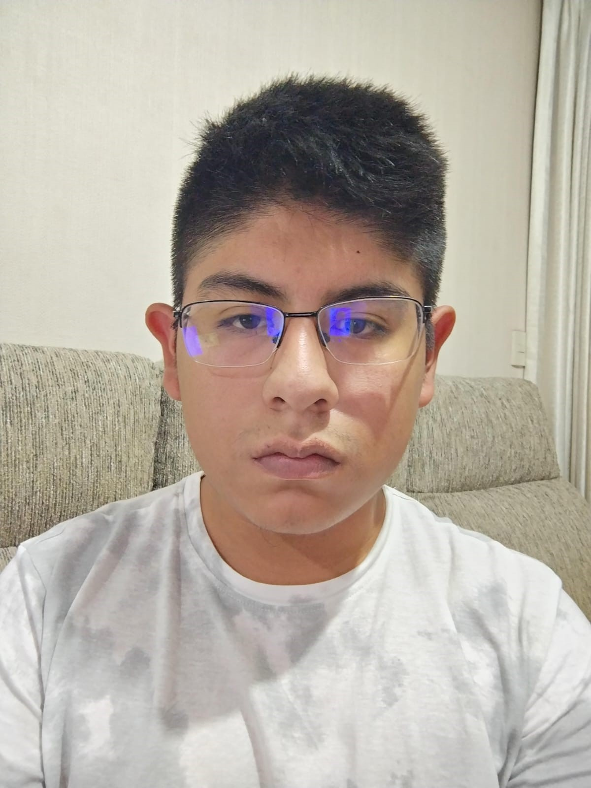

# Capítulo I: Introducción

## 1.1. StartUp Profile

Somos una empresa independiente formada por 5 estudiantes de la Universidad Peruana de Ciencias Aplicadas, dedicados a usar nuestras habilidades y conocimientos, adquiridos en los distintos cursos de Ingeniería, para ayudar a distintos grupos de personas que se puedan beneficiar de las aplicaciones que creemos.

### 1.1.1. Descripción de la StartUp

Actualmente, la tecnología está en todos lados a nuestro alrededor. Mayormente en forma de dispositivos electrónicos que, mediante una variedad de aplicaciones disponibles, nos ayudan en el día a día. Estas aplicaciones son posibles debido a la programación. Lo que buscamos como empresa, es usar nuestros conocimientos en programación para crear más aplicaciones que puedan ayudar a las personas de nuestro país, y, si es posible, al mundo en general. También usaremos los recursos y contactos que tengamos a la mano, para así poder asegurarnos que nuestros productos puedan ser lo más útil posible para nuestros clientes.

_Misión:_

Nuestra misión, como empresa, se forja en la meta de lograr que las personas necesitadas, de ámbitos específicos, tengan acceso a los recursos necesarios para solucionar sus problemas o mejorar su vida significativamente, mediante el uso de nuestros productos. Para esto, buscaremos conseguir que nuestros productos tengan una ventaja competitiva considerable, lo que atraerá tantos clientes como se pueda.

_Visión (Metas a medio o largo plazo):_

Nuestra visión a largo plazo es que nuestros productos alcancen un nivel de éxito que, no solo haya ayudado a nuestros clientes satisfactoria y consecutivamente, sino que nos permita aumentar la cantidad de servicios que ofrecemos, de esta forma aumentando el alcance y recepción de nuestros productos. Esto culminaría cementando a nuestra empresa como una parte relevante de la vida de los peruanos, y, de ahí, de la población mundial.

### 1.1.2. Perfiles de Integrantes del equipo

| Nombre Completo del integrante   | Descripcion de Carrera                                                                      | Fotografía                                    | Conocimientos y Habilidades a apuntar                                                                                                                                                                                                                                                     |
| -------------------------------- | ------------------------------------------------------------------------------------------- | --------------------------------------------- | ----------------------------------------------------------------------------------------------------------------------------------------------------------------------------------------------------------------------------------------------------------------------------------------- |
| Castilla Pachas Cesar Antonio    | Ingeniería de Software 5to Ciclo 2024-1 Universidad Peruana de Ciencias Aplicadas     |      | - Conocimientos básicos en C++, conocimiento regular en Javascript, Html y css. - Experiencia en trabajo en equipo. - Capacidad para encontrar soluciones en momentos de emergencia                                                                                                 |
| Héctor Marcelo Rentería Puga     | Ingeniería de Software  5to Ciclo 2024-1 Universidad Peruana de Ciencias Aplicadas |  | - Conocimiento Básico de C++ y Python. - Experiencia en trabajo rápido y en equipo. - Habilidad decente de ilustración y diseño. - Capacidad de idear y trabajar en situaciones emergentes.                                                                                      |
| Garcia Rodriguez Gabriel Stefano | Ingeniería de Software  5to Ciclo 2024-1 Universidad Peruana de Ciencias Aplicadas |    | - Conocimientos de lenguajes de programación c++, python, html y css. - Habilidades de liderazgo y contribución en equipo.                                                                                                                                                             |
| Flores Avalos Diego              | Ingeniería de Software  5to Ciclo 2024-1 Universidad Peruana de Ciencias Aplicadas |        | - Conocimientos de programación en los lenguajes C++, HTML, CSS y JavaScript. - Considero que soy una persona responsable y que se esfuerza en lograr un buen desempeño en los trabajos grupales.                                                                                      |
| Fabricio Apaza Morales           | Ingeniería de Software  5to Ciclo 2024-1 Universidad Peruana de Ciencias Aplicadas |   | - Conocimientos en lenguajes de programación como C++, Python, Html y CSS. - Considero que puedo aportar en el equipo, ya que soy responsable y trato de cumplir con las partes que se delegan en el equipo. A la vez, colaboro con ideas para poder lograr un buen trabajo en equipo. |

## 1.2. Solution Profile

### 1.2.1. Antecedentes y Problemática

Actualmente, los médicos son, cada vez más, presionados según su habilidad para manejar los problemas de las cantidades grandes de pacientes asignados a ellos día a día. Esto ha aumentado por el siempre creciente avance en tecnologías y guías de práctica de medicina, y las expectativas que generan en el paciente hacia su doctor. Dichas expectativas hacen que la probabilidad de una denuncia por actos médicos no acordes con el lex artis, que hace referencia a las acciones tomadas por los médicos frente a distintas complicaciones en medio de un acto médico, haya aumentado, lo que afecta a los valores y seguridad de la profesión médica, especialmente cuando dichos profesionales no tienen un respaldo legal estable.

Ante esto, surge la siguiente problemática: ¿Cómo podemos ayudar a los médicos a tener el apoyo legal necesario para afrontar, o, en el mejor de los casos, evitar estas denuncias? La respuesta yace en la creación de una aplicación web que permita a los profesionales médicos a tener fácil acceso a estos recursos legales en la forma de abogados médicos.

Bajo este contexto, aparece MedicDefense, una propuesta innovadora que, no solo aspira a unir los mundos de medicina y abogacía, sino que también busca marcar un precedente en cómo se evalúan los casos de negligencia médica, al darle acceso a los médicos inocentes, a un repertorio extensivo de abogados especializados en este campo, sea para defenderse de denuncias infundadas o solicitar consultas médicas ocasionales.

Para definir mejor la problemática, se usará la técnica de las 5W y 2H:

**What:**
El problema es que el riesgo de una denuncia por incumplimiento de lex artis ha aumentado, dejando a los médicos vulnerables ante un condena considerable de no tener el respaldo legal necesario para afrontar estas denuncias y probar su inocencia.

**Where:**
El problema surge en el entorno médico, donde un incidente desafortunado puede llevar a la idea de que se ha llevado a cabo una negligencia médica, causando que los familiares o el mismo involucrado inicien una pelea legal.

**When:**
El problema surge en el momento que el médico es denunciado por consecuencia de una tragedia presente durante un acto médico, en nombre de la negligencia, y éste no es capaz de defenderse.

**Who:**
Esta propuesta está dirigida a todos los profesionales médicos, o personas que están en formación para trabajar en este campo, de 20-50 años, y no tengan recursos legales disponibles, como un abogado especializado.

**Why:**
El problema surge debido a las expectativas crecientes de los pacientes a los profesionales del área médica, que llevan a una reacción muy negativa a cualquier posible imprevisto que pueda haber sucedido durante un acto médico, culminando en una denuncia hacia el profesional relacionado.

**How:**
La solución que proponemos es la creación de MedicDefense. Para ello utilizaremos nuestros conocimientos en el lenguaje de programación C#, creando una aplicación web que permita a los médicos, profesionales o en formación, contactar a abogados especializados en el área médica para comprar sus servicios o pedir una consulta.

**How much:**
Los costos relacionados con la aplicación serían relacionados al costo de las herramientas usadas, salarios de los programadores y mantenimiento de la aplicación, aparte de posible publicidad.

### 1.2.2. Lean UX Process

#### 1.2.2.1. Lean UX Problem Statements

El estado actual de las aplicaciones dirigidas al área de medicina se ha concentrado principalmente en identificación de medicamentos, cálculos de dosificación, o más generalmente, compartir información académica sobre enfermedades, biología y demás.
Lo que estas aplicaciones existentes fallan en tratar es el riesgo creciente para los médicos de no tener respaldo legal contra denuncias de negligencia médica.
Nuestro servicio tratará este problema al proporcionar una plataforma que permita a los médicos acceder a recursos legales de forma más sencilla y directa.
Nuestro enfoque inicial será en los médicos anestesiólogos y los estudiantes de medicina.
Sabremos que tuvimos éxito cuando veamos que el número de denuncias por negligencia médica, o al menos los casos perdidos por los médicos como consecuencia de dichas denuncias, haya reducido.

#### 1.2.2.2. Lean UX Assumptions

**User Assumptions**

- **¿Quién es el usuario?**

El usuario puede ser un médico que necesite defensa legal en casos relacionados con anestesiología o un estudiante de medicina interesado en obtener asesoramiento sobre el peritaje en anestesiología. Además, personas que han estudiado peritaje en anestesiología y buscan oportunidades laborales pueden ser usuarios potenciales.

- **¿Dónde encaja nuestro producto, en su trabajo o vida?**

Nuestro producto encaja en la vida profesional de médicos y estudiantes de medicina, así como en la búsqueda de empleo de personas con experiencia en peritaje en anestesiología. Para los médicos, el producto puede ayudar a resolver problemas legales relacionados con la anestesiología, mientras que para los estudiantes y profesionales del peritaje en anestesiología, puede proporcionar oportunidades laborales y asesoramiento educativo.

- **¿Qué problemas tiene nuestro producto y cómo se pueden resolver?**

  - Problema 1: Falta de acceso a expertos en anestesiología para asesoramiento legal o educativo.

    - Solución: Nosotros ofrecemos una plataforma donde los usuarios puedan encontrar peritos en anestesiología disponibles para asistencia legal y orientación educativa.

  - Problema 2: Falta de oportunidades laborales específicas en el campo del peritaje en anestesiología

    - Solución: El sistema puede conectar a los usuarios con empleadores que buscan estos perfiles.

- **¿Cuándo y cómo es usado nuestro producto?**

Nuestro producto podría ser utilizado por los usuarios en momentos en que enfrenten situaciones legales relacionadas con la anestesiología, como demandas por errores médicos. También podría ser utilizado por estudiantes de medicina interesados en aprender más sobre el peritaje en anestesiología y por profesionales que buscan oportunidades laborales en este campo. El producto sería utilizado a través de la plataforma en línea, donde los usuarios pueden acceder a los servicios de asesoramiento legal, educativo y de empleo.

- **¿Qué características son importantes?**

Características importantes pueden incluir un directorio de peritos en anestesiología disponibles para asistencia legal, recursos educativos sobre el peritaje en anestesiología, una sección de ofertas de empleo para profesionales en este campo, opciones de suscripción para acceder a diferentes niveles de servicios y una interfaz fácil de usar y navegación intuitiva.

- **¿Cómo debe verse nuestro producto y cómo debe comportarse?**

El producto debe tener una apariencia profesional y confiable, con un diseño limpio y fácil de entender. Debe comportarse de manera eficiente, brindando acceso rápido y fácil a los recursos y servicios necesarios para los usuarios. La plataforma debe ser intuitiva y fácil de navegar, con opciones claras y concisas para acceder a diferentes funciones y servicios.

**User Outcomes**

- Nuestros usuarios podrán acceder fácilmente a recursos legales ya sea información sobre leyes para practicantes de medicina y también procedimientos legales a seguir en caso de enfrentar alguna demanda.

- Ya que contamos con una herramienta que les brinda orientación legal los médicos pueden sentirse más seguros y tranquilos para enfrentar situaciones legales adversas que afecten su carrera.

- Nuestros usuarios al obtener información legal relevante y consejos prácticos pueden tomar decisiones más informadas y estratégicas durante algún proceso legal por lo que mejoraría sus probabilidades de obtener un caso favorable.

**Business Assumptions**

- **¿Cuál es nuestro mercado objetivo y cómo podemos alcanzarlo?**

Nuestro mercado objetivo son médicos que necesiten defensa legal en casos relacionados con anestesiología, estudiantes de medicina interesados en el peritaje en anestesiología y profesionales del peritaje en anestesiología en busca de oportunidades laborales. Podemos alcanzarlos mediante campañas de marketing dirigidas a instituciones médicas, facultades de medicina y asociaciones profesionales relacionadas con la anestesiología.

- **¿Cuál es nuestra estrategia de monetización y cómo podemos garantizar la rentabilidad?**

Nuestra estrategia de monetización se basa en ofrecer planes de suscripción para acceder a los servicios de la plataforma. Además, podemos generar ingresos a través de asociaciones con instituciones médicas para ofrecer servicios adicionales, como programas de formación continua en anestesiología. Para garantizar la rentabilidad, debemos asegurarnos de que nuestros planes de suscripción están estratégicamente diseñados para atraer a los usuarios y ofrecer un valor significativo.

- **¿Cuáles son nuestros costos operativos y cómo podemos mantenerlos bajo control?**

Nuestros costos operativos incluirían el desarrollo y mantenimiento de la plataforma web, así como los costos asociados con la contratación de personal especializado en anestesiología para proporcionar servicios de asesoramiento legal y educativo. Para mantener estos costos bajo control, podemos considerar la externalización de ciertas funciones y la optimización de nuestros procesos internos.

- **¿Cuál es nuestra estrategia de crecimiento a corto y largo plazo?**

A corto plazo, nuestra estrategia de crecimiento puede centrarse en la adquisición de usuarios y la mejora de la plataforma para aumentar la retención. A largo plazo, podemos expandir nuestros servicios para incluir otras áreas de especialización médica y buscar asociaciones estratégicas con instituciones médicas y empresas del sector de la salud.

- **¿Cómo vamos a diferenciarnos de la competencia y crear una propuesta de valor única?**

Nos diferenciaremos ofreciendo acceso directo a peritos en anestesiología para asistencia legal y educativa, así como oportunidades laborales específicas en este campo. Además, nos enfocaremos en brindar una experiencia de usuario excepcional y contenido de alta calidad para establecer nuestra plataforma como líder en el mercado de servicios de anestesiología.

**Business Outcomes**

- Nosotros al proporcionar un servicio valioso y especializado que ayuda a los médicos a enfrentar demandas legales el aplicativo puede aumentar la lealtad de los clientes hacia nuestra empresa desarrolladora del aplicativo.

- Si nuestro aplicativo ofrece un servicio de suscripción, puede generar ingresos recurrentes a través de las tarifas de suscripción pagadas por los médicos que utilizan la plataforma para acceder a la ayuda legal.

- A medida que los médicos encuentren valor a nuestro aplicativo y compartan sus experiencias positivas, la base de clientes puede expandirse a través de referencias y recomendaciones boca a boca.

**Features**

- **¿Que características son importantes?**

  - Una amplia base de datos legal actualizada es fundamental para proporcionar información precisa y relevante a los médicos.
  - El asesoramiento personalizado brinda a los médicos la orientación específica que necesitan para sus casos individuales.
  - El seguimiento de casos permite a los médicos mantenerse organizados y al tanto de los desarrollos en sus casos legales.
  - La educación legal continua es esencial para que los médicos comprendan sus derechos y responsabilidades legales.

- **¿Cómo debería verse y comportarse nuestro servicio?**

  - Debería ser fácil de navegar y buscar, con filtros y categorías intuitivas. La información de nuestro servicio debe presentarse de manera clara y concisa, con enlaces a recursos adicionales cuando sea necesario.
  - Debe haber opciones para programar consultas en línea con abogados especializados, así como la capacidad de enviar preguntas y recibir respuestas rápidas a través de la plataforma.
  - Debería haber una interfaz clara que muestre la información del caso, fechas importantes y posibles acciones a tomar. Las actualizaciones automáticas y las notificaciones pueden ayudar a mantener a nuestros usuarios informados.
  - Debe haber una sección dedicada a recursos educativos, con acceso a seminarios web, artículos informativos y videos explicativos. La presentación debe ser atractiva y fácil de consumir.

#### 1.2.2.3. Lean UX Hypothesis Statements

1. **Creemos que lograremos** aumentar la lealtad de los clientes hacia nuestra empresa desarrolladora **si** los médicos y estudiantes de medicina **obtienen** acceso fácil a recursos legales informativos sobre leyes y procedimientos **con** la lista de recursos educativos de la plataforma.
2. **Creemos que lograremos** generar ingresos recurrentes a través de la suscripción **si** los médicos **obtienen** seguridad y tranquilidad en que podrán evitar situaciones legales adversas **con** las herramientas de orientación legal que ofrece la suscripción.
3. **Creemos que logaremos** expandir la base de clientes mediante recomendaciones **si** los médicos **obtienen** mejores probabilidades de tomar decisiones informadas y estratégicas que ayuden a ganar sus casos **con** las consultas y servicios legales de nuestros abogados afiliados.

#### 1.2.2.4. Lean UX Canvas

## 1.3. Segmentos objetivo

Establecer y definir un segmento objetivo es fundamental para el desarrollo exitoso de esta etapa del proyecto. Como resultado, los futuros clientes del segmento tendrán un producto que cumpla sus necesidades. Esto llevó a la definición del siguiente segmento objetivo.

**Segmento 1:** Para nuestro primer segmento objetivo está compuesto por médicos que buscan asistencia legal especializada de parte de nuestros abogados expertos en medicina legal. Este grupo incluye a profesionales médicos de diversas especialidades, desde médicos generales hasta cirujanos y especialistas en áreas específicas como la obstetricia, la oncología o la neurología.

Estos médicos enfrentan una serie de desafíos legales en su práctica clínica diaria, que van desde cuestiones relacionadas con la responsabilidad profesional y la mala praxis médica hasta la interpretación de regulaciones y normativas sanitarias. La complejidad creciente del entorno legal y regulatorio en el que operan los profesionales de la salud hace que sea fundamental contar con asesoramiento legal sólido y especializado.

**Segmento 2:** Este segmento objetivo estará compuesto por estudiantes de medicina, residentes, internos y practicantes recién graduados que buscan adquirir nuestras suscripciones para obtener acceso a consultas legales especializadas en medicina. Estos individuos están en las primeras etapas de sus carreras médicas y reconocen la importancia de comprender el marco legal en el que operan como futuros profesionales de la salud.
